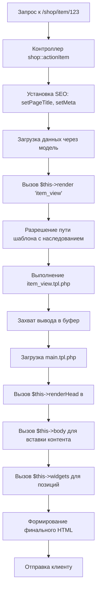

# 10. Система шаблонов

Система шаблонов DST Platform реализует уровень представления через высокооптимизированный PHP-рендеринг с поддержкой наследования тем, управления ресурсами, SEO-метаданными и позиционирования виджетов. Все операции координируются синглтоном `cmsTemplate` (`/system/core/template.php`).

---

## 10.1. Архитектура и ключевые принципы

| Принцип | Реализация | Выгода |
|---------|------------|--------|
| **PHP-рендеринг без компиляции** | Прямое выполнение `.tpl.php` | Максимальная производительность, отладка «на месте» |
| **Наследование тем** | Цепочка резолвинга через `inherit.php` | Минимизация дублирования, безопасные обновления |
| **Ленивая загрузка ресурсов** | Очереди CSS/JS с приоритетами | Оптимальный порядок подключения, минификация |
| **Чёткое разделение ответственности** | Макет (`main.tpl.php`) ≠ шаблон компонента | Независимая кастомизация структуры и контента |
| **Единая точка вывода метаданных** | `renderHead()` в макете | Гарантированная корректность SEO-тегов |

### Основной шаблонный класс

Класс cmsTemplate(system/core/template.php) — это синглтон, управляющий всеми операциями шаблона. Он создается во время загрузки системы и используется на протяжении всего жизненного цикла запроса.

Основные обязанности:

- Разрешение путей к файлам шаблонов с поддержкой наследования
- Управление очередями ресурсов CSS и JavaScript.
- Отрисовка макетов и внедрение контента.
- Управление SEO-метатегами и заголовками страниц
- Управление выводом виджета в заданных позициях.
- Предоставление вспомогательных методов для распространенных элементов пользовательского интерфейса (навигационная цепочка, сообщения и т. д.).

---

## 10.2. Структура файловой системы шаблонов

Шаблоны находятся в /templates/ отдельной подпапке для каждой темы. Эта default тема служит основой для всех остальных тем.

### Стандартная структура каталогов темы

/templates/{theme_name}/
├── main.tpl.php              # Primary site layout
├── admin.tpl.php             # Admin panel layout
├── scheme.html               # Widget position map
├── inherit.php               # Optional: parent theme declaration
├── options.form.php          # Theme settings form
├── options.css.php           # Dynamic CSS from settings
├── css/                      # Theme-specific stylesheets
│   └── style.css
├── js/                       # Theme-specific JavaScript
├── images/                   # Theme images
├── controllers/              # Component template overrides
│   └── {component}/
│       ├── view.tpl.php
│       ├── styles.css
│       └── backend/          # Admin templates for component
├── widgets/                  # General widget templates
│   └── widgets/
│       └── view.tpl.php
├── assets/                   # System templates
│   ├── errors/               # Error pages (404, offline, etc.)
│   ├── fields/               # Form field rendering
│   ├── includes/             # Category-specific overrides by ID
│   ├── pages/                # URL-specific page overrides
│   ├── template/             # Reusable layout partials
│   │   ├── headers/
│   │   ├── footers/
│   │   └── modals/
│   └── ui/                   # UI components (breadcrumbs, pagination, etc.)
└── content/                  # Content type templates
    └── TYPE_NAME/
	
**Правила именования:**
- Все шаблоны: `{название}.tpl.php`
- Шаблоны компонентов: `/controllers/{component}/{action}.tpl.php`
- Шаблоны бэкенда: `/controllers/{component}/backend/{action}.tpl.php`
- Шаблоны виджетов: `/widgets/{widget}.tpl.php` или `/controllers/{component}/widgets/{widget}.tpl.php`

---

## 10.3. Механизм наследования тем

Платформа DST реализует механизм наследования на основе резервных вариантов, позволяющий дочерним темам переопределять только определенные файлы, наследуя остальные от родительских тем.

### Объявление наследования
```php
// /templates/dark/inherit.php
<?php return 'default'; // Наследует от темы 'default' ?>
```

### Алгоритм поиска файла
При запросе файла система ищет в порядке приоритета:
1. Текущая тема (`/templates/dark/...`)
2. Родительская тема (`/templates/default/...`)
3. Рекурсивно вверх по цепочке наследования
4. Фолбэк на `default` (если не в цепочке)

### Примеры использования
```php
// Разрешение пути с учётом наследования
$path = $this->getTplFilePath('controllers/shop/item_view.tpl.php');

// Автоматическая загрузка CSS компонента с наследованием
$this->addControllerCSS('styles.css', 'shop'); 
// Ищет: /templates/{current}/controllers/shop/styles.css → /templates/default/...

// Загрузка изображения (требует ручного разрешения пути)
getTplFilePath('images/logo.png') ?>">
```

Разрешение вопросов, связанных с активами:

- CSS-файлы загружаются через одну и ту же цепочку наследования addCSS() или следуют ей .addControllerCSS()
- Файлы JavaScript, загружаемые с помощью, addJS() следуют одной и той же цепочке наследования.
- getTplFilePath() Если требуется наследование, пути к изображениям необходимо создавать вручную.

---

## 10.4. Макет сайта и ключевые методы

### Основная структура компоновки

Основной файл разметки ( main.tpl.php) определяет HTML-скелет. Вывод контроллера внедряется с помощью метода body(), а виджеты занимают указанные позиции.

Типичная main.tpl.php структура:

```
<!DOCTYPE html>
<html>
<head>
    <meta charset="utf-8">
    <?php $this->renderHead(); // Outputs meta tags, CSS, JS ?>
</head>
<body>
    <header>
        <?php $this->widgets('header'); ?>
    </header>
    
    <main class="container">
        <?php if ($this->hasWidgetsOn('sidebar')): ?>
        <aside class="sidebar">
            <?php $this->widgets('sidebar'); ?>
        </aside>
        <?php endif; ?>
        
        <div class="content">
            <?php echo cmsUser::getSessionMessages(); // Flash messages ?>
            <?php $this->breadcrumbs(); // Navigation breadcrumbs ?>
            <?php $this->body(); // Controller output ?>
        </div>
    </main>
    
    <footer>
        <?php $this->widgets('footer'); ?>
    </footer>
</body>
</html>
```

### Справочник методов макета
| Метод | Контекст | Назначение |
|-------|----------|------------|
| `$this->renderHead()` / `$this->head()` | `<head>` | Вывод всех метатегов, объединённых CSS/JS |
| `$this->body()` | `<body>` | Внедрение результата работы контроллера |
| `$this->widgets('позиция')` | Любой | Отображение виджетов в указанной позиции |
| `$this->hasWidgetsOn('позиция')` | Условие | Проверка наличия виджетов (для скрытия пустых блоков) |
| `$this->breadcrumbs()` | Контент | Генерация навигационной цепочки |
| `cmsUser::getSessionMessages()` | Глобально | Вывод flash-сообщений (успех, ошибка) |

---

## 10.5. Управление ресурсами (CSS/JS)

### CSS-ресурсы
| Метод | Расположение в HTML | Особенности |
|-------|---------------------|-------------|
| `$this->addMainCSS('путь')` | `<head>`, до остальных | Участвует в минификации и объединении |
| `$this->addCSS('путь')` | `<head>`, после основных | Не объединяется, для критических стилей |
| `$this->addControllerCSS('styles.css', 'component')` | `<head>` | Автоматический поиск с учётом наследования |

### JavaScript-ресурсы
| Метод | Расположение в HTML | Особенности |
|-------|---------------------|-------------|
| `$this->addMainJS('путь')` | `<head>` | Для критичных скриптов (блокирующий) |
| `$this->addJS('путь')` | Перед `</body>` | Неблокирующая загрузка (рекомендуется) |
| `$this->getLangJS(['KEY1', 'KEY2'])` | `<head>` | Экспорт языковых констант в `window.LANG` |

### Пример подключения
```php
// В шаблоне компонента
$this->addControllerCSS('item.css', 'shop');
$this->addJS('controllers/shop/cart.js');
$this->getLangJS(['LANG_ADD_TO_CART', 'LANG_SUCCESS']);
```

### Разрешение пути для активов

- Абсолютные пути (начинающиеся с /): используются как есть
- Относительные пути : определены относительно текущего каталога темы.
- Учитывает наследование : getTplFilePath() должно использоваться для унаследованных активов.

Интеграция Bootstrap CSS:

Платформа включает в себя CSS-фреймворк Bootstrap (css/bootstrap.css) с пользовательским оформлением DST Platform. Это обеспечивает:

- Адаптивная сеточная система ( .container, .row, .col-*)
- Типографические инструменты ( .h1- .h6, .lead, .display-*)
- Элементы управления формы ( .form-control, .btn, .form-group)
- Таблицы ( .table, .table-striped, .table-bordered)

---

## 10.6. SEO и управление метаданными

Класс cmsTemplate =предоставляет методы для управления SEO-элементами на уровне страницы. Их необходимо вызывать из контроллеров перед рендерингом.

### Методы метатегов

Устанавливаются **в контроллере** до вызова `render()`:

| Метод | Пример | Результат |
|-------|--------|-----------|
| `$this->setPageTitle('Заголовок')` | `$this->setPageTitle($item['title'])` | `<title>Заголовок — Название сайта</title>` |
| `$this->setPageDescription('Описание')` | `$this->setPageDescription($item['desc'])` | `<meta name="description" content="...">` |
| `$this->setMeta('keywords', 'ключ1, ключ2')` | `$this->setMeta('og:type', 'product')` | `<meta name="keywords" content="...">` |
| `$this->addHead('<meta ...>')` | `$this->addHead('<link rel="canonical" href="...">')` | Произвольный тег в `<head>` |

**Важно:** Все значения автоматически экранируются. Для сложных сценариев (Open Graph) используйте `addHead()` с ручным экранированием:
```php
$this->addHead('<meta property="og:image" content="' . htmlspecialchars($item['image']) . '">');
```

Использование в контроллере:

```
// In a controller action (e.g., shop component)
public function item_view() {
    $item = $this->model->getItem($id);
    
    // Set SEO meta-data
    $this->template->setPageTitle($item['title']);
    $this->template->setPageDescription($item['description']);
    $this->template->setMeta('keywords', implode(', ', $item['tags']));
    
    // Add Open Graph tags
    $this->template->addHead('<meta property="og:title" content="' . htmlspecialchars($item['title']) . '">');
    $this->template->addHead('<meta property="og:image" content="' . $item['image_url'] . '">');
    
    return $this->render('item_view', ['item' => $item]);
}
```

Вывод в renderHead():

Этот renderHead() метод (вызываемый в main.tpl.php) выводит все накопленные метатеги, CSS и JS в правильном порядке:

```
<head>
    <meta charset="utf-8">
    <title>Product Name - Site Name</title>
    <meta name="description" content="Product description here...">
    <meta name="keywords" content="product, category, brand">
    <meta property="og:title" content="Product Name">
    <meta property="og:image" content="https://...">
    <link rel="stylesheet" href="/templates/default/css/style.css">
    <script src="/templates/default/js/script.js"></script>
</head>
```

---

## 10.7. Система позиционирования виджетов

Виджеты (модульные блоки контента) размещаются в именованных позициях, определенных в макете. Файл scheme.html содержит визуальную карту доступных позиций.

### Определение должности

Позиции — это произвольные строковые идентификаторы, используемые как в main.tpl.php конфигурации виджета, так и в ней. К распространённым позициям относятся:

- header– Область заголовка сайта
- sidebar– Левая или правая боковая панель
- footer– Область нижнего колонтитула
- content_top– Выше основного содержимого
- content_bottom– Ниже приведено основное содержание

### Доступные позиции (стандартные)
| Позиция | Расположение | Типичное содержимое |
|---------|--------------|---------------------|
| `header` | Верх страницы | Логотип, меню, поиск |
| `sidebar` | Боковая панель | Фильтры, категории, баннеры |
| `content_top` | Над контентом | Рекламные блоки, уведомления |
| `content_bottom` | Под контентом | Похожие товары, комментарии |
| `footer` | Низ страницы | Контакты, карта сайта, копирайт |

### Визуализация в `scheme.html`
```html
<!-- /templates/default/scheme.html -->
<div class="layout-scheme">
  <div class="position" data-position="header">Header</div>
  <div class="content-area">
    <div class="position" data-position="sidebar">Sidebar</div>
    <div class="position" data-position="content">Main Content</div>
  </div>
  <div class="position" data-position="footer">Footer</div>
</div>
```

### Условный вывод в макете
```php
<?php if ($this->hasWidgetsOn('sidebar')): ?>
<aside class="sidebar">
  <?= $this->widgets('sidebar') ?>
</aside>
<?php endif; ?>
```

### Разрешение виджета

Виджеты отображаются путем вызова соответствующих файлов шаблонов. Шаблоны виджетов подчиняются тем же правилам наследования, что и шаблоны компонентов.

Расположение шаблонов виджетов:

- Общие виджеты: /templates/THEME/widgets/WIDGET_NAME/view.tpl.php
- Компонентные виджеты: /templates/THEME/controllers/COMPONENT/widgets/WIDGET_NAME.tpl.php

---

## 10.8. Область видимости в шаблонах

Полный цикл от запроса до отображения HTML-кода включает в себя несколько этапов, в которых участвует система шаблонов.


Ключевые этапы:

1. Инициализация контроллера : контроллер устанавливает метаданные и ресурсы на уровне страницы.
2. Получение данных : Контроллер получает данные из модели.
3. Отображение представления : вызовы контроллера $this->template->render('view_name', $data), которые:
- Разрешает путь к шаблону с помощью наследования.
- Включает файл шаблона, находящийся $dataв пределах области действия.
- Захватывает выходные данные в буфер
4. Отображение макета : Система шаблонов загружает main.tpl.php следующее:
- Вызовы renderHead() для вывода метатегов и ресурсов.
- Вызовы body() для внедрения буферизованного вывода контроллера
- Вызовы widgets('position') для каждой позиции виджета
5. Результат : Итоговый HTML-код, отправленный в браузер.

| Переменная / Объект | Доступность | Назначение |
|---------------------|-------------|------------|
| `$переменная` | Шаблон компонента | Данные из `render('view', ['item' => $data])` (извлекаются в область видимости) |
| `$this` | Все шаблоны | Экземпляр `cmsTemplate` (методы: `addCSS()`, `widgets()`, `getTplFilePath()`) |
| `cmsUser::getInstance()` | Глобально | Текущий пользователь, сессия |
| `cmsConfig::getInstance()` | Глобально | Конфигурация приложения |
| `LANG` | Глобально | Массив локализованных строк |

**Пример шаблона компонента:**
```php
<?php
// /templates/default/controllers/shop/item_view.tpl.php
// $item доступен напрямую (извлечён из массива данных)
$this->addControllerCSS('item.css', 'shop');
?>
<article class="product">
  <h1><?= htmlspecialchars($item['title']) ?></h1>
  <div class="price"><?= number_format($item['price'], 0, '', ' ') ?> ₽</div>
  <div class="description"><?= $item['description'] ?></div>
  <button data-id="<?= (int)$item['id'] ?>">В корзину</button>
</article>
```
> **Безопасность:** Всегда экранируйте пользовательские данные через `htmlspecialchars()`. Для чисел — приведение типов `(int)`, `(float)`.

---

## 10.9. Вспомогательные методы и компоненты пользовательского интерфейса

Этот cmsTemplate класс предоставляет удобные методы для реализации распространенных шаблонов пользовательского интерфейса.

### Breadcrumb

```
// In controller, build breadcrumb trail:
$this->template->addBreadcrumb('Home', '/');
$this->template->addBreadcrumb('Catalog', '/shop');
$this->template->addBreadcrumb('Category', '/shop/category');
$this->template->addBreadcrumb($item['title']); // Current page (no link)

// In main.tpl.php:
<?php $this->breadcrumbs(); ?>
// Outputs: Home > Catalog > Category > Product Name
```

### Флэш-сообщения

Сообщения пользователя, привязанные к сессии (успех, ошибка, информация), отображаются следующим образом cmsUser::getSessionMessages():

```
// In controller, set a message:
cmsUser::addSessionMessage('Item added to cart', 'success');

// In main.tpl.php:
<?php echo cmsUser::getSessionMessages(); ?>
// Outputs styled alert boxes
```

### Условные элементы компоновки

```
// Hide sidebar if no widgets assigned
<?php if ($this->hasWidgetsOn('sidebar')): ?>
<aside class="sidebar">
    <?php $this->widgets('sidebar'); ?>
</aside>
<?php endif; ?>
```

---

## 10.10. Область действия и переменные файла шаблона

В файле шаблона ( .tpl.php) доступно несколько переменных и объектов:

Переменная/Объект | Описание
$this | Ссылка на cmsTemplate экземпляр (в шаблонах макета) или контроллер (в шаблонах компонента)
$data | Массив переменных, передаваемых из контроллера черезrender()
cmsCore::getInstance() | Доступ к основному синглтону
cmsUser::getInstance() | Доступ к текущей пользовательской сессии
cmsConfig::getInstance() | Доступ к конфигурации

Пример шаблона компонента:

```
// /templates/default/controllers/shop/item_view.tpl.php
// $data['item'] is available from controller

<article class="product">
    <h1><?php echo htmlspecialchars($data['item']['title']); ?></h1>
    
    <div class="price">
        <?php echo number_format($data['item']['price'], 2); ?> USD
    </div>
    
    <div class="description">
        <?php echo $data['item']['description']; ?>
    </div>
    
    <button type="button" onclick="addToCart(<?php echo $data['item']['id']; ?>)">
        Add to Cart
    </button>
</article>
```

Примечание по безопасности: Всегда используйте htmlspecialchars() экранирующие функции при выводе предоставленных пользователем данных, чтобы предотвратить XSS-атаки.

---

## 10.11. Динамические настройки темы

### `options.form.php` — форма настроек
Определяет поля в админке темы (цвета, шрифты, отступы) через `cmsForm`.

### `options.css.php` — генерация CSS
```php
<?php
header('Content-Type: text/css');
$options = $this->options; // Сохранённые настройки темы
?>
:root {
  --primary: <?= $options['primary_color'] ?? '#5b88bd' ?>;
  --font-main: <?= $options['font_family'] ?? 'GT Eesti Pro, sans-serif' ?>;
}
.btn-primary { background-color: var(--primary); }
```
Файл автоматически подключается в `renderHead()`, если существует.

---

## 10.12. Жизненный цикл рендеринга



---

## 10.13. Сводная таблица ключевых сущностей

| Сущность | Тип | Расположение | Назначение |
|----------|-----|--------------|------------|
| `cmsTemplate` | Синглтон | `/system/core/template.php` | Ядро системы шаблонов |
| `main.tpl.php` | Файл | `/templates/{theme}/` | Каркас страницы |
| `inherit.php` | Файл | `/templates/{theme}/` | Объявление родительской темы |
| `scheme.html` | Файл | `/templates/{theme}/` | Визуальная карта позиций виджетов |
| `getTplFilePath()` | Метод | `cmsTemplate` | Разрешение пути с учётом наследования |
| `addControllerCSS()` | Метод | `cmsTemplate` | Автоматическая загрузка CSS компонента |
| `renderHead()` | Метод | `cmsTemplate` | Формирование содержимого `<head>` |
| `hasWidgetsOn()` | Метод | `cmsTemplate` | Проверка наличия виджетов в позиции |

---

## Ключевые рекомендации

✅ **Делайте:**
- Используйте наследование для кастомизации (не копируйте всю тему)
- Подключайте ресурсы через методы `cmsTemplate` (не прямые `<link>`)
- Экранируйте все пользовательские данные в шаблонах
- Разделяйте логику (контроллер) и представление (шаблон)

❌ **Не делайте:**
- Не вызывайте SQL-запросы напрямую в шаблонах
- Не используйте глобальные переменные вместо переданных данных
- Не модифицируйте шаблоны ядра (`/system/...`) — переопределяйте в теме
- Не вставляйте `<script>`/`<style>` напрямую — используйте очереди ресурсов

Система шаблонов DST Platform обеспечивает баланс между гибкостью кастомизации и производительностью, сохраняя чёткое разделение слоёв приложения. Все механизмы оптимизированы для работы в условиях высокой нагрузки без потери удобства разработки.
