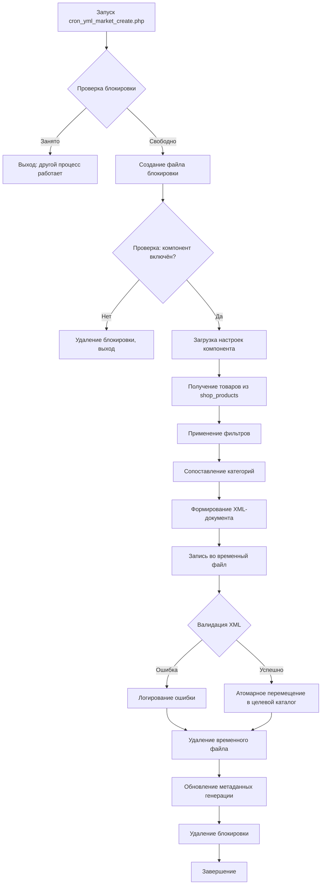

# 13. Компонент - Интеграция с Яндекс.Маркет

Данный документ содержит техническую спецификацию компонента **«Интеграция с Яндекс.Маркет»** (`market`), предназначенного для автоматической генерации и синхронизации товарных фидов в формате YML (Яндекс.Маркет) с внешними маркетплейсами. Компонент обеспечивает преобразование внутренних данных каталога товаров в стандартизированный XML-формат, сопоставление категорий, управление фильтрами и автоматизированную доставку фидов.

> **Важно**: Компонент `market` **не обрабатывает заказы или платежи** с внешних маркетплейсов. Его функция ограничивается экспортом и синхронизацией данных о товарах. Обработка заказов, поступающих через Яндекс.Маркет, реализуется в компонентах `shop`, `orders`, `partner`.

## 13.1. Назначение и область применения

Компонент интеграции с Яндекс Маркет (market контроллер) служит связующим звеном между экосистемой магазинов DST Platform и внешними маркетплейсами, в первую очередь Yandex.Market. Компонент преобразует внутренние данные каталога товаров в стандартизированный формат YML (Яндекс.Маркет), который может использоваться агрегаторами маркетплейсов.

Основные обязанности:

- Генерация YML-файлов с товарными фидами, совместимых со спецификациями Яндекс.Маркета.
- Сопоставьте внутренние категории товаров с таксономиями категорий на торговой площадке.
- Синхронизация наличия товара, цен и характеристик.
- Автоматизируйте генерацию контента с помощью запланированных задач.
- Настройте отдельные параметры фида для разных каналов торговой площадки.

Компонент Интеграция с Яндекс Маркет не обрабатывает заказы или платежи с внешних торговых площадок — он сосредоточен исключительно на экспорте и синхронизации данных о товарах.

Компонент `market` решает следующие задачи:
- Генерация валидных YML-фидов, соответствующих [официальной спецификации Яндекс.Маркет](https://yandex.ru/support/marketplace/export/feed-xml.html).
- Сопоставление внутренних категорий товаров с таксономией Яндекс.Маркет.
- Автоматическая фильтрация товаров по статусу, наличию, цене.
- Применение корректировок цен и наценок для маркетплейса.
- Управление изображениями и медиа-контентом в фиде.
- Планирование генерации через систему cron с защитой от параллельного запуска.

**Не решает**:
- Приём и обработку заказов из Яндекс.Маркет (реализуется через компонент `orders`).
- Синхронизацию остатков в реальном времени (только через регулярную генерацию фида).
- Управление товарами продавца на стороне маркетплейса (только экспорт).

---

## 13.2. Архитектура компонента

Система интеграции Яндекс Маркет построена по принципу «производитель-потребитель», где маркетплейс DST Platform выступает в качестве источника данных, а внешние торговые площадки — в качестве потребителей сгенерированных YML-файлов.


Схема взаимодействия компонентов:

- Источник данных: shop Контролер ведет основной каталог продукции.
- Слой преобразования: market Контроллер запрашивает данные маркетплейса и преобразует их в формат YML.
- Уровень выполнения: скрипт Cron запускает генерацию ленты новостей по расписанию.
- Выходной слой: Сгенерированные YML-файлы записываются в каталог экспорта.
- Внешняя интеграция: Яндекс.Маркет получает фиды через HTTP/FTP (настраивается извне).

Компонент реализует паттерн **«производитель-потребитель»**:
- **Источник данных**: компонент `shop` (таблицы `shop_products`, `shop_categories`).
- **Преобразователь**: компонент `market` (логика сопоставления, фильтрации, генерации XML).
- **Потребитель**: Яндекс.Маркет (забирает фид по HTTP/FTP/SFTP).
- **Оркестратор**: скрипт `cron_yml_market_create.php`.

```
┌───────────────────────────────────────────────────────────┐
│                   ЭКОСИСТЕМА ИНТЕГРАЦИИ                   │
├───────────────────────────────────────────────────────────┤
│                                                           │
│  ┌──────────────┐     ┌──────────────┐     ┌────────────┐ │
│  │   shop       │────▶│   market     │────▶│  Яндекс.  │ │
│  │ (каталог)    │     │ (преобразов.)│     │  Маркет    │ │
│  └──────────────┘     └──────┬───────┘     └────────────┘ │
│                              │                            │
│                              ▼                            │
│                     ┌────────────────┐                    │
│                     │  cron_yml_     │                    │
│                     │ market_create  │                    │
│                     │     .php       │                    │
│                     └────────────────┘                    │
│                              │                            │
│                              ▼                            │
│                     ┌────────────────┐                    │
│                     │  exports/jobs/ │                    │
│                     │ yml_category_  │                    │
│                     │    market/     │                    │
│                     └────────────────┘                    │
└───────────────────────────────────────────────────────────┘
```

**Ключевые принципы**:
- **Только для чтения**: компонент `market` никогда не изменяет данные компонента `shop`.
- **Изолированность**: ошибки в генерации фида не влияют на работу основного магазина.
- **Идемпотентность**: повторный запуск генерации создаёт новый файл, не повреждая предыдущий.
- **Атомарность**: файл фида записывается во временную директорию, затем атомарно перемещается в целевую.

---

## 13.3. Структура файлов компонента

| Путь | Назначение | Обязательность |
|------|------------|----------------|
| `/system/controllers/market/frontend.php` | Фронтенд-контроллер (публичный интерфейс, если требуется) | Опционально |
| `/system/controllers/market/model.php` | Модель данных (`class modelMarket extends cmsModel`) | Обязательно |
| `/system/controllers/market/backend/controller.php` | Административный контроллер | Обязательно |
| `/system/controllers/market/backend/model.php` | Модель админки (`class modelBackendMarket extends modelMarket`) | Опционально |
| `/system/controllers/market/hooks.php` | Обработчики событий (включая cron-хуки) | Обязательно |
| `/system/controllers/market/options.form.php` | Форма настроек компонента | Обязательно |
| `/templates/default/controllers/market/backend/` | Шаблоны административного интерфейса | Обязательно |


> **Примечание**: Фронтенд-контроллер часто отсутствует, так как компонент работает в фоновом режиме. Публичный интерфейс требуется только для специфичных сценариев (например, ручная генерация фида через веб-интерфейс).

---

## 13.4. Формат YML-фида и соответствие спецификации

Компонент генерирует валидный XML в формате YML, соответствующий [официальной схеме Яндекс.Маркет](https://yandex.ru/support/marketplace/export/feed-xml.html).

### Структура документа

```xml
<?xml version="1.0" encoding="UTF-8"?>
<!DOCTYPE yml_catalog SYSTEM "shops.dtd">
<yml_catalog date="2026-01-31 14:30">
  <shop>
    <name>Название магазина</name>
    <company>Юридическое название компании</company>
    <url>https://example.com</url>
    <platform>DST Platform</platform>
    <version>1.0</version>
    <agency>DST Global</agency>
    
    <currencies>
      <currency id="RUB" rate="1"/>
      <currency id="USD" rate="90.5"/>
    </currencies>
    
    <categories>
      <category id="1">Электроника</category>
      <category id="2" parentId="1">Смартфоны</category>
      <category id="3" parentId="1">Ноутбуки</category>
    </categories>
    
    <delivery-options>
      <option cost="300" days="1-3" order-before="15"/>
    </delivery-options>
    
    <offers>
      <offer id="12345" available="true" type="vendor.model">
        <url>https://example.com/shop/item/12345</url>
        <price>19990.00</price>
        <oldprice>24990.00</oldprice>
        <currencyId>RUB</currencyId>
        <categoryId>2</categoryId>
        <market_category>Смартфоны</market_category>
        <picture>https://example.com/upload/images/phone.jpg</picture>
        <picture>https://example.com/upload/images/phone_2.jpg</picture>
        <name>Смартфон XYZ Pro 256GB</name>
        <vendor>BrandName</vendor>
        <vendorCode>BN-XYZ-256</vendorCode>
        <description>Полное описание товара без HTML-тегов. Максимум 3000 символов.</description>
        <sales_notes>Срок доставки 1-3 дня. Гарантия 12 месяцев.</sales_notes>
        <manufacturer_warranty>true</manufacturer_warranty>
        <country_of_origin>Китай</country_of_origin>
        <barcode>4601234567890</barcode>
        <cpa>1</cpa>
        <param name="Цвет">Чёрный</param>
        <param name="Объём памяти">256 ГБ</param>
        <param name="Оперативная память">8 ГБ</param>
      </offer>
    </offers>
  </shop>
</yml_catalog>
```

### Ключевые элементы и требования

| Элемент | Обязательность | Ограничения | Примечания |
|---------|----------------|-------------|------------|
| `offer/@id` | Да | Уникальный в рамках фида | Рекомендуется использовать `shop_products.id` |
| `offer/@available` | Да | `true` \| `false` | Определяется по наличию на складе |
| `url` | Да | Валидный URL | Должен вести на страницу товара |
| `price` | Да | > 0, два знака после запятой | Базовая цена из `shop_products.price` |
| `oldprice` | Нет | > `price` | Для отображения скидки |
| `currencyId` | Да | Из списка `currencies` | Обычно `RUB` |
| `categoryId` | Да | Должен существовать в `<categories>` | После сопоставления с таксономией Яндекс.Маркет |
| `picture` | Рекомендуется | До 10 изображений | Абсолютные URL, HTTPS |
| `name` | Да | ≤ 50 символов | Название товара |
| `vendor` | Рекомендуется | — | Производитель |
| `description` | Рекомендуется | ≤ 3000 символов, без HTML | Очищается от тегов |
| `param` | Опционально | — | Характеристики товара |

### Валидация фида

Перед отправкой в Яндекс.Маркет рекомендуется:
1. Проверить валидность XML через [онлайн-валидатор Яндекса](https://partner.market.yandex.ru/validator/).
2. Убедиться, что все категории из `categoryId` присутствуют в блоке `<categories>`.
3. Проверить кодировку файла (только UTF-8 без BOM).
4. Убедиться, что все URL изображений доступны и возвращают статус 200.

---

## 13.5. Система сопоставления категорий

Яндекс.Маркет использует фиксированную таксономию категорий. Компонент `market` обеспечивает сопоставление внутренних категорий (`shop_categories`) с категориями маркетплейса.


### Стратегия сопоставления

| Тип сопоставления | Описание | Пример |
|-------------------|----------|--------|
| **Прямое** | Администратор вручную связывает внутреннюю категорию с ID категории Яндекс.Маркет | `Электроника (id=5)` → `Смартфоны (id=12345)` |
| **Наследование** | Подкатегории наследуют сопоставление родительской категории, если не задано явно | `Смартфоны Apple` наследует сопоставление от `Смартфоны` |
| **Категория по умолчанию** | Товары без сопоставленной категории попадают в указанную категорию | Все несопоставленные → `Разное (id=99999)` |
| **Исключение** | Категории, помеченные как «не экспортировать», полностью исключаются из фида | `Служебные товары` → не экспортируется |

### Структура таблицы сопоставления

Таблица `market_category_mappings` (создаётся при установке компонента):

| Поле | Тип | Описание |
|------|-----|----------|
| `id` | INT | Первичный ключ |
| `internal_category_id` | INT | ID категории из `shop_categories.id` |
| `market_category_id` | INT | ID категории в таксономии Яндекс.Маркет |
| `market_category_name` | VARCHAR(255) | Название категории в Яндекс.Маркет (для отладки) |
| `is_default` | TINYINT(1) | Флаг категории по умолчанию |
| `is_excluded` | TINYINT(1) | Флаг исключения из экспорта |
| `created_at` | DATETIME | Дата создания записи |
| `updated_at` | DATETIME | Дата обновления записи |

### Пример сопоставления в админке

```
Внутренняя категория       | Категория Яндекс.Маркет      | Статус
---------------------------|------------------------------|--------
Электроника (id=1)         | —                            | Не сопоставлена
├─ Смартфоны (id=2)       | Смартфоны (id=12345)         | Сопоставлена
│  ├─ Apple (id=3)        | Смартфоны Apple (id=12346)   | Сопоставлена
│  └─ Samsung (id=4)      | —                            | Наследует от "Смартфоны"
└─ Ноутбуки (id=5)        | Ноутбуки (id=67890)          | Сопоставлена
```

---

## 13.6. Процесс генерации фида

Генерация выполняется в несколько этапов с защитой от ошибок и повреждения данных.


### Этапы генерации



### Фильтры товаров

Товары включаются в фид только при соблюдении **всех** условий:

| Условие | Проверка | Конфигурируемость |
|---------|----------|-------------------|
| Статус | `is_published = 1` | Нет |
| Наличие | `quantity > 0` (если включена проверка остатков) | Да (в настройках компонента) |
| Цена | `price > 0` | Нет |
| Категория | Сопоставлена с категорией Яндекс.Маркет | Нет (автоматически) |
| Модерация | `is_approved = 1` (если включена модерация) | Нет |
| Видимость | Не скрыт от экспорта (`hide_from_export = 0`) | Да |

### Обработка данных товара

| Поле | Источник | Преобразование |
|------|----------|----------------|
| `id` | `shop_products.id` | Без изменений |
| `name` | `shop_products.title` | Обрезка до 50 символов, удаление спецсимволов |
| `description` | `shop_products.description` | Удаление HTML-тегов, обрезка до 3000 символов |
| `price` | `shop_products.price` | Применение наценки/скидки (если задано в настройках) |
| `oldprice` | `shop_products.old_price` | Только если `old_price > price` |
| `categoryId` | `shop_products.category_id` → `market_category_mappings.market_category_id` | Сопоставление через таблицу |
| `picture` | `shop_product_images.image_path` | Генерация абсолютного URL, HTTPS |
| `vendor` | `shop_products.manufacturer` | — |
| `vendorCode` | `shop_products.sku` | — |
| `barcode` | `shop_products.barcode` | — |

---

## 13.7. Планирование и автоматизация генерации

Генерация фидов выполняется через cron-скрипт `cron_yml_market_create.php`.


### Архитектура скрипта

```php
#!/usr/bin/env php
<?php
// cron_yml_market_create.php

define('PATH', dirname(__FILE__));
define('NO_SESSION', true); // Отключаем сессию для CLI

require_once PATH . '/bootstrap.php';

// 1. Блокировка файла для предотвращения параллельного запуска
$lock_file = cmsConfig::get('cache_path') . 'cron_lock_market_yml';
$lockfp = fopen($lock_file, 'w');

if (!$lockfp || !flock($lockfp, LOCK_EX | LOCK_NB)) {
    error_log('[MARKET] Another process is already running. Exiting.');
    exit(1);
}

// Гарантированная очистка блокировки при завершении
register_shutdown_function(function() use ($lockfp, $lock_file) {
    if ($lockfp) {
        flock($lockfp, LOCK_UN);
        fclose($lockfp);
        @unlink($lock_file);
    }
});

// 2. Проверка: компонент включён?
$controller = cmsCore::getController('market');
if (!$controller || !$controller->isEnabled()) {
    error_log('[MARKET] Component is disabled. Exiting.');
    exit(0);
}

// 3. Выполнение хука генерации
try {
    $result = cmsEventsManager::hook('cron_yml_market_create_files');
    
    if ($result === false) {
        error_log('[MARKET] Hook returned false. Generation failed.');
        exit(1);
    }
    
    error_log('[MARKET] Feed generation completed successfully.');
    exit(0);
    
} catch (Exception $e) {
    error_log('[MARKET] Exception: ' . $e->getMessage());
    error_log($e->getTraceAsString());
    exit(1);
}
```

### Рекомендации по настройке cron

| Параметр | Рекомендуемое значение | Обоснование |
|----------|------------------------|-------------|
| **Частота запуска** | Каждые 2-4 часа | Баланс между актуальностью и нагрузкой |
| **Время запуска** | Ночное время (02:00–05:00) | Минимальная нагрузка на сервер |
| **Таймаут скрипта** | ≥ 300 секунд | Для каталогов > 10 000 товаров |
| **Логирование** | В отдельный файл (`/var/log/dst_market_cron.log`) | Упрощает отладку |
| **Уведомления** | Email при ошибках | Быстрое реагирование на сбои |

Пример записи в crontab:
```bash
# Генерация YML-фида для Яндекс.Маркет каждые 4 часа в ночное время
0 2,6,10,14,18,22 * * * /usr/bin/php /var/www/site/cron_yml_market_create.php >> /var/log/dst_market_cron.log 2>&1
```

---

## 13.8. Структура выходных каталогов и файлов

Сгенерированные файлы сохраняются в строго организованной структуре.

### Дерево каталогов

```
exports/jobs/
├── yml_category/              # YML-фиды для внутреннего использования (см. раздел 12)
├── yml_category_market/       # YML-фиды для Яндекс.Маркет
│   ├── market_feed_full.yml   # Полный фид (актуальная версия)
│   ├── market_feed_full_20260131_143022.yml  # Архивная копия с временной меткой
│   ├── market_feed_delta.yml  # Инкрементальный фид (если поддерживается)
│   ├── market_categories.xml  # Справочник сопоставленных категорий (для отладки)
│   └── .last_generation       # Файл с метаданными последней генерации (timestamp, кол-во товаров)
└── tmp/                       # Временные файлы во время генерации
    └── market_feed_tmp_*.yml
```

### Правила именования файлов

| Файл | Назначение | Жизненный цикл |
|------|------------|----------------|
| `market_feed_full.yml` | Актуальный фид для загрузки в Яндекс.Маркет | Перезаписывается при каждой генерации |
| `market_feed_full_YYYYMMDD_HHMMSS.yml` | Архивная копия | Хранится 7 дней (настраивается) |
| `market_feed_delta.yml` | Только изменённые товары | Генерируется при включённом режиме дельта-обновлений |
| `market_categories.xml` | Справочник категорий | Обновляется при изменении сопоставления |
| `.last_generation` | Метаданные генерации | Обновляется после успешной генерации |

### Права доступа

| Каталог/Файл | Права | Владелец | Примечание |
|--------------|-------|----------|------------|
| `exports/jobs/` | 755 | www-data | Доступ для веб-сервера |
| `yml_category_market/` | 755 | www-data | — |
| `*.yml` | 644 | www-data | Доступен для чтения внешними системами |
| `.last_generation` | 644 | www-data | — |

> **Важно**: Веб-сервер должен иметь права на запись в `exports/jobs/`. Для безопасности рекомендуется ограничить доступ к каталогу через `.htaccess`:
> ```
> # Запретить доступ ко всем файлам, кроме .yml
> <FilesMatch "^\.(.*)$">
>   Require all denied
> </FilesMatch>
> ```

---

## 13.9. Интеграция с компонентом «Маркетплейс»

Компонент `market` зависит от данных компонента `shop`, но не изменяет их.


### Диаграмма потока данных

```
┌───────────────────────────────────────────────────────────┐
│                   ИСТОЧНИКИ ДАННЫХ                        │
├───────────────────────────────────────────────────────────┤
│                                                           │
│  ┌─────────────────────────────────────────────────────┐  │
│  │              КОМПОНЕНТ shop                         │  │
│  │  ┌─────────────┐  ┌───────────────┐┌─────────────┐  │  │
│  │  │shop_products│  │shop_categories││shop_images  │  │  │
│  │  └──────┬──────┘  └──────┬────────┘└─────┬───────┘  │  │
│  └─────────┼────────────────┼───────────────┼──────────┘  │
│            │                │               │             │
│            ▼                ▼               ▼             │
│  ┌─────────────────────────────────────────────────────┐  │
│  │           КОМПОНЕНТ market (только чтение)          │  │
│  │  ┌───────────────────────────────────────────────┐  │  │
│  │  │ 1. Запрос товаров с фильтрами                 │  │  │
│  │  │ 2. Сопоставление категорий                    │  │  │
│  │  │ 3. Формирование XML                           │  │  │
│  │  │ 4. Запись в файл                              │  │  │
│  │  └───────────────────────────────────────────────┘  │  │
│  └─────────────────────────────────────────────────────┘  │
│                            │                              │
│                            ▼                              │
│              ┌───────────────────────────┐                │
│              │  Яндекс.Маркет (внешний)  │                │
│              └───────────────────────────┘                │
└───────────────────────────────────────────────────────────┘
```

### Запрос данных из компонента `shop`

Компонент `market` получает данные через прямые SQL-запросы к таблицам `shop_*` (не через модель `shop`, чтобы избежать накладных расходов).

Пример запроса товаров:
```php
// В modelMarket::getProductsForFeed()
public function getProductsForFeed($filters = []) {
    $sql = "
        SELECT 
            p.id,
            p.title,
            p.description,
            p.price,
            p.old_price,
            p.sku,
            p.barcode,
            p.manufacturer,
            p.category_id,
            p.quantity,
            p.is_published,
            c.title AS category_title,
            GROUP_CONCAT(DISTINCT i.image_path ORDER BY i.sort_order SEPARATOR '|') AS images
        FROM {shop_products} p
        INNER JOIN {shop_categories} c ON c.id = p.category_id
        LEFT JOIN {shop_product_images} i ON i.product_id = p.id AND i.is_main = 1
        WHERE p.is_published = 1
          AND p.price > 0
          AND p.category_id IN (
              SELECT internal_category_id 
              FROM {market_category_mappings} 
              WHERE market_category_id IS NOT NULL 
                AND is_excluded = 0
          )
    ";
    
    // Применение дополнительных фильтров
    if (!empty($filters['in_stock'])) {
        $sql .= " AND p.quantity > 0";
    }
    
    if (!empty($filters['min_price'])) {
        $sql .= " AND p.price >= " . (float)$filters['min_price'];
    }
    
    $sql .= " GROUP BY p.id";
    
    return $this->db->query($sql, true);
}
```

> **Примечание**: Использование `{table_name}` позволяет автоматически подставлять префикс таблиц из конфигурации.

Доступ только для чтения:

- Контролер Яндекс Маркет никогда не изменяет данные магазина.
- Все операции выполняются только в виде запросов SELECT.
- Отсутствует транзакционная зависимость — данные представляют собой моментальные снимки.
- Контроллер Яндекс Маркет может работать независимо от работы магазина.

Общая конфигурация:

- Оба используют одно и то же соединение с базой данных (через cmsCore).
- Общая конфигурация кэша
- Используйте одинаковые пути для загрузки файлов изображений.
- Наследование разрешений и контроля доступа

---

## 13.10. Административный интерфейс и настройка

Административный интерфейс компонента доступен по пути `/admin/market/` (требуются права администратора).

### Параметры конфигурации

| Параметр | Тип | По умолчанию | Описание |
|----------|-----|--------------|----------|
| `enabled` | checkbox | выключено | Активировать компонент |
| `shop_name` | text | из настроек сайта | Название магазина в фиде |
| `company_name` | text | из настроек сайта | Юридическое название |
| `shop_url` | url | текущий домен | URL магазина |
| `currency` | select | RUB | Валюта фида |
| `price_markup` | number | 0.00 | Наценка в процентах (например, 5.5 = +5.5%) |
| `price_round` | select | без округления | Округление цены (до 10, 50, 100) |
| `export_out_of_stock` | checkbox | выключено | Экспортировать товары без остатка |
| `min_price` | number | 0 | Минимальная цена для экспорта |
| `image_limit` | number | 5 | Максимум изображений на товар |
| `feed_filename` | text | market_feed_full.yml | Имя файла фида |
| `archive_days` | number | 7 | Хранить архивные копии (дней) |

### Интерфейс сопоставления категорий

1. **Древовидное представление** внутренних категорий с индикаторами статуса:
   - ✅ Зелёная галочка — сопоставлена
   - ⚠️ Жёлтый треугольник — наследует от родителя
   - ❌ Красный крест — не сопоставлена / исключена

2. **Поиск категорий Яндекс.Маркет**:
   - Автозаполнение при вводе названия
   - Выпадающий список с подсказками
   - Отображение полного пути категории («Электроника → Смартфоны → Apple»)

3. **Массовые операции**:
   - Сопоставить все подкатегории с выбранной категорией маркетплейса
   - Исключить категорию и все подкатегории
   - Сбросить сопоставление для ветки

4. **Предварительный просмотр**:
   - Количество товаров, которые попадут в фид после сопоставления
   - Статистика по категориям (сколько товаров в каждой)

### Тестирование и валидация

В админке доступны кнопки:
- **«Сгенерировать фид вручную»** — запуск генерации без ожидания cron.
- **«Проверить валидность XML»** — базовая проверка структуры.
- **«Предпросмотр фида»** — показать первые 10 товаров в формате XML.
- **«Скачать последний фид»** — загрузить актуальный файл для локальной проверки.

---

## 13.11. Обработка ошибок и мониторинг

Система включает многоуровневую обработку ошибок и инструменты мониторинга.

### Типичные сценарии ошибок

| Ошибка | Причина | Решение |
|--------|---------|---------|
| **Файл блокировки не удалён** | Аварийное завершение предыдущего запуска | Удалить вручную: `rm /cache/cron_lock_market_yml` |
| **Пустой фид** | Нет товаров, прошедших фильтры | Проверить сопоставление категорий, фильтры в настройках |
| **Невалидный XML** | Специальные символы в данных, кодировка | Проверить экранирование, использовать `htmlspecialchars()` |
| **Таймаут генерации** | Слишком большой каталог (>50 000 товаров) | Увеличить `max_execution_time`, оптимизировать запросы |
| **403 ошибка при доступе к фиду** | Неправильные права на файл | `chmod 644 exports/jobs/yml_category_market/*.yml` |
| **Изображения не загружаются** | Неверный базовый URL, проблемы с SSL | Проверить `shop_url` в настройках, сертификат SSL |

### Мониторинг и логирование

Рекомендуется настроить:
1. **Логирование генерации**:
   ```php
   // В hooks.php компонента market
   error_log(sprintf(
       '[MARKET] Generated feed: %d products, size: %.2f MB, time: %.2f sec',
       $product_count,
       filesize($feed_path) / 1024 / 1024,
       microtime(true) - $start_time
   ));
   ```

2. **Метрики для мониторинга**:
   - Время генерации (секунды)
   - Количество товаров в фиде
   - Размер файла фида (МБ)
   - Количество ошибок валидации
   - Время последней успешной генерации

3. **Алерты**:
   - Отправка email при ошибке генерации
   - Уведомление в Slack/Telegram через вебхук
   - Интеграция с системами мониторинга (Zabbix, Prometheus)

### Отладка

Для диагностики проблем:
```bash
# 1. Запустить генерацию вручную с выводом ошибок
php cron_yml_market_create.php 2>&1

# 2. Проверить логи
tail -f /var/log/dst_market_cron.log

# 3. Проверить права доступа
ls -la exports/jobs/yml_category_market/

# 4. Проверить валидность XML
xmllint --noout exports/jobs/yml_category_market/market_feed_full.yml

# 5. Проверить доступность фида через HTTP
curl -I https://example.com/exports/jobs/yml_category_market/market_feed_full.yml
```

Рекомендации по мониторингу:

- Регулярно проверяйте метку времени изменения файла ленты.
- Проверка фида на соответствие схеме YML XSD
- Отслеживайте размер файлов (внезапное уменьшение указывает на проблемы).
- Отслеживание количества неотмеченных товаров
- Продолжительность генерации лог-потока для мониторинга производительности

Отладка:

- Включите режим отладки контроллера в панели администратора.
- Просмотрите журнал ошибок PHP на предмет исключений во время генерации.
- Запуск скрипта cron вручную: php cron_yml_market_create.php
- Проверьте журнал медленных запросов к базе данных на предмет возможностей оптимизации.

---

## 13.12. Сравнение с генерацией YML-фидов для магазина

В DST Platform существует два отдельных механизма генерации YML:

| Характеристика | `shop` (cron_yml_create.php) | `market` (cron_yml_market_create.php) |
|----------------|-------------------------------|----------------------------------------|
| **Цель** | Универсальный фид для любых маркетплейсов | Специализированный фид для Яндекс.Маркет |
| **Контроллер** | `shop` | `market` |
| **Хук** | `cron_yml_create_files` | `cron_yml_market_create_files` |
| **Файл блокировки** | `cron_lock_yml` | `cron_lock_market_yml` |
| **Выходной каталог** | `exports/jobs/yml_category/` | `exports/jobs/yml_category_market/` |
| **Сопоставление категорий** | Прямое использование внутренних категорий | Преобразование в таксономию Яндекс.Маркет |
| **Фильтры** | Базовые (опубликовано, цена > 0) | Расширенные (наличие, сопоставление, наценка) |
| **Формат** | Упрощённый YML | Полный YML с расширенными полями (param, barcode) |
| **Частота генерации** | Чаще (каждый час) | Реже (каждые 2-4 часа) |
| **Зависимости** | Только `shop` | `shop` + таблица сопоставления категорий |

**Почему два механизма?**
- **Разные требования**: Яндекс.Маркет требует строгого соответствия таксономии и расширенных полей.
- **Производительность**: Разделение предотвращает конфликты при одновременной генерации.
- **Гибкость**: Можно отключить экспорт в Яндекс.Маркет, сохранив универсальный фид.
- **Безопасность**: Ошибки в одном процессе не влияют на другой.

**Рекомендация**: Для интеграции с Яндекс.Маркет всегда используйте компонент `market`. Универсальный фид из компонента `shop` подходит для других маркетплейсов (например, «Wildberries», «Озон») при наличии соответствующих адаптеров.

Инструкция по применению:

- Включите поддержку формата ShopYML, если вы интегрируетесь с несколькими маркетплейсами или используете универсальные потребители фидов.
- Включите поддержку YML-файлов для Яндекс Маркет, специально предназначенных для интеграции с Яндекс.Маркетом.
- При необходимости оба режима могут работать одновременно.
- Для Яндекс.Маркета следует отдавать предпочтение Market YML из-за лучшего соответствия нормативным требованиям. 

---

## 13.13. Расширение функциональности через хуки

Компонент `market` предоставляет хуки для кастомизации процесса генерации без изменения исходного кода.

### Доступные хуки

| Хук | Параметры | Назначение | Пример использования |
|-----|-----------|------------|----------------------|
| `market_before_generate_feed` | — | Выполняется перед началом генерации | Очистка временных файлов, проверка зависимостей |
| `market_filter_products` | `$products` | Фильтрация/модификация списка товаров | Исключение товаров по кастомным правилам |
| `market_modify_offer` | `$offer_data`, `$product` | Изменение данных отдельного товара в фиде | Добавление кастомных `<param>`, изменение цены |
| `market_after_generate_feed` | `$feed_path`, `$product_count` | Действия после успешной генерации | Отправка уведомления, копирование фида на удалённый сервер |
| `market_on_error` | `$exception` | Обработка ошибок генерации | Логирование в специальный канал, отправка алерта |

### Примеры использования хуков

**1. Добавление кастомных параметров к товарам**
```php
// /system/controllers/custom_hooks/hooks.php
class custom_hooks {
    public function hookMarketModifyOffer($offer_data, $product) {
        // Добавляем характеристику "Гарантия" для электроники
        if (in_array($product['category_id'], [1, 2, 5])) {
            $offer_data['params'][] = [
                'name' => 'Гарантия',
                'value' => '12 месяцев'
            ];
        }
        
        // Применяем сезонную скидку 10% на товары категории "Одежда"
        if ($product['category_id'] == 10) {
            $offer_data['price'] = round($offer_data['price'] * 0.9, 2);
            $offer_data['oldprice'] = $product['price'];
        }
        
        return $offer_data;
    }
}
```

**2. Отправка фида на удалённый сервер после генерации**
```php
class ftp_uploader {
    public function hookMarketAfterGenerateFeed($feed_path, $product_count) {
        $config = cmsConfig::getInstance();
        
        // Подключаемся к FTP
        $ftp = ftp_connect($config->get('market_ftp_host'));
        ftp_login($ftp, $config->get('market_ftp_user'), $config->get('market_ftp_pass'));
        
        // Загружаем файл
        $remote_path = '/feeds/market_feed_' . date('Ymd_His') . '.yml';
        ftp_put($ftp, $remote_path, $feed_path, FTP_ASCII);
        
        // Закрываем соединение
        ftp_close($ftp);
        
        // Логируем успешную отправку
        error_log("[MARKET] Feed uploaded to FTP: {$remote_path}");
        
        return true;
    }
}
```

**3. Исключение товаров по кастомному правилу**
```php
class product_filter {
    public function hookMarketFilterProducts($products) {
        $filtered = [];
        
        foreach ($products as $product) {
            // Исключаем товары с пометкой "Не для маркетплейса"
            if (!empty($product['exclude_from_market'])) {
                continue;
            }
            
            // Исключаем товары дешевле 100 рублей
            if ($product['price'] < 100) {
                continue;
            }
            
            $filtered[] = $product;
        }
        
        return $filtered;
    }
}
```

---

## 13.14. Тестирование и валидация фидов

Перед отправкой фида в Яндекс.Маркет необходимо провести комплексную проверку.

### Этапы валидации

1. **Синтаксическая валидация XML**
   ```bash
   xmllint --noout --schema yml_catalog.xsd market_feed_full.yml
   ```

2. **Проверка через официальный валидатор Яндекса**
   - Загрузить файл в [Валидатор фидов Яндекс.Маркет](https://partner.market.yandex.ru/validator/)
   - Исправить все критические ошибки («Красные»)
   - Оптимизировать предупреждения («Жёлтые»)

3. **Проверка доступности ресурсов**
   - Все URL изображений должны возвращать HTTP 200
   - URL товаров должны быть доступны и содержать микроразметку
   - Проверить скорость загрузки изображений (< 3 сек)

4. **Тестовая загрузка в Яндекс.Маркет**
   - Загрузить фид в тестовом режиме
   - Проверить корректность отображения товаров
   - Убедиться, что цены и остатки актуальны

### Автоматизированные проверки

Рекомендуется добавить в процесс генерации:
```php
// В hooks.php компонента market
public function hookMarketAfterGenerateFeed($feed_path) {
    // Проверка размера файла
    if (filesize($feed_path) < 1024) {
        throw new Exception('Feed file is too small (< 1KB). Generation failed.');
    }
    
    // Проверка количества товаров
    $xml = simplexml_load_file($feed_path);
    $offer_count = count($xml->shop->offers->offer);
    
    if ($offer_count < 10) {
        throw new Exception("Too few products in feed: {$offer_count}");
    }
    
    // Проверка валидности XML
    libxml_use_internal_errors(true);
    $dom = new DOMDocument();
    $dom->load($feed_path);
    
    if (!$dom->schemaValidate('yml_catalog.xsd')) {
        $errors = libxml_get_errors();
        throw new Exception('XML validation failed: ' . print_r($errors, true));
    }
    
    return true;
}
```

---

## 13.15. Справочник по структуре файлов

Полная структура компонента и связанных ресурсов:

```
system/controllers/market/
├── frontend.php                     # Фронтенд-контроллер (опционально)
├── model.php                        # modelMarket (cmsModel)
├── hooks.php                        # Обработчики событий и cron-хуков
├── options.form.php                 # Форма настроек компонента
├── manifest.php                     # Метаданные компонента
└── backend/
    ├── controller.php               # backendMarket (cmsBackend)
    ├── model.php                    # modelBackendMarket (расширение modelMarket)
    └── forms/
        ├── settings.form.php        # Форма основных настроек
        └── mapping.form.php         # Форма сопоставления категорий

templates/default/controllers/market/
└── backend/
    ├── settings.tpl.php             # Шаблон основных настроек
    ├── mapping.tpl.php              # Шаблон интерфейса сопоставления
    ├── preview.tpl.php              # Шаблон предпросмотра фида
    └── logs.tpl.php                 # Шаблон логов генерации

exports/jobs/
└── yml_category_market/             # Выходные файлы
    ├── market_feed_full.yml
    ├── market_feed_full_20260131_143022.yml
    ├── market_categories.xml
    └── .last_generation

cache/
├── cron_lock_market_yml             # Файл блокировки
└── market/
    └── category_mapping_cache.php   # Кэш сопоставления категорий

cron_yml_market_create.php           # Скрипт запуска генерации
```

---

## 13.16. Заключение

Компонент **«Интеграция с Яндекс.Маркет»** предоставляет специализированное решение для автоматической синхронизации каталога товаров с маркетплейсом Яндекс.Маркет. Ключевые особенности:

| Категория | Реализация |
|-----------|------------|
| **Архитектура** | Изолированный компонент, работающий только в режиме чтения |
| **Генерация фида** | Полностью автоматизирована через cron с защитой от параллелизма |
| **Сопоставление категорий** | Гибкая система с прямым сопоставлением, наследованием и категорией по умолчанию |
| **Валидность** | Генерация строго соответствует спецификации Яндекс.Маркет |
| **Расширяемость** | Поддержка хуков для кастомизации без изменения ядра |
| **Мониторинг** | Логирование, метрики, алерты при ошибках |
| **Безопасность** | Атомарная запись файлов, защита каталогов через .htaccess |

**Рекомендации по внедрению**:
1. Начните с тестовой генерации и валидации через официальный инструмент Яндекса.
2. Настройте сопоставление категорий постепенно, начиная с основных разделов.
3. Включите логирование и настройте алерты для оперативного реагирования на сбои.
4. Используйте хуки для добавления кастомной логики (наценки, исключения, параметры).
5. Регулярно проверяйте актуальность фида и соответствие требованиям маркетплейса.

Для дальнейшего изучения:
- *«Компонент — Маркетплейс и электронная коммерция»* — источник данных для экспорта
- *«Система событий и хуков»* — механизм расширения функциональности
- *«Архитектура планировщика Cron»* — организация фоновых задач
- Официальная документация Яндекс.Маркет: [https://yandex.ru/support/marketplace/](https://yandex.ru/support/marketplace/)
