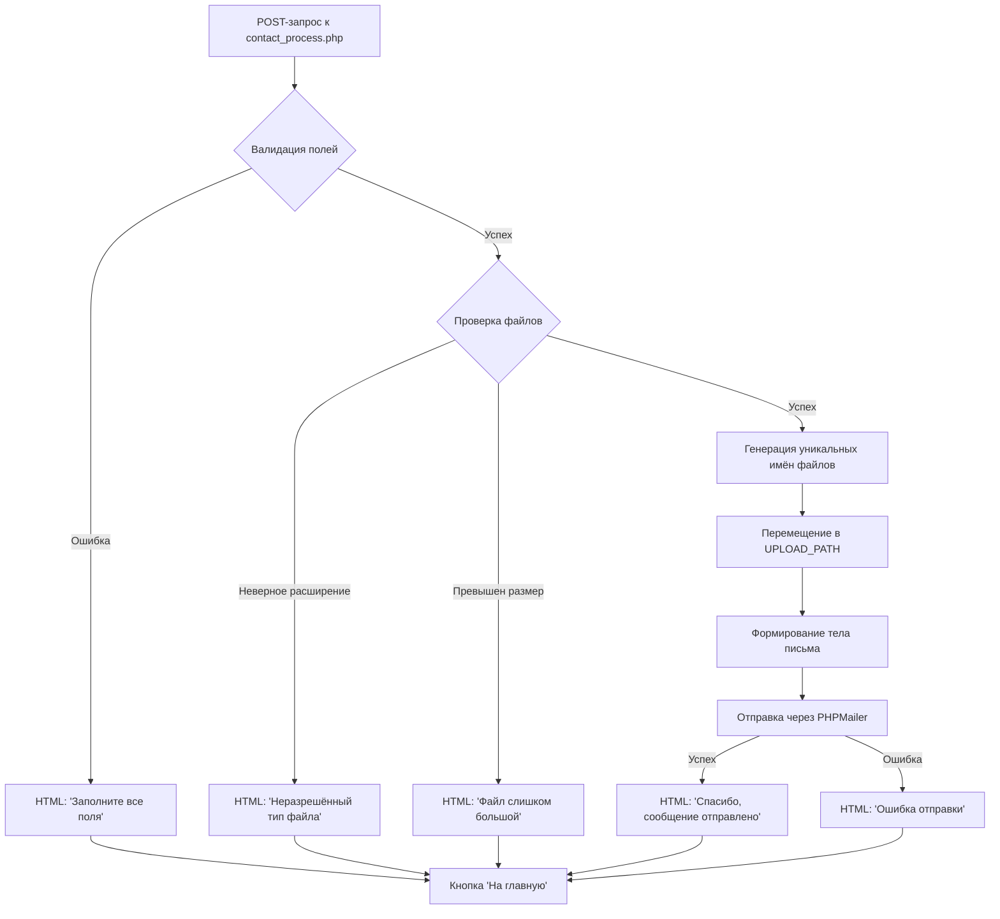

# 15. Система контактных форм

Данный документ описывает **автономный обработчик контактных форм** (`contact_process.php`), предназначенный для приёма и обработки запросов пользователей с веб-форм, включая валидацию данных, обработку вложений и отправку уведомлений через SMTP. Система функционирует **независимо от ядра DST Platform**, что делает её пригодной для статических страниц, лендингов и внешних интеграций без обязательной загрузки полной CMS-инфраструктуры.

> **Важно**: Это узкоспециализированный обработчик. Для полноценных форм с сохранением в БД, модерацией и интеграцией с ядром используйте компонент `forms` или `feedback`. Системные сервисы отправки почты описаны в разделе *«Службы электронной почты»*.

---

## 15.1. Архитектурные особенности и назначение

### Ключевые характеристики
| Аспект | Реализация | Преимущество |
|--------|------------|--------------|
| **Автономность** | Не требует `cmsCore`, `cmsModel`, `cmsTemplate` | Минимальные зависимости, быстрая загрузка |
| **Точка входа** | Единый файл `contact_process.php` | Простота развёртывания |
| **Формат ответа** | HTML-фрагмент (не JSON) | Прямая вставка в DOM при AJAX-отправке |
| **Хранение данных** | Не сохраняет в БД | Соответствие требованиям GDPR (если не требуется архивация) |
| **Локализация** | Жёстко закодированные русские строки | Простота для одноязычных проектов |

### Типичные сценарии использования
- Статические лендинги вне основного сайта
- Внешние рекламные кампании
- Простые контактные формы на поддоменах
- Интеграция с системами, не имеющими доступа к ядру CMS
- Быстрое развёртывание без настройки компонентов

### Ограничения
- ❌ Отсутствует логирование в БД
- ❌ Нет поддержки интернационализации
- ❌ Не интегрируется с системой событий (`cmsEventsManager`)
- ❌ Не использует шаблоны темы (`cmsTemplate`)
- ❌ Нет встроенной защиты от спама (CAPTCHA, рейт-лимиты)

---

## 15.2. Требования и зависимости

### Системные требования
| Требование | Версия | Примечание |
|------------|--------|------------|
| PHP | 7.0+ | Для совместимости с PHPMailer |
| Composer | Последняя | Управление зависимостями |
| Расширения | `fileinfo`, `mbstring` | Обработка файлов и строк |
| Веб-сервер | Apache/Nginx | Поддержка `.htaccess` или эквивалента |

### Зависимости Composer
```json
{
  "require": {
    "phpmailer/phpmailer": "^6.0"
  }
}
```
Установка:
```bash
composer require phpmailer/phpmailer
```

### Внешние сервисы
| Сервис | Параметр | Пример |
|--------|----------|--------|
| SMTP-сервер | `smtp.yandex.ru` | Порт 587, шифрование TLS |
| Учётная запись | `info@mysite.com` | Требуется пароль приложения |

---

## 15.3. Конфигурация параметров

Все настройки задаются в начале файла `contact_process.php` через константы:

```php
// Разрешённые расширения файлов (строго в нижнем регистре)
const ALLOWED_EXTENSIONS = [
    'jpg', 'jpeg', 'png', 'gif', 'bmp', 'webp', // Изображения
    'pdf', 'doc', 'docx', 'xls', 'xlsx', 'ppt', 'pptx', // Документы Office
    'txt', 'rtf' // Текстовые файлы
];

// Максимальный размер файла (64 МБ)
const MAX_FILE_SIZE = 67108864; // байт

// Адрес получателя писем
const SEND_EMAIL = 'info@mysite.com';

// Путь для сохранения загруженных файлов (относительно корня)
const UPLOAD_PATH = '../uploads/contact_forms/';
```

### Рекомендации по безопасности
| Параметр | Рекомендация | Причина |
|----------|--------------|---------|
| `SEND_EMAIL` | Использовать переменную окружения | Избегаем хранения в коде |
| `UPLOAD_PATH` | Расположить вне DOCUMENT_ROOT | Предотвращаем прямой доступ к файлам |
| `ALLOWED_EXTENSIONS` | Исключить `php`, `js`, `html` | Защита от выполнения кода |
| `MAX_FILE_SIZE` | Сверить с `upload_max_filesize` в `php.ini` | Избегаем конфликтов настроек |

**Пример безопасной настройки:**
```php
// Вместо жёсткого кодирования:
const SEND_EMAIL = getenv('CONTACT_FORM_EMAIL') ?: 'default@site.com';
const SMTP_PASSWORD = getenv('SMTP_APP_PASSWORD');
```

---

## 15.4. Жизненный цикл обработки запроса



Следующая диаграмма иллюстрирует полный жизненный цикл обработки запроса:

Диаграмма: Обработка запросов через форму обратной связи


---

## 15.5. Валидация и санитизация данных

### Обрабатываемые поля
| Поле | Источник | Обязательность | Санитизация |
|------|----------|----------------|-------------|
| `name` | `$_POST['name']` | Да | `strip_tags(htmlspecialchars(...))` |
| `email` | `$_POST['email']` | Да | `filter_var(..., FILTER_SANITIZE_EMAIL)` |
| `sub` | `$_POST['sub']` | Да | `strip_tags(htmlspecialchars(...))` (телефон) |
| `body` | `$_POST['body']` | Нет | `strip_tags(htmlspecialchars(...))` |

### Критически важное замечание по безопасности
В исходной реализации используется устаревший фильтр:
```php
// ❌ НЕ РЕКОМЕНДУЕТСЯ (устарел в PHP 8.1+)
filter_var($_POST['field'], FILTER_SANITIZE_STRING)
```

**Рекомендуемая замена:**
```php
// ✅ Современная санитизация
function sanitizeInput($value) {
    $value = trim($value);
    $value = htmlspecialchars($value, ENT_QUOTES, 'UTF-8');
    return strip_tags($value);
}

$name = sanitizeInput($_POST['name'] ?? '');
```

### Валидация email
```php
if (!filter_var($email, FILTER_VALIDATE_EMAIL)) {
    die('<center><h1>Некорректный email</h1></center>');
}
```

---

## 15.6. Обработка вложений

### Алгоритм обработки
1. **Проверка расширения**:
   ```php
   $ext = strtolower(pathinfo($fileName, PATHINFO_EXTENSION));
   if (!in_array($ext, ALLOWED_EXTENSIONS)) {
       $errors[] = "Файл {$fileName} имеет неразрешённый тип";
   }
   ```
2. **Проверка размера**:
   ```php
   if ($_FILES['attachment']['size'][$i] > MAX_FILE_SIZE) {
       $errors[] = "Файл {$fileName} превышает допустимый размер";
   }
   ```
3. **Генерация уникального имени**:
   ```php
   $uniqueName = 'contact_' . uniqid('', true) . '_' . time() . '.' . $ext;
   $targetPath = UPLOAD_PATH . $uniqueName;
   ```
4. **Перемещение файла**:
   ```php
   if (!move_uploaded_file($_FILES['attachment']['tmp_name'][$i], $targetPath)) {
       $errors[] = "Ошибка сохранения файла {$fileName}";
   }
   ```
   
Диаграмма: Проверка и обработка загружаемых файлов

   

### Рекомендации
- Создайте каталог `UPLOAD_PATH` с правами `755`
- Настройте `.htaccess` в каталоге загрузок:
  ```apache
  # Запрет выполнения скриптов
  <FilesMatch "\.(php|phtml|php3|php4|php5|php7|phps|cgi|pl|py)$">
      Require all denied
  </FilesMatch>
  # Разрешить только доступ к изображениям/документам
  <FilesMatch "\.(jpg|jpeg|png|pdf|docx)$">
      Require all granted
  </FilesMatch>
  ```

---

## 15.7. Настройка и отправка почты через PHPMailer

### Конфигурация SMTP
```php
use PHPMailer\PHPMailer\PHPMailer;
use PHPMailer\PHPMailer\SMTP;
use PHPMailer\PHPMailer\Exception;

$mail = new PHPMailer(true);
try {
    // Серверные настройки
    $mail->isSMTP();
    $mail->Host       = 'smtp.yandex.ru';
    $mail->SMTPAuth   = true;
    $mail->Username   = SEND_EMAIL; // Из конфигурации или .env
    $mail->Password   = SMTP_PASSWORD; // Пароль приложения!
    $mail->SMTPSecure = PHPMailer::ENCRYPTION_STARTTLS;
    $mail->Port       = 587;
    
    // Кодировка
    $mail->CharSet = 'UTF-8';
    
    // Получатели
    $mail->setFrom(SEND_EMAIL, 'Контактная форма сайта');
    $mail->addAddress(SEND_EMAIL); // Получатель
    
    // Содержимое письма
    $mail->isHTML(false); // Текстовое письмо для безопасности
    $mail->Subject = "Новое сообщение: {$subject}";
    $mail->Body    = $emailBody; // Сформированное тело
    
    // Прикрепление файлов
    foreach ($attachments as $path) {
        $mail->addAttachment($path);
    }
    
    $mail->send();
    // Успешная отправка → вывод сообщения
} catch (Exception $e) {
    // Обработка ошибки
    error_log("Ошибка отправки: {$mail->ErrorInfo}");
    die('<center><h1>Ошибка отправки</h1><h2>Попробуйте позже</h2></center>');
}
```

### Диаграмма: Интеграция PHPMailer


### Критически важные замечания
| Проблема | Риск | Решение |
|----------|------|---------|
| Жёстко закодированный пароль SMTP | Утечка учётных данных | Использовать переменные окружения |
| Отсутствие логирования ошибок | Сложность диагностики | Добавить `error_log()` |
| Нет проверки на спам | Злоупотребление формой | Интегрировать reCAPTCHA |
| Отправка без подтверждения | Подделка запросов | Добавить CSRF-токен |

---

## 15.8. Формат ответа и интеграция с фронтендом

### Структура успешного ответа
```html
<center>
  <h4>Спасибо, ваше сообщение отправлено<br>
  В ближайшее время мы обязательно свяжемся с Вами.</h4>
</center>
<div class="intro_buttons">
  <div class="dstbut">
    <a href="/" class="primary_btn"><span>На главную</span></a>
  </div>
</div>
```

### Пример AJAX-интеграции
```javascript
document.getElementById('contactForm').addEventListener('submit', function(e) {
    e.preventDefault();
    
    const formData = new FormData(this);
    
    fetch('/contact_process.php', {
        method: 'POST',
        body: formData
    })
    .then(response => response.text())
    .then(html => {
        document.getElementById('formContainer').innerHTML = html;
        // Дополнительно: очистка формы, скролл к сообщению
    })
    .catch(error => {
        console.error('Ошибка:', error);
        alert('Произошла ошибка при отправке. Попробуйте позже.');
    });
});
```

### Рекомендации по стилизации
- Обёртывайте ответ в контейнер с классом `.contact-form-response`
- Используйте CSS-переменные для цветов кнопок (согласование с темой)
- Добавьте плавную анимацию появления сообщения

---

## 15.9. Безопасность: критические улучшения

### Обязательные доработки для продакшена
1. **Хранение учётных данных**
   ```php
   // ❌ НЕ ДЕЛАТЬ:
   $mail->Password = 'demo_password_123';
   
   // ✅ РЕКОМЕНДУЕТСЯ:
   $mail->Password = getenv('SMTP_APP_PASSWORD');
   ```
   Используйте `.env`-файл (вне корня сайта) или переменные окружения сервера.

2. **Защита от CSRF**
   ```php
   // В форме:
   <input type="hidden" name="csrf_token" value="<?= $_SESSION['csrf_token'] ?>">
   
   // В обработчике:
   if ($_POST['csrf_token'] !== $_SESSION['csrf_token']) {
       die('Ошибка безопасности');
   }
   ```

3. **Ограничение частоты запросов**
   ```php
   // Простой рейт-лимит (5 запросов в минуту)
   $limitKey = 'contact_form_' . $_SERVER['REMOTE_ADDR'];
   $attempts = (int)($_SESSION[$limitKey] ?? 0);
   
   if ($attempts >= 5) {
       die('Слишком много попыток. Попробуйте через минуту.');
   }
   $_SESSION[$limitKey] = $attempts + 1;
   ```

4. **Логирование**
   ```php
   error_log("Contact form submitted: {$name} <{$email}>");
   ```

### Санитаризация входных данных

Все POST-запросы проходят проверку на соответствие единому шаблону:

```
strip_tags(filter_var($_POST['field'], FILTER_SANITIZE_STRING))
```

Такой подход:

1. Применяет фильтр PHP FILTER_SANITIZE_STRING для удаления/кодирования специальных символов.
2. Удаляет все HTML и PHP теги с помощью strip_tags()
3. Сбрасывает значения переменных, если после проверки они становятся пустыми строками.

Примечание: FILTER_SANITIZE_STRING в PHP 8.1 и выше эта опция устарела и должна быть заменена на htmlspecialchars()или аналогичный вариант.

### Безопасность загрузки файлов

Загрузка файлов защищена следующими способами:

1. Список разрешенных расширений: принимаются только явно указанные типы файлов.
2. Ограничение по размеру: файлы размером более 64 МБ отклоняются.
3. Рандомизация имен файлов: исходные имена файлов заменяются, uniqid() чтобы предотвратить:
- Атаки с использованием обхода каталогов
- Конфликты имен файлов
- Выполнение загруженных скриптов (хотя проверка расширений обеспечивает основную защиту).

### Учетные данные SMTP

Проблема безопасности: учетные данные SMTP жестко закодированы в скрипте:

```
$mail->Username = 'info@mysite.com';
```

Рекомендация: Эти параметры следует переместить в переменные среды или в защищенный конфигурационный файл вне корневого каталога веб-сервера.

---

## 15.10. Сравнение с встроенными решениями платформы

| Критерий | Автономный обработчик | Компонент `forms` / `feedback` |
|----------|------------------------|-------------------------------|
| Зависимости | Только PHPMailer | Полное ядро DST Platform |
| Сохранение в БД | Нет | Да |
| Модерация | Нет | Да |
| Шаблоны | Жёстко закодированы | Настраиваемые через тему |
| События | Нет | Поддержка хуков |
| Локализация | Нет | Поддержка через `LANG` |
| Защита от спама | Требует ручной настройки | Встроенная (reCAPTCHA) |
| Использование | Статические страницы, внешние интеграции | Внутри основного сайта на DST Platform |

**Рекомендация**: Используйте автономный обработчик только для изолированных сценариев. Для форм внутри основного сайта — компонент `forms`.

---

## 15.11. Диагностика и устранение неполадок

| Симптом | Возможная причина | Решение |
|---------|-------------------|---------|
| «Файл имеет неразрешённый тип» | Расширение в верхнем регистре | Приводить к нижнему регистру перед проверкой |
| «Ошибка отправки» | Неверные учётные данные SMTP | Проверить пароль приложения в Яндексе |
| Файлы не сохраняются | Нет прав на запись в `UPLOAD_PATH` | `chmod 755 uploads/contact_forms/` |
| Письма в спаме | Отсутствует SPF/DKIM | Настроить DNS-записи для домена |
| Пустые поля в письме | Некорректная санитизация | Проверить обработку `htmlspecialchars` |

### Включение отладки PHPMailer (временно!)
```php
$mail->SMTPDebug = SMTP::DEBUG_SERVER; // Вывод в браузер
// ИЛИ
$mail->Debugoutput = function($str, $level) {
    error_log("PHPMailer [{$level}]: {$str}");
};
```

---

## 15.12. Заключение

Система контактных форм представляет собой **лёгкий, автономный обработчик** для базовых сценариев приёма сообщений от пользователей. Её ключевые преимущества — минимальные зависимости и простота развёртывания. Однако для использования в продакшен-среде **требуются критические доработки**:

✅ **Обязательно внедрить**:
- Хранение учётных данных в переменных окружения
- Современную санитизацию (без `FILTER_SANITIZE_STRING`)
- CSRF-защиту и рейт-лимиты
- Логирование операций
- Проверку на спам (reCAPTCHA)

❌ **Не рекомендуется**:
- Использовать в проектах с требованиями к аудиту и хранению данных
- Применять без дополнительной защиты на публичных сайтах
- Хранить пароли SMTP в коде

Для интеграции с основным сайтом на DST Platform предпочтительнее использовать **компонент `forms`**, который обеспечивает:
- Сохранение в БД
- Модерацию
- Поддержку событий
- Полноценную локализацию
- Встроенную защиту от спама
- Интеграцию с системой уведомлений

Данное решение оправдано только для изолированных сценариев, где требуется минимальная функциональность без зависимости от ядра платформы.
