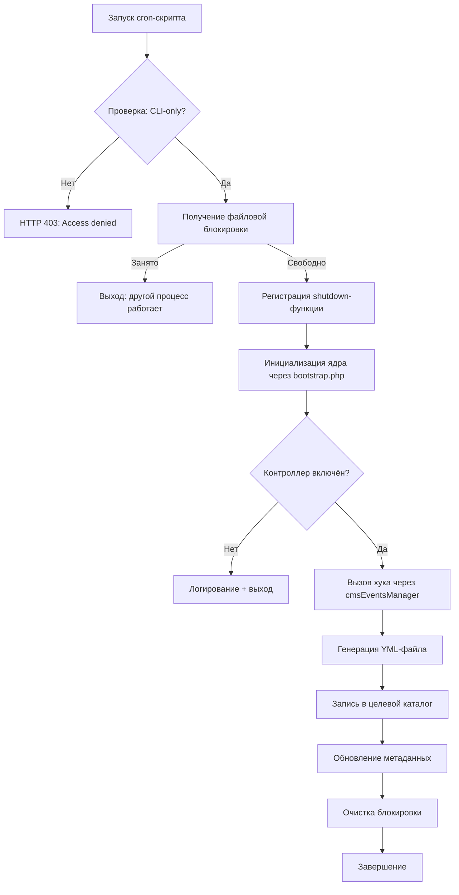

# 20. Генерация YML-канала

Данный документ описывает систему автоматической генерации товарных фидов в формате **YML (Yandex Market Language)** — XML-стандарте, используемом Яндекс.Маркет и совместимыми маркетплейсами. Платформа DST реализует два независимых механизма генерации, каждый из которых обслуживает отдельные бизнес-сценарии и требования внешних площадок.

> **Примечание**: YML (Yandex Market Language) — это спецификация XML для обмена данными о товарах. Подробнее: [официальная документация Яндекс.Маркет](https://yandex.ru/support/marketplace/export/feed-xml.html).  
> Для общей архитектуры планировщика Cron см. раздел *«Архитектура планировщика Cron»*.  
> Для полного описания интеграции с Яндекс.Маркет (включая сопоставление категорий, валидацию) см. раздел *«Компонент — Интеграция с Яндекс.Маркет»*.

---

## 20.1. Обзор архитектуры генерации

Платформа использует **два изолированных cron-скрипта**, каждый из которых генерирует отдельный YML-фид с уникальной бизнес-логикой:

| Скрипт | Целевой контроллер | Назначение | Особенности |
|--------|-------------------|------------|-------------|
| `cron_yml_create.php` | `shop` | Универсальный фид для внутреннего использования или интеграции с маркетплейсами (кроме Яндекс.Маркет) | Прямое использование внутренних категорий, базовая структура |
| `cron_yml_market_create.php` | `market` | Специализированный фид для Яндекс.Маркет | Сопоставление категорий с таксономией Яндекс.Маркет, расширенные поля (`param`, `barcode`), валидация по схеме |


### Зачем два отдельных механизма?
- **Разные требования**: Яндекс.Маркет требует строгого соответствия таксономии и расширенных полей, тогда как другие площадки могут использовать упрощённый формат.
- **Производительность**: Разделение предотвращает конфликты при одновременной генерации.
- **Гибкость**: Можно отключить экспорт в Яндекс.Маркет, сохранив универсальный фид.
- **Безопасность**: Ошибки в одном процессе не влияют на другой.

```
┌──────────────────────────────────────────────────────────────┐
│                   ЭКОСИСТЕМА ГЕНЕРАЦИИ YML                   │
├──────────────────────────────────────────────────────────────┤
│                                                              │
│  ┌────────────────────┐      ┌───────────────────┐           │
│  │ cron_yml_create.php│      │cron_yml_market_   │           │
│  │ (универсальный)    │      │create.php (Я.М.)  │           │
│  └─────────┬──────────┘      └─────────┬─────────┘           │
│            │                          │                      │
│  ┌─────────▼─────────┐      ┌─────────▼─────────┐            │
│  │ Файл блокировки:  │      │ Файл блокировки:  │            │
│  │ cron_lock_yml     │      │ cron_lock_market_ │            │
│  │                   │      │ yml               │            │
│  └─────────┬─────────┘      └─────────┬─────────┘            │
│            │                          │                      │
│  ┌─────────▼──────────────────────────▼─────────┐            │
│  │        cmsEventsManager::hook(...)           │            │
│  └─────────┬──────────────────────────┬─────────┘            │
│            │                          │                      │
│  ┌─────────▼─────────┐      ┌─────────▼─────────┐            │
│  │ shop::            │      │ market::          │            │
│  │ cron_yml_create_  │      │ cron_yml_market_  │            │
│  │ files()           │      │ create_files()    │            │
│  └─────────┬─────────┘      └─────────┬─────────┘            │
│            │                          │                      │
│  ┌─────────▼──────────────────────────▼─────────┐            │
│  │        exports/jobs/yml_category/            │            │
│  │        exports/jobs/yml_category_market/     │            │
│  └──────────────────────────────────────────────┘            │
└──────────────────────────────────────────────────────────────┘
```

---

## 20.2. Механизм блокировки файлов

Оба скрипта используют **файловую блокировку** для предотвращения параллельного запуска. Это критически важно, так как генерация YML — ресурсоёмкая операция, и одновременное выполнение может привести к повреждению файлов или несогласованности данных.

### Алгоритм блокировки
```php
// 1. Создание файла блокировки
$lock_file = cmsConfig::get('cache_path') . 'cron_lock_yml'; // или 'cron_lock_market_yml'
$lockfp = fopen($lock_file, 'w');

// 2. Попытка получения эксклюзивной неблокирующей блокировки
if (!$lockfp || !flock($lockfp, LOCK_EX | LOCK_NB)) {
    error_log('[YML] Another process is running. Exiting.');
    exit(0); // Тихий выход — ожидаемое поведение при конфликте
}

// 3. Гарантированная очистка при завершении (даже при ошибке)
register_shutdown_function(function() use ($lockfp, $lock_file) {
    if ($lockfp) {
        flock($lockfp, LOCK_UN); // Снятие блокировки
        fclose($lockfp);
        @unlink($lock_file);    // Удаление файла (оператор @ подавляет ошибку, если файл уже удалён)
    }
});
```

### Сравнение параметров блокировки
| Параметр | Универсальный генератор (`cron_yml_create.php`) | Генератор для Яндекс.Маркет (`cron_yml_market_create.php`) |
|----------|--------------------------------------------------|-------------------------------------------------------------|
| **Файл блокировки** | `{cache_path}/cron_lock_yml` | `{cache_path}/cron_lock_market_yml` |
| **Тип блокировки** | `LOCK_EX \| LOCK_NB` (эксклюзивная, неблокирующая) | `LOCK_EX \| LOCK_NB` |
| **Поведение при конфликте** | Немедленный выход с кодом 0 | Немедленный выход с кодом 0 |
| **Область действия** | Глобальная для сервера | Глобальная для сервера |


> **Почему файловая блокировка?**  
> - Простота реализации без внешних зависимостей  
> - Надёжность: работает даже при отсутствии Redis/Memcached  
> - Переносимость: не зависит от ОС (в отличие от семафоров)  
> - Автоматическая очистка при аварийном завершении через `register_shutdown_function`

---

## 20.3. Последовательность выполнения (единая для обоих скриптов)

Скрипт генератора YML-файлов для маркетплейса (cron_yml_create.php) генерирует товарные фиды из основного каталога маркетплейса.

### Структура сценария


Оба скрипта следуют идентичному жизненному циклу:



### Детализация этапов
1. **Проверка CLI-only**  
   ```php
   if (PHP_SAPI !== 'cli') {
       http_response_code(403);
       exit('Access denied. CLI only.');
   }
   ```
   *Зачем*: Предотвращает запуск через HTTP (риск таймаутов, утечки данных).

2. **Получение блокировки**  
   Как описано в разделе 20.2.

3. **Инициализация ядра**  
   Подключение `bootstrap.php` обеспечивает:
   - Подключение к БД через `cmsCore`
   - Доступ к конфигурации через `cmsConfig`
   - Инициализацию системы событий

4. **Проверка состояния контроллера**  
   ```php
   $controller = cmsCore::getController('shop'); // или 'market'
   if (!$controller || !$controller->isEnabled()) {
       error_log('[YML] Controller is disabled. Exiting.');
       exit(0);
   }
   ```
   *Зачем*: Избегает ошибок при отключённом компоненте.

5. **Выполнение хука**  
   ```php
   $result = cmsEventsManager::hook('cron_yml_create_files'); // или 'cron_yml_market_create_files'
   if ($result === false) {
       throw new Exception('Hook returned false');
   }
   ```

---

## 20.4. Делегирование бизнес-логики через хуки

Оба скрипта генерации YML делегируют всю бизнес-логику обработчикам контроллера, обеспечивая разделение между оркестрацией (скрипты cron) и реализацией (методы контроллера).


Вся логика генерации вынесена в методы-хуки контроллеров. Это обеспечивает:
- **Разделение ответственности**: оркестрация (cron-скрипт) vs реализация (контроллер)
- **Тестируемость**: хуки можно тестировать изолированно
- **Расширяемость**: новые форматы — через новые хуки

### Соглашение об именовании
| Скрипт | Хук | Метод в контроллере |
|--------|-----|---------------------|
| `cron_yml_create.php` | `cron_yml_create_files` | `shop::hookCronYmlCreateFiles()` |
| `cron_yml_market_create.php` | `cron_yml_market_create_files` | `market::hookCronYmlMarketCreateFiles()` |

### Пример реализации хука (упрощённый)
```php
// /system/controllers/shop/hooks.php
class shop {
    public function hookCronYmlCreateFiles() {
        try {
            // 1. Получение товаров с фильтрацией
            $products = $this->model->getProductsForYmlFeed([
                'is_published' => 1,
                'in_stock' => true
            ]);
            
            // 2. Формирование XML-документа
            $xml = new SimpleXMLElement('<?xml version="1.0" encoding="UTF-8"?><yml_catalog></yml_catalog>');
            $xml->addAttribute('date', date('Y-m-d H:i'));
            
            // Добавление секций: магазин, валюты, категории, предложения
            $this->buildShopInfo($xml);
            $this->buildCurrencies($xml);
            $this->buildCategories($xml, $products);
            $this->buildOffers($xml, $products);
            
            // 3. Сохранение в файл
            $output_path = PATH . '/exports/jobs/yml_category/shop_feed_' . date('Y-m-d_H-i-s') . '.yml';
            $xml->asXML($output_path);
            
            // 4. Создание символической ссылки на актуальный фид
            $latest_path = PATH . '/exports/jobs/yml_category/shop_feed_latest.yml';
            if (file_exists($latest_path)) {
                unlink($latest_path);
            }
            symlink(basename($output_path), $latest_path);
            
            // 5. Логирование
            error_log(sprintf(
                '[YML] Generated feed: %d products, size: %.2f MB',
                count($products),
                filesize($output_path) / 1024 / 1024
            ));
            
            return true;
        } catch (Exception $e) {
            error_log('[YML] Generation failed: ' . $e->getMessage());
            return false;
        }
    }
}
```

---

## 20.5. Обработка ошибок и граничные случаи

### Ключевые сценарии и обработка
| Сценарий | Поведение | Рекомендация |
|----------|-----------|--------------|
| **Контроллер отключён** | Тихий выход с логированием | Проверять статус компонента в админке |
| **Файл блокировки занят** | Немедленный выход (код 0) | Мониторить длительность блокировки (>10 мин — аномалия) |
| **Пустой фид** | Файл создаётся, но без `<offer>` | Добавить валидацию: если товаров < 10 — логировать как ошибку |
| **Ошибка генерации XML** | Исключение → возврат `false` | Настроить алерт при возврате `false` |
| **Недостаточно прав на запись** | `fopen()` вернёт `false` | Проверять права на `exports/jobs/` перед запуском |

### Рекомендуемое логирование
```php
// В начале хука
$start = microtime(true);
error_log('[YML] Starting feed generation at ' . date('Y-m-d H:i:s'));

// При завершении
$duration = round(microtime(true) - $start, 2);
error_log(sprintf(
    '[YML] Completed: %d products in %.2f sec. File: %s',
    $product_count,
    $duration,
    basename($output_path)
));
```

### Очистка файлов блокировки

Функция выключения обеспечивает очистку блокировки, даже если:

- Скрипт завершается с ошибкой.
- В процессе выполнения возникает исключение.
- Процесс получает сигнал завершения.

Оператор @ подавления ошибок unlink() предотвращает ошибки, если файл уже был удален.

### Предотвращение одновременного выполнения

Неблокирующая блокировка (LOCK_NB флаг) обеспечивает:

- Отсутствие ожидания или очереди на повторные выполнения.
- Немедленное завершение работы, если запущен другой экземпляр.
- Отсутствие конкуренции за ресурсы или условий гонки


---

## 20.6. Настройка расписания в crontab

Скрипты для генерации YML-лент предназначены для периодического выполнения с помощью системного cron. 

### Рекомендуемые интервалы
| Тип фида | Интервал | Обоснование |
|----------|----------|-------------|
| Универсальный (`cron_yml_create.php`) | Каждые 1–2 часа | Баланс между актуальностью и нагрузкой |
| Для Яндекс.Маркет (`cron_yml_market_create.php`) | Каждые 2–4 часа | Требования площадки + время на валидацию |

### Примеры записей crontab
```bash
# Универсальный фид: каждый час в 15 минут
15 * * * * cd /var/www/site && /usr/bin/php cron_yml_create.php >> /var/log/dst_yml_shop.log 2>&1

# Фид для Яндекс.Маркет: каждые 4 часа в ночное время
0 2,6,10,14,18,22 * * * cd /var/www/site && /usr/bin/php cron_yml_market_create.php >> /var/log/dst_yml_market.log 2>&1
```

### Критически важные параметры
- **Полные пути**: Указывайте абсолютный путь к `php` и рабочей директории
- **Логирование**: Перенаправляйте вывод в отдельные файлы для каждого фида
- **Переменные окружения**: При необходимости задавайте `DOCUMENT_ROOT`
- **Права**: Убедитесь, что пользователь cron имеет права на запись в `cache/` и `exports/jobs/`

### Требования к выполнению

1. Доступ к командной строке PHP: скрипты должны быть исполняемыми из командной строки.
2. Права на запись: Процесс должен иметь права на запись в следующие области:
- Каталог кэша (для файлов блокировки)
- Выходной каталог (для YML-файлов)
3. Доступ к базе данных: Требуется полное подключение к базе данных.
4. Доступность контроллеров: Целевые контроллеры должны быть включены.

---

## 20.7. Интеграция с компонентами платформы

### Взаимодействие с универсальным планировщиком

В то время как универсальный планировщик может выполнять обработчики контроллеров, генерация YML-ленты использует специальные скрипты для:

- Приоритетная изоляция: для генерации потока данных выделяется отдельный слот для выполнения.
- Независимое планирование: отдельные расписания cron для разных потоков данных.
- Управление ресурсами: выделенные файлы блокировки предотвращают конфликты.
- Упрощенный мониторинг: отдельные процессы для отдельных видов мониторинга.

### Взаимодействие с компонентом `shop`
```
cron_yml_create.php
    ↓
cmsCore::getController('shop')
    ↓
shop::hookCronYmlCreateFiles()
    ↓
modelShop::getProductsForYmlFeed()
    ↓
Запрос к таблицам: 
  - shop_products
  - shop_categories
  - shop_product_images
```
- Использует **прямые данные** из каталога маркетплейса
- Не требует сопоставления категорий
- Подходит для интеграции с площадками, принимающими упрощённый формат

### Взаимодействие с компонентом `market`
```
cron_yml_market_create.php
    ↓
cmsCore::getController('market')
    ↓
market::hookCronYmlMarketCreateFiles()
    ↓
modelMarket::getProductsForMarketFeed()
    ↓
Запрос к таблицам:
  - shop_products (через JOIN)
  - market_category_mappings (сопоставление категорий)
```
- Выполняет **преобразование данных** под требования Яндекс.Маркет
- Применяет фильтры: только сопоставленные категории, валидные цены
- Генерирует расширенные поля: `param`, `barcode`, `cpa`

---

## 20.8. Структура выходных каталогов

```
exports/jobs/
├── yml_category/                      # Универсальные фиды (от компонента shop)
│   ├── shop_feed_latest.yml          # Символическая ссылка на актуальный фид
│   ├── shop_feed_20260202_141500.yml # Архивная копия с временной меткой
│   ├── shop_feed_20260202_131500.yml
│   └── .last_generation               # Метаданные: timestamp, кол-во товаров
│
└── yml_category_market/               # Фиды для Яндекс.Маркет (от компонента market)
    ├── market_feed_latest.yml
    ├── market_feed_20260202_140000.yml
    ├── market_categories.xml          # Справочник сопоставленных категорий
    └── .last_generation
```

### Рекомендации по защите каталогов
Добавьте в `.htaccess` корневого каталога экспорта:
```apache
# Запрет доступа ко всем файлам, кроме .yml
<FilesMatch "^\.(.*)$">
    Require all denied
</FilesMatch>

# Разрешить доступ только к YML-фидам
<Files "*.yml">
    Require all granted
</Files>

# Опционально: ограничить доступ по IP
<RequireAll>
    Require ip 77.88.0.0/18      # Яндекс.Маркет
    Require ip 195.216.128.0/18  # Яндекс
</RequireAll>
```

---

## 20.9. Диагностика и устранение неполадок

### Типичные проблемы и решения
| Проблема | Симптом | Решение |
|----------|---------|---------|
| **Фид не генерируется** | Нет записей в логе | Проверить crontab, права на скрипт, логи системного cron |
| **Пустой фид** | Файл создан, но без `<offer>` | Проверить фильтры в `getProductsForYmlFeed()`, сопоставление категорий |
| **Ошибка валидации Яндекс.Маркет** | Отклонение фида площадкой | Проверить обязательные поля: `url`, `price`, `currencyId`, `categoryId` |
| **Зависший процесс** | Файл блокировки существует > 30 мин | Удалить вручную: `rm cache/cron_lock_*.yml`, проверить логи |
| **Некорректные пути к изображениям** | Ссылки в фиде ведут на 404 | Проверить `cmsConfig::get('host')`, настройки SSL |

### Команды для диагностики
```bash
# Проверка блокировок
ls -la cache/cron_lock_*.yml

# Просмотр последних записей в логе
tail -100 /var/log/dst_yml_*.log

# Валидация XML (требуется xmllint)
xmllint --noout exports/jobs/yml_category_market/market_feed_latest.yml

# Проверка доступности фида через HTTP
curl -I https://example.com/exports/jobs/yml_category_market/market_feed_latest.yml
```

---

## 20.10. Заключение

Система генерации YML-каналов в DST Platform обеспечивает:
- **Надёжность**: файловая блокировка предотвращает конфликты
- **Гибкость**: два независимых механизма под разные сценарии
- **Расширяемость**: бизнес-логика вынесена в хуки контроллеров
- **Мониторинг**: детальное логирование и метаданные
- **Безопасность**: CLI-only выполнение, защита выходных каталогов

**Рекомендации по внедрению**:
1. Начните с тестовой генерации и валидации через [официальный валидатор Яндекс.Маркет](https://partner.market.yandex.ru/validator/)
2. Настройте мониторинг логов и алерты при ошибках
3. Для Яндекс.Маркет используйте компонент `market` — он обеспечивает корректное сопоставление категорий
4. Регулярно проверяйте актуальность фида и соответствие требованиям площадки
5. Документируйте структуру фида для команды, отвечающей за интеграции

Для углублённого изучения:
- *«Компонент — Интеграция с Яндекс.Маркет»* — детали сопоставления категорий и валидации
- *«Архитектура планировщика Cron»* — общая схема автоматизации
- *«Компонент — Маркетплейс и электронная коммерция»* — источник данных для экспорта
