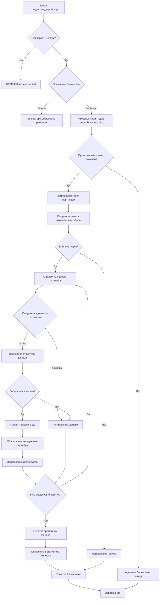

# 21. Импорт данных продавцов

Данный документ описывает систему автоматизированного импорта данных о партнёрах и поставщиках в компонент `partner` DST Platform. Система предназначена для периодической синхронизации внешних источников данных (прайс-листы, системы учёта, ERP) с внутренней базой данных маркетплейса без прямого доступа к БД.

> **Важно**: Данный документ описывает систему импорта данных партнёров через специализированный cron-скрипт. Для экспорта данных о товарах см. раздел *«Задания экспорта продукции»*. Для генерации фидов маркетплейсов (формат YML) см. раздел *«Генерация фидов для маркетплейсов»*. Общую архитектуру планировщика Cron см. в разделе *«Архитектура планировщика Cron»*.

---

## 21.1. Обзор системы

Система импорта данных партнёров реализована в виде специализированного cron-скрипта, работающего независимо от универсального планировщика задач (`cron.php`). Она преобразует данные из внешних источников (файлы, API, FTP) в структуру БД компонента `partner`, обеспечивая автоматическую синхронизацию каталогов товаров, остатков и цен поставщиков.

### Ключевые характеристики

| Характеристика | Реализация |
|----------------|------------|
| **Точка входа** | `cron_partner_import.php` |
| **Контроллер** | `partner` |
| **Название хука** | `cron_partner_import_job` |
| **Файл блокировки** | `{cache_path}/cron_partner_import_lock` |
| **Модель параллелизма** | Неблокирующая блокировка файла (предотвращает повторные запуски) |
| **Требования к окружению** | Только командная строка (HTTP-доступ запрещён) |
| **Источники данных** | Файлы (XLSX/CSV), FTP/SFTP, REST API, SOAP |
| **Типичная частота** | Каждые 15-60 минут |

### Типичные сценарии использования

| Сценарий | Описание | Частота |
|----------|----------|---------|
| **Синхронизация прайс-листов** | Импорт обновлённых цен и остатков от поставщиков | Каждые 15-30 минут |
| **Первоначальная загрузка** | Массовый импорт каталога нового партнёра | Однократно |
| **Обновление остатков** | Синхронизация текущих остатков на складе | Каждые 5-15 минут |
| **Интеграция с 1С/ERP** | Автоматическая синхронизация с системами учёта | Каждый час |

---

## 21.2. Архитектура системы

### Диаграмма архитектуры

```
┌─────────────────────────────────────────────────────────────┐
│              СИСТЕМА ИМПОРТА ДАННЫХ ПАРТНЁРОВ               │
├─────────────────────────────────────────────────────────────┤
│                                                             │
│  ┌──────────────────────┐     ┌─────────────────────────┐   │
│  │ Системный Cron (OS)  │     │  Административный       │   │
│  │ (crontab)            │     │  интерфейс              │   │
│  └──────────┬───────────┘     └───────────┬─────────────┘   │
│             │                             │                 │
│  ┌──────────▼────────────┐     ┌───────────▼─────────────┐  │
│  │cron_partner_import.php│     │  Компонент partner      │  │
│  │  (специализированный  │     │  (приёмник данных)      │  │
│  │   скрипт)             │     └───────────┬─────────────┘  │
│  └──────────┬────────────┘                 │                │
│             │                             │                 │
│  ┌──────────▼─────────────────────────────▼──────────────┐  │
│  │          Механизм блокировки (файловая)               │  │
│  │  • Файл: {cache_path}/cron_partner_import_lock        │  │
│  │  • Тип: LOCK_EX | LOCK_NB                             │  │
│  │  • Поведение: немедленный выход при конфликте         │  │
│  └──────────┬─────────────────────────────┬──────────────┘  │
│             │                             │                 │
│  ┌──────────▼───────────┐     ┌───────────▼─────────────┐   │
│  │  Инициализация ядра  │     │  Загрузка контроллера   │   │
│  │  (bootstrap.php)     │     │  через cmsCore          │   │
│  └──────────┬───────────┘     └───────────┬─────────────┘   │
│             │                             │                 │
│             └───────────────┬─────────────┘                 │
│                             ▼                               │
│              ┌──────────────────────────────┐               │
│              │  Выполнение хука через       │               │
│              │  cmsEventsManager::hook()    │               │
│              └───────────────┬──────────────┘               │
│                              │                              │
│              ┌───────────────▼──────────────┐               │
│              │  Бизнес-логика в контроллере │               │
│              │  (cron_partner_import_job)   │               │
│              └───────────────┬──────────────┘               │
│                              │                              │
│              ┌───────────────▼──────────────┐               │
│              │  Подключение к источникам    │               │
│              │  (FTP, API, файлы)           │               │
│              └───────────────┬──────────────┘               │
│                              │                              │
│              ┌───────────────▼──────────────┐               │
│              │  Валидация и преобразование  │               │
│              │  данных                      │               │
│              └───────────────┬──────────────┘               │
│                              │                              │
│              ┌───────────────▼──────────────┐               │
│              │  Обновление БД (товары,      │               │
│              │  остатки, цены)              │               │
│              └──────────────────────────────┘               │
└─────────────────────────────────────────────────────────────┘
```

### Ключевые компоненты

| Компонент | Тип | Назначение |
|-----------|-----|------------|
| **`cron_partner_import.php`** | CLI-скрипт | Точка входа для системного cron |
| **`cron_partner_import_lock`** | Файл блокировки | Предотвращение параллельного выполнения |
| **`partner`** | Контроллер | Приёмник данных, бизнес-логика |
| **`cron_partner_import_job`** | Хук | Основная логика импорта |
| **`Box Spout`** | Библиотека | Чтение табличных файлов (если требуется) |
| **`Guzzle`** | Библиотека | HTTP-запросы к внешним API |

### Диаграмма архитектуры


---

## 21.3. Последовательность выполнения

Процесс импорта данных о партнерах следует линейному алгоритму выполнения с четкими защитными условиями и управлением ресурсами.

Диаграмма последовательности выполнения


---

## 21.4. Механизм блокировки файлов

Система использует блокировку на основе файлов для предотвращения одновременного выполнения нескольких экземпляров скрипта импорта.

### Реализация блокировки

```php
#!/usr/bin/env php
<?php
/**
 * Автоматический импорт данных партнёров
 * Запускается по расписанию через системный cron
 */

// Определение корневого пути для CLI-окружения
if (!defined('PATH')) {
    define('PATH', dirname(__DIR__));
}

// Только для CLI (защита от HTTP-вызова)
if (PHP_SAPI !== 'cli') {
    http_response_code(403);
    exit('Access denied. CLI only.');
}

// Инициализация ядра
require_once PATH . '/bootstrap.php';

// Блокировка файла для предотвращения параллельного запуска
$lock_file = cmsConfig::get('cache_path') . 'cron_partner_import_lock';
$lockfp = fopen($lock_file, 'w');

if (!$lockfp || !flock($lockfp, LOCK_EX | LOCK_NB)) {
    error_log('[PARTNER IMPORT] Another process is running. Exiting.');
    exit(1);
}

// Гарантированная очистка блокировки при завершении
register_shutdown_function(function() use ($lockfp, $lock_file) {
    if ($lockfp) {
        flock($lockfp, LOCK_UN);
        fclose($lockfp);
        @unlink($lock_file);
    }
});

// ... остальная логика импорта ...
```

### Параметры блокировки

| Параметр | Значение | Обоснование |
|----------|----------|-------------|
| **Тип блокировки** | `LOCK_EX | LOCK_NB` | Эксклюзивная, неблокирующая |
| **Поведение при конфликте** | Немедленный выход с кодом 1 | Предотвращение накопления процессов |
| **Область действия** | Глобальная для сервера | Предотвращение конфликтов между cron-задачами |
| **Очистка** | Автоматическая через `register_shutdown_function` | Гарантия очистки даже при аварийном завершении |

### Жизненный цикл блокировки

```
1. Создание файла блокировки
↓
2. Попытка получения эксклюзивной блокировки
↓
3. Если блокировка получена → продолжение импорта
   Если блокировка занята → немедленный выход
↓
4. Выполнение бизнес-логики импорта
↓
5. Автоматическая очистка блокировки (гарантированно)
```

---

## 21.5. Интеграция контроллера

Скрипт делегирует всю бизнес-логику контроллеру маркетплейса с помощью паттерна "хуки":


Эта архитектура разделяет оркестровку (скрипт cron) и бизнес-логику (контроллер), что позволяет:

- Тестируемость: логику хуков можно вызывать непосредственно в тестах.
- Повторное использование: та же логика доступна из административного интерфейса или API.
- Поддерживаемость: изменения бизнес-логики не требуют модификации скриптов cron.
- Последовательность: Все операции импорта партнеров используют один и тот же путь выполнения кода.

---

## 21.6. Полный алгоритм выполнения



---

## 21.7. Бизнес-логика импорта

### Структура хука импорта

```php
// /system/controllers/partner/hooks.php
class partner {
    /**
     * Хук: автоматический импорт данных партнёров
     * Вызывается из cron_partner_import.php
     */
    public function hookCronPartnerImportJob() {
        $start_time = microtime(true);
        $import_stats = [
            'total_partners' => 0,
            'processed' => 0,
            'errors' => []
        ];

        try {
            // 1. Получение списка активных партнёров с настройками импорта
            $partners = $this->model->getPartnersWithImportSettings();
            $import_stats['total_partners'] = count($partners);

            if (empty($partners)) {
                error_log('[PARTNER IMPORT] No partners with import settings');
                return true;
            }

            error_log(sprintf(
                '[PARTNER IMPORT] Starting import for %d partners',
                count($partners)
            ));

            // 2. Обработка каждого партнёра
            foreach ($partners as $partner) {
                try {
                    $this->processPartnerImport($partner, $import_stats);
                } catch (\Exception $e) {
                    // Логирование ошибки, но продолжение обработки других партнёров
                    $error_msg = sprintf(
                        'Partner %d (%s): %s',
                        $partner['id'],
                        $partner['company_name'],
                        $e->getMessage()
                    );
                    error_log('[PARTNER IMPORT] ERROR: ' . $error_msg);
                    $import_stats['errors'][] = [
                        'partner_id' => $partner['id'],
                        'partner_name' => $partner['company_name'],
                        'error' => $e->getMessage()
                    ];
                }
            }

            // 3. Финальное логирование
            $duration = round(microtime(true) - $start_time, 2);
            error_log(sprintf(
                '[PARTNER IMPORT] Completed: %d/%d partners processed. Duration: %.2f sec. Errors: %d',
                $import_stats['processed'],
                $import_stats['total_partners'],
                $duration,
                count($import_stats['errors'])
            ));

            // 4. Отправка отчёта администратору при ошибках
            if (!empty($import_stats['errors'])) {
                $this->sendImportReport($import_stats);
            }

            return true;
        } catch (\Exception $e) {
            error_log('[PARTNER IMPORT] CRITICAL ERROR: ' . $e->getMessage());
            error_log($e->getTraceAsString());
            return false;
        }
    }

    /**
     * Обработка импорта для одного партнёра
     */
    private function processPartnerImport($partner, &$stats) {
        // 1. Получение данных из внешнего источника
        $import_data = $this->fetchPartnerData($partner);
        
        if (empty($import_data)) {
            throw new \Exception('No data received from source');
        }

        // 2. Валидация структуры данных
        $this->validateImportData($import_data);

        // 3. Импорт товаров
        $result = $this->model->importPartnerProducts(
            $partner['id'],
            $import_data['products']
        );

        // 4. Логирование результатов
        $this->model->logPartnerImport($partner['id'], [
            'status' => 'success',
            'imported' => $result['imported'],
            'updated' => $result['updated'],
            'skipped' => $result['skipped'],
            'errors' => $result['errors']
        ]);

        // 5. Запуск события для других компонентов
        cmsEventsManager::hook('partner_products_imported', [
            'partner_id' => $partner['id'],
            'import_result' => $result
        ]);

        $stats['processed']++;
        error_log(sprintf(
            '[PARTNER IMPORT] Partner %d: %d imported, %d updated, %d skipped',
            $partner['id'],
            $result['imported'],
            $result['updated'],
            $result['skipped']
        ));
    }

    /**
     * Получение данных из внешнего источника
     */
    private function fetchPartnerData($partner) {
        $source_type = $partner['import_source_type'];

        switch ($source_type) {
            case 'ftp':
                return $this->fetchFromFTP($partner);
            case 'api':
                return $this->fetchFromAPI($partner);
            case 'file':
                return $this->fetchFromFile($partner);
            case 'sftp':
                return $this->fetchFromSFTP($partner);
            default:
                throw new \Exception('Unsupported import source type: ' . $source_type);
        }
    }

    /**
     * Получение данных через FTP
     */
    private function fetchFromFTP($partner) {
        $ftp_server = $partner['ftp_host'];
        $ftp_user = $partner['ftp_user'];
        $ftp_pass = $partner['ftp_password'];
        $remote_file = $partner['ftp_path'];

        $conn = ftp_connect($ftp_server);
        if (!$conn) {
            throw new \Exception('Cannot connect to FTP server');
        }

        if (!ftp_login($conn, $ftp_user, $ftp_pass)) {
            ftp_close($conn);
            throw new \Exception('FTP login failed');
        }

        // Скачивание файла во временную директорию
        $local_file = PATH . '/cache/tmp/partner_' . $partner['id'] . '_' . time() . '.xlsx';
        if (!ftp_get($conn, $local_file, $remote_file, FTP_BINARY)) {
            ftp_close($conn);
            throw new \Exception('Failed to download file from FTP');
        }

        ftp_close($conn);

        // Чтение файла через Box Spout
        return $this->parseSpreadsheet($local_file);
    }

    /**
     * Получение данных через REST API
     */
    private function fetchFromAPI($partner) {
        $client = new \GuzzleHttp\Client();
        $response = $client->request('GET', $partner['api_url'], [
            'headers' => [
                'Authorization' => 'Bearer ' . $partner['api_token'],
                'Accept' => 'application/json'
            ],
            'timeout' => 30
        ]);

        if ($response->getStatusCode() !== 200) {
            throw new \Exception('API returned status: ' . $response->getStatusCode());
        }

        $data = json_decode($response->getBody(), true);
        if (json_last_error() !== JSON_ERROR_NONE) {
            throw new \Exception('Invalid JSON response');
        }

        return $data;
    }

    /**
     * Парсинг табличного файла
     */
    private function parseSpreadsheet($file_path) {
        $extension = pathinfo($file_path, PATHINFO_EXTENSION);
        
        if (!in_array($extension, ['xlsx', 'xls', 'csv', 'ods'])) {
            throw new \Exception('Unsupported file format: ' . $extension);
        }

        $reader = \Box\Spout\Reader\Common\Creator\ReaderFactory::create(
            strtoupper($extension)
        );
        
        $reader->open($file_path);
        $products = [];

        foreach ($reader->getSheetIterator() as $sheet) {
            foreach ($sheet->getRowIterator() as $row_index => $row) {
                // Пропускаем заголовок
                if ($row_index === 1) {
                    continue;
                }

                // Ожидаемая структура: [SKU, Название, Цена, Остаток, Категория]
                $products[] = [
                    'sku' => $row[0],
                    'title' => $row[1],
                    'price' => (float)$row[2],
                    'quantity' => (int)$row[3],
                    'category' => $row[4] ?? null
                ];
            }
        }

        $reader->close();
        unlink($file_path); // Удаление временного файла

        return ['products' => $products];
    }

    /**
     * Валидация структуры импортируемых данных
     */
    private function validateImportData($data) {
        if (!isset($data['products']) || !is_array($data['products'])) {
            throw new \Exception('Invalid data structure: missing "products" array');
        }

        foreach ($data['products'] as $index => $product) {
            // Обязательные поля
            if (empty($product['sku'])) {
                throw new \Exception(sprintf(
                    'Product #%d missing required field: sku',
                    $index
                ));
            }

            if (!isset($product['price']) || $product['price'] <= 0) {
                throw new \Exception(sprintf(
                    'Product #%d has invalid price: %s',
                    $index,
                    $product['sku'] ?? 'unknown'
                ));
            }

            // Опциональная валидация
            if (isset($product['quantity']) && $product['quantity'] < 0) {
                throw new \Exception(sprintf(
                    'Product #%d has negative quantity',
                    $index
                ));
            }
        }

        return true;
    }

    /**
     * Отправка отчёта об ошибках импорта
     */
    private function sendImportReport($stats) {
        if (empty($stats['errors'])) {
            return;
        }

        $mailer = cmsMailer::getInstance();
        $mailer->setTo(cmsConfig::get('admin_email'));
        $mailer->setSubject('Отчёт об ошибках импорта данных партнёров');
        
        $body = "Обнаружены ошибки при импорте данных партнёров:\n\n";
        foreach ($stats['errors'] as $error) {
            $body .= sprintf(
                "Партнёр #%d (%s): %s\n",
                $error['partner_id'],
                $error['partner_name'],
                $error['error']
            );
        }
        
        $body .= sprintf(
            "\n\nВсего обработано: %d/%d партнёров\nОшибок: %d",
            $stats['processed'],
            $stats['total_partners'],
            count($stats['errors'])
        );

        $mailer->setBody($body);
        $mailer->send();
    }
}
```

---

## 21.8. Требования к окружению

### Системные требования

| Требование | Версия | Обязательность |
|------------|--------|----------------|
| **PHP** | 7.1+ | Обязательно |
| **CLI SAPI** | Любая | Обязательно |
| **Box Spout** | ^3.3 | Опционально (для файлов) |
| **Guzzle** | ~6.0 | Опционально (для API) |
| **phpseclib** | ~2.0 | Опционально (для SFTP) |
| **Права на запись** | 755 для каталогов | Обязательно |

### Зависимости Composer

```json
{
    "require": {
        "box/spout": "^3.3",
        "guzzlehttp/guzzle": "~6.0",
        "phpseclib/phpseclib": "~2.0"
    }
}
```

Установка:
```bash
composer require box/spout:^3.3 guzzlehttp/guzzle:~6.0 phpseclib/phpseclib:~2.0
```

### Права доступа к файловой системе

| Каталог/Файл | Права | Владелец | Назначение |
|--------------|-------|----------|------------|
| `cache/` | 755 | www-data | Хранение файлов блокировки и временных файлов |
| `cache/tmp/` | 775 | www-data | Временные файлы во время импорта |
| `cron_partner_import.php` | 755 | root | Исполняемый скрипт |

---

## 21.9. Конфигурация и планирование

### Настройка системного cron

Пример записи в crontab:

```bash
# Импорт данных партнёров каждые 15 минут
*/15 * * * * /usr/bin/php /var/www/site/cron_partner_import.php >> /var/log/dst_partner_import.log 2>&1

# Альтернатива с явным указанием переменных окружения
*/15 * * * * DOCUMENT_ROOT=/var/www/site PHP_MEMORY_LIMIT=512M /usr/bin/php /var/www/site/cron_partner_import.php >> /var/log/dst_partner_import.log 2>&1
```

### Рекомендации по планированию

| Фактор | Рекомендация | Обоснование |
|--------|--------------|-------------|
| **Частота** | Каждые 15-60 минут | Баланс между актуальностью и нагрузкой |
| **Время запуска** | Круглосуточно | Для поддержки глобальных партнёров |
| **Таймаут** | ≥ 300 секунд | Для обработки больших прайс-листов |
| **Логирование** | В отдельный файл | Упрощает отладку и мониторинг |
| **Уведомления** | Email при ошибках | Быстрое реагирование на сбои |

### Конфигурация партнёра

Каждый партнёр должен иметь настройки импорта в таблице `partner_vendors`:

| Поле | Тип | Описание | Пример |
|------|-----|----------|--------|
| `import_enabled` | TINYINT(1) | Включён ли импорт | 1 |
| `import_source_type` | ENUM | Тип источника | `ftp`, `api`, `file`, `sftp` |
| `ftp_host` | VARCHAR | Хост FTP-сервера | `ftp.partner.com` |
| `ftp_user` | VARCHAR | Логин FTP | `username` |
| `ftp_password` | VARCHAR | Пароль FTP | (хранится в зашифрованном виде) |
| `ftp_path` | VARCHAR | Путь к файлу | `/uploads/pricelist.xlsx` |
| `api_url` | VARCHAR | URL API | `https://api.partner.com/products` |
| `api_token` | VARCHAR | Токен авторизации | `abc123...` |
| `import_schedule` | VARCHAR | Расписание (опционально) | `*/30 * * * *` |

---

## 21.10. Форматы данных и источники

### Поддерживаемые источники

| Источник | Протокол | Аутентификация | Особенности |
|----------|----------|----------------|-------------|
| **FTP** | FTP | Логин/пароль | Простота настройки, небезопасно |
| **SFTP** | SSH | SSH-ключ/пароль | Безопасная передача файлов |
| **REST API** | HTTP/HTTPS | Bearer token, API key | Гибкость, поддержка фильтров |
| **Локальный файл** | Файловая система | — | Для тестирования, ручной загрузки |
| **SOAP** | HTTP/HTTPS | WS-Security | Для интеграции с 1С, SAP |

### Структура данных прайс-листа

#### Формат XLSX/CSV

| Колонка | Тип | Обязательность | Описание |
|---------|-----|----------------|----------|
| **SKU** | STRING | Да | Артикул/код товара |
| **Название** | STRING | Да | Название товара |
| **Цена** | DECIMAL | Да | Цена за единицу |
| **Остаток** | INT | Нет | Количество на складе |
| **Категория** | STRING | Нет | Название категории |
| **Описание** | TEXT | Нет | Описание товара |
| **Изображение** | STRING | Нет | URL изображения |
| **Атрибуты** | JSON | Нет | Дополнительные характеристики |

#### Формат JSON (для API)

```json
{
    "partner_id": 123,
    "timestamp": "2026-02-02T14:30:00Z",
    "products": [
        {
            "sku": "ABC-123",
            "title": "Смартфон XYZ Pro",
            "price": 19990.00,
            "quantity": 50,
            "category": "Смартфоны",
            "description": "Флагманский смартфон с 5 камерами",
            "image_url": "https://partner.com/images/phone.jpg",
            "attributes": {
                "color": "Чёрный",
                "memory": "256 ГБ",
                "warranty": "12 месяцев"
            }
        }
    ]
}
```

---

## 21.11. Мониторинг и диагностика

### Ключевые метрики для мониторинга

| Метрика | Пороговое значение | Действие при превышении |
|---------|-------------------|-------------------------|
| **Время выполнения** | > 300 секунд | Оптимизация запросов, чанкирование |
| **Количество ошибок** | > 5% от общего количества | Диагностика источника данных |
| **Размер импортируемых данных** | > 100 МБ | Разделение на чанки |
| **Частота сбоев подключения** | > 3 подряд | Проверка сетевых настроек |

### Инструменты диагностики

```bash
# Проверка блокировки
ls -la cache/cron_partner_import_lock

# Просмотр логов
tail -f /var/log/dst_partner_import.log

# Проверка процессов
ps aux | grep cron_partner_import

# Проверка последних импортов в БД
mysql -u user -p database -e "SELECT * FROM partner_import_logs ORDER BY created_at DESC LIMIT 10;"

# Тестовый запуск скрипта
php cron_partner_import.php 2>&1
```

### Типичные проблемы и решения

| Проблема | Симптом | Причина | Решение |
|----------|---------|---------|---------|
| **Зависший процесс** | Файл блокировки существует > 1 часа | Сбой в логике импорта | Удалить блокировку вручную |
| **Ошибка подключения к FTP** | `Cannot connect to FTP server` | Неверные учётные данные или хост | Проверить настройки партнёра |
| **Неверный формат файла** | `Unsupported file format` | Неподдерживаемое расширение | Конвертировать в XLSX/CSV |
| **Ошибка валидации** | `Product missing required field` | Отсутствуют обязательные поля | Исправить структуру прайс-листа |
| **Таймаут API** | `Operation timed out` | Медленный ответ сервера партнёра | Увеличить таймаут, проверить сеть |
| **Ошибка памяти** | `Allowed memory size exhausted` | Большой файл без чанкирования | Увеличить `memory_limit`, оптимизировать |

Скрипт реализует многоуровневую защиту от сбоев:


---

## 21.12. Безопасность

### Рекомендации по безопасности

| Рекомендация | Реализация | Обоснование |
|--------------|------------|-------------|
| **Хранение учётных данных** | Использовать переменные окружения или зашифрованное хранение | Предотвращение утечки в репозиторий |
| **Использование SFTP вместо FTP** | Настройка SSH-ключа для аутентификации | Шифрование передаваемых данных |
| **Валидация входных данных** | Санитизация через модель, проверка структуры | Предотвращение инъекций |
| **Логирование операций** | Запись в отдельный файл с детализацией | Аудит операций, диагностика |
| **Ограничение частоты запросов** | Настройка интервалов импорта | Предотвращение блокировки со стороны партнёра |

### Пример безопасного хранения учётных данных

```php
// Вместо хранения паролей в БД в открытом виде:
$partner['ftp_password'] = encryptPassword($raw_password);

// При использовании:
$decrypted_password = decryptPassword($partner['ftp_password']);

// Или использование переменных окружения:
$ftp_pass = getenv('PARTNER_' . $partner['id'] . '_FTP_PASSWORD');
```

### Защита от атак

- **Rate limiting**: Ограничение количества запросов к API партнёра
- **Валидация файлов**: Проверка расширений и содержимого перед обработкой
- **Изоляция ошибок**: Обработка исключений без раскрытия внутренних деталей
- **Логирование подозрительной активности**: Запись неудачных попыток подключения

---

## 21.13. Интеграция с другими системами

### Диаграмма интеграции

```
┌──────────────────────────────────────────────────────────────┐
│                   ЭКОСИСТЕМА ИМПОРТА                         │
├──────────────────────────────────────────────────────────────┤
│                                                              │
│  ┌────────────────┐     ┌───────────────┐     ┌────────────┐ │
│  │  1С:Предприятие│     │  Складская    │     │  Поставщик │ │
│  │  (внешняя)     │     │  система (ERP)│     │  (FTP/SFTP)│ │
│  └──────┬─────────┘     └──────┬────────┘     └─────┬──────┘ │
│         │                      │                    │        │
│         ▼                      ▼                    ▼        │
│  ┌──────────────────────────────────────────────────────┐    │
│  │          FTP/SFTP / REST API / SOAP                  │    │
│  │  • Получение прайс-листов                            │    │
│  │  • Синхронизация остатков                            │    │
│  └──────────────────────────────────────────────────────┘    │
│                            ▲                                 │
│                            │                                 │
│         ┌──────────────────┴──────────────────┐              │
│         ▼                                     ▼              │
│  ┌──────────────────────────────────────────────────────┐    │
│  │          Валидация и преобразование данных           │    │
│  │  • Проверка структуры                                │    │
│  │  • Санитизация                                       │    │
│  │  • Преобразование форматов                           │    │
│  └──────────────────────────────────────────────────────┘    │
│                            ▲                                 │
│                            │                                 │
│         ┌──────────────────┴──────────────────┐              │
│         ▼                                     ▼              │
│  ┌────────────────┐                     ┌──────────────┐     │
│  │ cron_partner_  │                     │  Компонент   │     │
│  │ import.php     │                     │   partner    │     │
│  └──────┬─────────┘                     └──────┬───────┘     │
│         │                                      │             │
│         ▼                                      ▼             │
│  ┌──────────────────────────────────────────────────────┐    │
│  │              Обновление базы данных                  │    │
│  │  • Вставка новых товаров                             │    │
│  │  • Обновление цен и остатков                         │    │
│  │  • Логирование операций                              │    │
│  └──────────────────────────────────────────────────────┘    │
│                            ▲                                 │
│                            │                                 │
│         ┌──────────────────┴──────────────────┐              │
│         ▼                                     ▼              │
│  ┌────────────────┐                     ┌──────────────┐     │
│  │   Компонент    │                     │   События    │     │
│  │     shop       │                     │   хуков      │     │
│  └────────────────┘                     └──────────────┘     │
└──────────────────────────────────────────────────────────────┘
```

### Точки интеграции

| Компонент | Тип интеграции | Описание |
|-----------|----------------|----------|
| **`shop`** | Общая БД | Импортированные товары доступны в каталоге |
| **`orders`** | События | Уведомление о новых товарах для заказов |
| **`notifications`** | События | Отправка уведомлений администратору об ошибках |
| **`search`** | События | Индексация импортированных товаров |
| **`market`** | Данные | Использование импортированных товаров для генерации фидов |

---

## 21.14. Лучшие практики

### ✅ Рекомендуется

| Практика | Обоснование |
|----------|-------------|
| **Чанкирование больших файлов** | Обработка по 1000 товаров за итерацию снижает нагрузку на память |
| **Детальное логирование** | Запись количества обработанных товаров, времени выполнения |
| **Обработка ошибок на уровне партнёра** | Продолжение импорта остальных партнёров при ошибке одного |
| **Тестирование перед деплоем** | Ручной запуск `php cron_partner_import.php` для проверки |
| **Настройка мониторинга** | Алерты при превышении пороговых значений |
| **Документирование форматов** | Описание структуры данных для каждого партнёра |

### ❌ Избегайте

| Анти-паттерн | Риск |
|--------------|------|
| **Жёсткое кодирование учётных данных** | Утечка секретов в репозиторий |
| **Отсутствие валидации данных** | Повреждение БД некорректными данными |
| **Игнорирование ошибок** | Невидимые сбои, потеря данных |
| **Частые запросы к одному партнёру** | Блокировка со стороны партнёра |
| **Отсутствие блокировки файлов** | Повреждение данных при параллельном запуске |
| **Хранение паролей в открытом виде** | Угроза безопасности |

### Пример безопасного импорта с чанкированием

```php
public function importPartnerProducts($partner_id, $products) {
    $chunk_size = 1000;
    $total_imported = 0;
    $total_updated = 0;
    $errors = [];

    foreach (array_chunk($products, $chunk_size) as $chunk) {
        foreach ($chunk as $product) {
            try {
                // Проверка существования товара по SKU
                $existing = $this->getProductBySKU($partner_id, $product['sku']);
                
                if ($existing) {
                    // Обновление существующего товара
                    $this->updateProduct($existing['id'], $product);
                    $total_updated++;
                } else {
                    // Создание нового товара
                    $this->createProduct($partner_id, $product);
                    $total_imported++;
                }
            } catch (\Exception $e) {
                $errors[] = [
                    'sku' => $product['sku'],
                    'error' => $e->getMessage()
                ];
                // Продолжаем импорт остальных товаров
            }
        }
        
        // Небольшая пауза между чанками
        usleep(50000); // 50 мс
    }

    return [
        'imported' => $total_imported,
        'updated' => $total_updated,
        'skipped' => count($errors),
        'errors' => $errors
    ];
}
```

---

## 21.15. Сравнение с другими системами импорта/экспорта

| Система | Назначение | Источник/Назначение | Частота | Особенности |
|---------|------------|---------------------|---------|-------------|
| **`cron_partner_import.php`** | Импорт данных партнёров | Внешние источники → БД | Каждые 15-60 мин | Поддержка FTP/API/SFTP, валидация |
| **`cron_export.php`** | Экспорт товаров | БД → XLSX/CSV | 1-4 раза в день | Потоковая обработка, оптимизация памяти |
| **`cron_yml_create.php`** | Генерация фида для магазина | БД → YML (XML) | Каждый час | Упрощённый формат, без сопоставления категорий |
| **`cron_yml_market_create.php`** | Генерация фида для Яндекс.Маркет | БД → YML (XML) | Каждые 2-4 часа | Сопоставление категорий, расширенные поля |

**Рекомендация**: Используйте `cron_partner_import.php` для автоматической синхронизации данных от поставщиков. Для экспорта данных используйте `cron_export.php` или специализированные скрипты генерации фидов.

---

## 21.16. Типичные сценарии использования

### Сценарий 1: Ежедневная синхронизация прайс-листов

**Описание**: Автоматическая загрузка обновлённых цен и остатков от ключевых поставщиков.

**Конфигурация**:
- Источник: FTP/SFTP
- Формат: XLSX
- Частота: Каждые 30 минут
- Валидация: Проверка обязательных полей, диапазона цен

**Логика**:
1. Подключение к FTP-серверу поставщика
2. Скачивание файла прайс-листа
3. Парсинг и валидация данных
4. Обновление цен и остатков в БД
5. Логирование результатов

### Сценарий 2: Интеграция с 1С:Предприятие

**Описание**: Синхронизация каталога товаров и остатков с системой учёта 1С.

**Конфигурация**:
- Источник: REST API (или SOAP)
- Формат: JSON
- Частота: Каждый час
- Аутентификация: Bearer token

**Логика**:
1. Вызов метода API для получения списка товаров
2. Фильтрация по категориям/поставщикам
3. Преобразование формата данных
4. Пакетное обновление в БД
5. Отправка уведомления при ошибках

### Сценарий 3: Массовый импорт нового партнёра

**Описание**: Первоначальная загрузка полного каталога нового поставщика.

**Конфигурация**:
- Источник: Локальный файл (загруженный вручную)
- Формат: CSV
- Частота: Однократно
- Особенности: Создание новых категорий, обработка изображений

**Логика**:
1. Загрузка файла через админку
2. Предварительная валидация структуры
3. Создание категорий (если отсутствуют)
4. Импорт товаров с изображениями
5. Генерация отчёта об импорте

---

## 21.17. Заключение

Система импорта данных партнёров представляет собой **надёжное, гибкое решение** для автоматизированной синхронизации внешних источников данных с внутренней базой маркетплейса. Ключевые особенности:

| Категория | Реализация |
|-----------|------------|
| **Архитектура** | Специализированный cron-скрипт с блокировкой файлов |
| **Гибкость** | Поддержка множества источников (FTP, API, файлы) |
| **Безопасность** | CLI-only выполнение, валидация данных, шифрование |
| **Надёжность** | Обработка ошибок на уровне партнёра, логирование |
| **Производительность** | Чанкирование больших объёмов данных |
| **Мониторинг** | Детальное логирование, алерты при ошибках |

**Рекомендации по внедрению**:

1. Начните с тестового импорта одного партнёра
2. Настройте детальное логирование и мониторинг
3. Определите оптимальную частоту импорта для каждого партнёра
4. Реализуйте механизм уведомлений при ошибках
5. Документируйте форматы данных для каждого источника

Для дальнейшего изучения:

- *«Архитектура планировщика Cron»* — общая архитектура автоматизации
- *«Задания экспорта продукции»* — обратная операция синхронизации
- *«Компонент — Партнёрская система»* — управление партнёрами и поставщиками
- *«Компонент — Маркетплейс и электронная коммерция»* — источник данных для импорта
