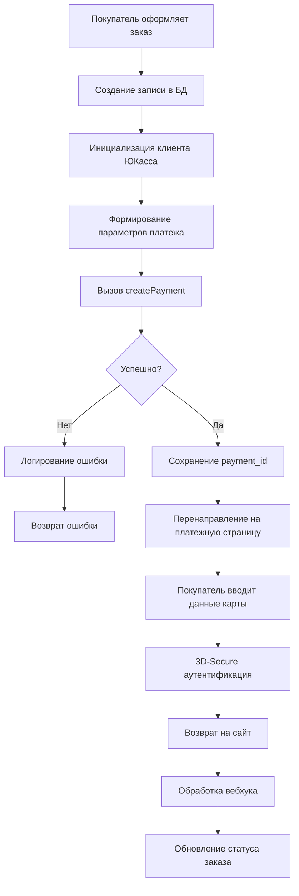

# 24. Интеграция платежного шлюза

Данный документ содержит исчерпывающую техническую спецификацию интеграции платежного шлюза **ЮКасса** (ранее Яндекс.Касса) в платформу DST Platform. Интеграция реализована через официальный PHP SDK, обеспечивая безопасную обработку платежей, поддержку множества способов оплаты и соответствие требованиям законодательства.

> **Важно**: Данный документ описывает технические аспекты интеграции платежного шлюза. Для получения информации о компоненте `payment` и его взаимодействии с маркетплейсом см. раздел *«Компонент — Маркетплейс и электронная коммерция»*. Общую архитектуру внешних интеграций см. в разделе *«Внешняя интеграция»*.

---

## 24.1. Обзор системы

### Назначение и функциональность

Платформа DST интегрируется с **ЮКасса** — платежным агрегатором, предоставляющим единый интерфейс для приема платежей от множества платежных систем. Интеграция обеспечивает:

| Функция | Описание | Статус |
|---------|----------|--------|
| **Создание платежей** | Инициация транзакций с поддержкой 3D-Secure | ✅ Реализовано |
| **Обработка вебхуков** | Автоматическое обновление статуса платежей | ✅ Реализовано |
| **Возврат средств** | Частичные и полные возвраты | ✅ Реализовано |
| **Формирование чеков** | Соответствие 54-ФЗ (фискализация) | ✅ Реализовано |
| **Поддержка способов оплаты** | Банковские карты, электронные кошельки, мобильные платежи | ✅ Реализовано |
| **Идемпотентность** | Защита от дублирующих транзакций | ✅ Реализовано |

### Архитектурные принципы

Интеграция ЮКасса следует ключевым архитектурным принципам платформы:

| Принцип | Реализация | Преимущество |
|---------|------------|--------------|
| **Слабая связанность** | Интеграция через компонент `payment` | Независимость от бизнес-логики маркетплейса |
| **Событийная архитектура** | Использование `cmsEventsManager` | Расширяемость без модификации ядра |
| **Безопасность** | Соответствие стандарту PCI DSS | Отсутствие хранения конфиденциальных данных |
| **Идемпотентность** | Уникальные ключи для каждого платежа | Защита от дублирования транзакций |
| **Асинхронная обработка** | Вебхуки + фоновые задачи | Высокая производительность |

### Диаграмма архитектуры интеграции

```
┌────────────────────────────────────────────────────────────┐
│              ИНТЕГРАЦИЯ ПЛАТЕЖНОГО ШЛЮЗА ЮКАССА            │
├────────────────────────────────────────────────────────────┤
│                                                            │
│  ┌──────────────┐     ┌──────────────┐     ┌────────────┐  │
│  │  Покупатель  │────▶│  Компонент   │────▶│  ЮКасса   │  │
│  │              │     │   payment    │     │   SDK      │  │
│  └──────────────┘     └──────┬───────┘     └──────┬─────┘  │
│                              │                    │        │
│                              ▼                    ▼        │
│                     ┌─────────────────┐    ┌──────────────┐│
│                     │  YooKassaClient │    │  ЮКасса API  ││
│                     │  (инициализация │    │  (внешний)   ││
│                     │   с ключами)    │    └──────┬───────┘│
│                     └─────────────────┘           │        │
│                              │                    │        │
│                              ▼                    ▼        │
│                     ┌────────────────────────────────────┐ │
│                     │  Платёжная страница (3D-Secure)    │ │
│                     └────────────────────────────────────┘ │
│                              │                             │
│                              ▼                             │
│                     ┌─────────────────┐                    │
│                     │  Webhook (POST) │                    │
│                     └────────┬────────┘                    │
│                              │                             │
│                              ▼                             │
│                     ┌─────────────────┐                    │
│                     │  Обработка      │                    │
│                     │  уведомления    │                    │
│                     └─────────────────┘                    │
└────────────────────────────────────────────────────────────┘
```

### Обзор системной интеграции

 

Архитектура платежного потока

### Диаграмма взаимодействия компонентов

 

Связи между кодом и сущностями

---

## 24.2. Жизненный цикл платежной транзакции

 

Последовательность обработки платежей

---

## 24.3. Зависимость и установка SDK YooKassa

### Требования к окружению

| Требование | Минимальная версия | Рекомендуемая версия |
|------------|-------------------|----------------------|
| **PHP** | 7.1 | 7.4+ |
| **Composer** | 1.0 | 2.0+ |
| **Расширения PHP** | `curl`, `json`, `mbstring` | Все включены |
| **SSL/TLS** | TLS 1.2+ | TLS 1.3 |

### Установка через Composer

```bash
composer require yoomoney/yookassa-sdk-php:^2.1
```

### Версии и совместимость

| Параметр | Значение | Описание |
|----------|----------|----------|
| **Текущая версия** | 2.11.1 | Стабильная версия |
| **Ограничение** | `^2.1` | Разрешает обновления до 3.0 |
| **Лицензия** | MIT | Открытая лицензия |
| **PHP-совместимость** | `>=7.1` | Требует современной версии PHP |

### Структура зависимостей SDK

```
yoomoney/yookassa-sdk-php (2.11.1)
├── php: >=7.1
├── ext-curl: *
├── ext-json: *
├── ext-mbstring: *
└── psr/log: ^1.0
```

### Автозагрузка и пространства имён

SDK использует автозагрузку PSR-4:

```php
// Автоматическая загрузка через Composer
require_once 'vendor/autoload.php';

// Пространство имён
use YooKassa\Client;
use YooKassa\Model\PaymentInterface;
use YooKassa\Model\Notification\NotificationSucceeded;
use YooKassa\Request\Payments\CreatePaymentRequest;
```

---

## 24.4. Настройка аутентификации

### Получение учётных данных

Для интеграции с ЮКасса требуется два параметра:

| Параметр | Где получить | Формат |
|----------|--------------|--------|
| **`shopId`** | Личный кабинет ЮКасса → Настройки → Интеграции | `54401` |
| **`secretKey`** | Личный кабинет ЮКасса → Настройки → Интеграции | `live_...` или `test_...` |

### Хранение учётных данных

**Рекомендуемый способ** — использование переменных окружения:

```php
// В .env файле (не коммитить в репозиторий!)
YOOKASSA_SHOP_ID=54401
YOOKASSA_SECRET_KEY=live_abc123def456
```

**Альтернативный способ** — конфигурация через `cmsConfig`:

```php
// /system/config/config.php
return [
    // ... другие настройки ...
    'payment' => [
        'yookassa' => [
            'shop_id' => getenv('YOOKASSA_SHOP_ID') ?: 'test_shop_id',
            'secret_key' => getenv('YOOKASSA_SECRET_KEY') ?: 'test_secret_key',
            'test_mode' => getenv('YOOKASSA_TEST_MODE') ?: true
        ]
    ]
];
```

### Инициализация клиента

```php
// /system/controllers/payment/model.php
use YooKassa\Client as YooKassaClient;

class modelPayment extends cmsModel {
    private $yookassa_client;

    /**
     * Инициализация клиента ЮКасса
     * @return YooKassaClient
     */
    private function initYooKassaClient() {
        if (!$this->yookassa_client) {
            $config = cmsConfig::getInstance();
            
            $this->yookassa_client = new YooKassaClient();
            $this->yookassa_client->setAuth(
                $config->get('payment.yookassa.shop_id'),
                $config->get('payment.yookassa.secret_key')
            );
        }
        return $this->yookassa_client;
    }
}
```

---

## 24.5. Создание платежа

### Полный процесс создания платежа



### Реализация метода создания платежа

```php
// /system/controllers/payment/model.php
class modelPayment extends cmsModel {
    /**
     * Создание платежа в ЮКасса
     * @param int $order_id ID заказа
     * @param float $amount Сумма платежа
     * @param string $currency Валюта (по умолчанию RUB)
     * @param string $return_url URL возврата после оплаты
     * @param array $metadata Дополнительные данные
     * @return array Данные платежа
     * @throws \Exception При ошибке создания платежа
     */
    public function createPayment($order_id, $amount, $currency = 'RUB', $return_url, $metadata = []) {
        $client = $this->initYooKassaClient();
        
        try {
            // Формирование параметров платежа
            $payment_data = [
                'amount' => [
                    'value' => number_format($amount, 2, '.', ''),
                    'currency' => $currency
                ],
                'confirmation' => [
                    'type' => 'redirect',
                    'return_url' => $return_url
                ],
                'capture' => true, // Автоматическое подтверждение платежа
                'description' => 'Оплата заказа #' . $order_id,
                'metadata' => array_merge($metadata, [
                    'order_id' => $order_id,
                    'platform' => 'DST Platform',
                    'timestamp' => date('Y-m-d H:i:s')
                ])
            ];
            
            // Генерация уникального идемпотентного ключа
            $idempotency_key = 'payment_' . $order_id . '_' . time();
            
            // Создание платежа
            $payment = $client->createPayment(
                $payment_data,
                $idempotency_key
            );
            
            // Сохранение данных платежа в БД
            $this->update('shop_orders', $order_id, [
                'payment_id' => $payment->getId(),
                'payment_status' => $payment->getStatus(),
                'payment_created_at' => date('Y-m-d H:i:s'),
                'payment_method' => $payment->getPaymentMethod()->getType() ?? 'unknown'
            ]);
            
            // Логирование успешного создания
            $this->logPaymentEvent($order_id, 'created', [
                'payment_id' => $payment->getId(),
                'amount' => $amount,
                'status' => $payment->getStatus()
            ]);
            
            // Возврат данных для перенаправления
            return [
                'id' => $payment->getId(),
                'status' => $payment->getStatus(),
                'confirmation_url' => $payment->getConfirmation()->getConfirmationUrl(),
                'paid' => $payment->getPaid(),
                'amount' => $payment->getAmount()->getValue(),
                'currency' => $payment->getAmount()->getCurrency()
            ];
            
        } catch (\YooKassa\Common\Exceptions\ApiException $e) {
            // Ошибка API ЮКасса
            $this->logPaymentError($order_id, 'api_error', $e->getMessage());
            throw new \Exception('Ошибка создания платежа: ' . $e->getMessage());
            
        } catch (\YooKassa\Common\Exceptions\BadApiRequestException $e) {
            // Неверные параметры запроса
            $this->logPaymentError($order_id, 'bad_request', $e->getMessage());
            throw new \Exception('Неверные параметры платежа: ' . $e->getMessage());
            
        } catch (\Exception $e) {
            // Любая другая ошибка
            $this->logPaymentError($order_id, 'unknown', $e->getMessage());
            throw new \Exception('Неизвестная ошибка при создании платежа: ' . $e->getMessage());
        }
    }
}
```

### Поддерживаемые способы оплаты

| Способ оплаты | Код | Описание | Требования |
|---------------|-----|----------|------------|
| **Банковские карты** | `bank_card` | Visa, Mastercard, МИР | Поддержка 3D-Secure |
| **ЮMoney** | `yoo_money` | Электронный кошелёк | Регистрация в ЮMoney |
| **Qiwi** | `qiwi` | Электронный кошелёк | Номер телефона |
| **Мобильные операторы** | `mobile_balance` | МТС, Билайн, Мегафон | Баланс на счету |
| **Рассрочка** | `installments` | Тинькофф Рассрочка | Проверка кредитной истории |
| **СБП** | `sbp` | Система быстрых платежей | Мобильное приложение банка |
| **WebMoney** | `webmoney` | Электронная валюта | Кошелёк WebMoney |
| **Apple Pay** | `apple_pay` | Мобильный платеж | Устройство Apple |
| **Google Pay** | `google_pay` | Мобильный платеж | Устройство Android |

### Пример использования в контроллере

```php
// /system/controllers/shop/frontend.php
class shop extends cmsFrontend {
    /**
     * Действие: оплата заказа
     */
    public function actionPayOrder($order_id) {
        // Проверка авторизации
        $user = cmsUser::getInstance();
        if (!$user->is_logged) {
            $this->redirect('/auth/login?redirect=' . urlencode($this->request->uri));
        }
        
        // Получение заказа
        $order = $this->model->getItem('shop_orders', $order_id);
        if (!$order || $order['user_id'] != $user->id) {
            cmsCore::error404('Заказ не найден');
        }
        
        // Проверка статуса заказа
        if ($order['status'] === 'paid') {
            cmsUser::addSessionMessage('Заказ уже оплачен', 'info');
            $this->redirect('/shop/order/' . $order_id);
        }
        
        // Обработка формы оплаты
        if ($this->request->has('submit')) {
            try {
                // Инициализация платежа
                $payment_model = cmsCore::getModel('payment');
                $payment_data = $payment_model->createPayment(
                    $order_id,
                    $order['total'],
                    'RUB',
                    cmsConfig::get('host') . '/shop/order/' . $order_id,
                    [
                        'customer_email' => $user->email,
                        'customer_phone' => $user->phone ?? ''
                    ]
                );
                
                // Перенаправление на платежную страницу
                $this->redirect($payment_data['confirmation_url']);
                
            } catch (\Exception $e) {
                cmsUser::addSessionMessage($e->getMessage(), 'error');
                return $this->render('pay_order', ['order' => $order]);
            }
        }
        
        return $this->render('pay_order', ['order' => $order]);
    }
}
```

---

## 24.6. Обработка вебхуков

### Настройка вебхука в личном кабинете ЮКасса

1. Перейти в **Личный кабинет ЮКасса** → **Настройки** → **Вебхуки**
2. Нажать **«Добавить вебхук»**
3. Ввести URL: `https://your-domain.com/payment/webhook`
4. Выбрать события:
   - `payment.succeeded` — успешная оплата
   - `payment.canceled` — отмена платежа
   - `refund.succeeded` — успешный возврат
5. Сохранить

### Реализация обработчика вебхука

```php
// /system/controllers/payment/frontend.php
class payment extends cmsFrontend {
    /**
     * Обработка вебхуков от ЮКасса
     */
    public function actionWebhook() {
        // Только для POST-запросов
        if ($this->request->isNotMethod('POST')) {
            http_response_code(405);
            exit('Method Not Allowed');
        }
        
        // Получение тела запроса
        $input = file_get_contents('php://input');
        if (empty($input)) {
            http_response_code(400);
            exit('Empty request body');
        }
        
        // Парсинг JSON
        $event_data = json_decode($input, true);
        if (json_last_error() !== JSON_ERROR_NONE) {
            http_response_code(400);
            exit('Invalid JSON');
        }
        
        // Логирование входящего вебхука
        $this->model->logWebhook($event_data);
        
        // Проверка типа события
        $event_type = $event_data['event'] ?? '';
        
        try {
            switch ($event_type) {
                case 'payment.succeeded':
                    $this->handlePaymentSucceeded($event_data);
                    break;
                    
                case 'payment.canceled':
                    $this->handlePaymentCanceled($event_data);
                    break;
                    
                case 'refund.succeeded':
                    $this->handleRefundSucceeded($event_data);
                    break;
                    
                default:
                    $this->model->logWebhookError('Unknown event type: ' . $event_type);
                    http_response_code(400);
                    exit('Unknown event type');
            }
            
            // Успешная обработка — возвращаем 200
            http_response_code(200);
            exit('OK');
            
        } catch (\Exception $e) {
            $this->model->logWebhookError($e->getMessage());
            http_response_code(500);
            exit('Internal Server Error');
        }
    }
    
    /**
     * Обработка успешного платежа
     */
    private function handlePaymentSucceeded($event_data) {
        $payment_id = $event_data['object']['id'];
        $amount = $event_data['object']['amount']['value'];
        $currency = $event_data['object']['amount']['currency'];
        
        // Поиск заказа по payment_id
        $order = $this->model->getItemByField('shop_orders', 'payment_id', $payment_id);
        
        if (!$order) {
            $this->model->logWebhookError('Order not found for payment: ' . $payment_id);
            return false;
        }
        
        // Проверка: заказ уже оплачен?
        if ($order['status'] === 'paid') {
            $this->model->logWebhookInfo('Order already paid: ' . $order['id']);
            return true;
        }
        
        // Обновление статуса заказа
        $this->model->update('shop_orders', $order['id'], [
            'status' => 'paid',
            'payment_status' => 'succeeded',
            'paid_at' => date('Y-m-d H:i:s'),
            'paid_amount' => $amount,
            'paid_currency' => $currency
        ]);
        
        // Запуск события для других компонентов
        cmsEventsManager::hook('shop_order_paid', $order);
        
        // Отправка уведомления покупателю
        $this->model->sendPaymentSuccessNotification($order);
        
        // Логирование
        $this->model->logWebhookInfo(sprintf(
            'Order #%d paid successfully (payment: %s, amount: %s %s)',
            $order['id'],
            $payment_id,
            $amount,
            $currency
        ));
        
        return true;
    }
    
    /**
     * Обработка отмены платежа
     */
    private function handlePaymentCanceled($event_data) {
        $payment_id = $event_data['object']['id'];
        
        // Поиск заказа
        $order = $this->model->getItemByField('shop_orders', 'payment_id', $payment_id);
        
        if (!$order) {
            return false;
        }
        
        // Обновление статуса
        $this->model->update('shop_orders', $order['id'], [
            'status' => 'canceled',
            'payment_status' => 'canceled',
            'canceled_at' => date('Y-m-d H:i:s')
        ]);
        
        // Запуск события
        cmsEventsManager::hook('shop_order_canceled', $order);
        
        // Отправка уведомления
        $this->model->sendPaymentCanceledNotification($order);
        
        return true;
    }
    
    /**
     * Обработка успешного возврата
     */
    private function handleRefundSucceeded($event_data) {
        $payment_id = $event_data['object']['payment_id'];
        $refund_amount = $event_data['object']['amount']['value'];
        
        // Поиск заказа
        $order = $this->model->getItemByField('shop_orders', 'payment_id', $payment_id);
        
        if (!$order) {
            return false;
        }
        
        // Обновление статуса возврата
        $this->model->update('shop_orders', $order['id'], [
            'refund_status' => 'succeeded',
            'refunded_at' => date('Y-m-d H:i:s'),
            'refunded_amount' => $refund_amount
        ]);
        
        // Запуск события
        cmsEventsManager::hook('shop_order_refunded', $order, $refund_amount);
        
        // Отправка уведомления
        $this->model->sendRefundNotification($order, $refund_amount);
        
        return true;
    }
}
```

### Безопасность вебхуков

```php
/**
 * Проверка подписи вебхука (опционально)
 * ЮКасса не отправляет подпись, но можно проверять по IP-адресам
 */
private function verifyWebhookSignature($input, $signature) {
    $secret_key = cmsConfig::get('payment.yookassa.secret_key');
    $expected_signature = hash_hmac('sha256', $input, $secret_key);
    
    return hash_equals($expected_signature, $signature);
}

/**
 * Проверка IP-адреса отправителя
 */
private function verifyWebhookIp() {
    $allowed_ips = [
        '185.71.76.0/27',
        '185.71.77.0/27',
        '77.75.153.0/25',
        '77.75.156.11',
        '77.75.156.35',
        '77.75.156.136',
        '77.75.156.142',
        '2a02:5180::/32'
    ];
    
    $client_ip = $_SERVER['REMOTE_ADDR'] ?? '';
    
    foreach ($allowed_ips as $cidr) {
        if ($this->ipInCidr($client_ip, $cidr)) {
            return true;
        }
    }
    
    return false;
}

/**
 * Проверка, находится ли IP в диапазоне CIDR
 */
private function ipInCidr($ip, $cidr) {
    list($subnet, $mask) = explode('/', $cidr);
    
    if (filter_var($ip, FILTER_VALIDATE_IP, FILTER_FLAG_IPV4) && 
        filter_var($subnet, FILTER_VALIDATE_IP, FILTER_FLAG_IPV4)) {
        // IPv4
        $ip_long = ip2long($ip);
        $subnet_long = ip2long($subnet);
        $mask_long = -1 << (32 - $mask);
        return ($ip_long & $mask_long) == ($subnet_long & $mask_long);
    } elseif (filter_var($ip, FILTER_VALIDATE_IP, FILTER_FLAG_IPV6) && 
              filter_var($subnet, FILTER_VALIDATE_IP, FILTER_FLAG_IPV6)) {
        // IPv6 (упрощённая проверка)
        return true;
    }
    
    return false;
}
```

---

## 24.7. Возврат средств

### Типы возвратов

| Тип | Описание | Ограничения |
|-----|----------|-------------|
| **Полный возврат** | Возврат всей суммы заказа | До полного подтверждения |
| **Частичный возврат** | Возврат части суммы | До полного подтверждения |
| **Возврат после подтверждения** | Возврат после списания средств | Требует согласования с банком |

### Реализация метода возврата

```php
// /system/controllers/payment/model.php
class modelPayment extends cmsModel {
    /**
     * Создание возврата средств
     * @param string $payment_id ID платежа в ЮКасса
     * @param float $amount Сумма возврата
     * @param string $reason Причина возврата
     * @return bool Успешность операции
     */
    public function createRefund($payment_id, $amount, $reason = 'requested_by_customer') {
        $client = $this->initYooKassaClient();
        
        try {
            // Создание возврата
            $refund = $client->createRefund([
                'amount' => [
                    'value' => number_format($amount, 2, '.', ''),
                    'currency' => 'RUB'
                ],
                'payment_id' => $payment_id,
                'description' => $reason
            ]);
            
            // Логирование
            $this->logRefund($payment_id, $amount, $refund->getId(), 'succeeded');
            
            return true;
            
        } catch (\Exception $e) {
            $this->logRefund($payment_id, $amount, null, 'failed', $e->getMessage());
            throw new \Exception('Ошибка возврата средств: ' . $e->getMessage());
        }
    }
    
    /**
     * Получение информации о возврате
     * @param string $refund_id ID возврата
     * @return array|null Данные возврата или null
     */
    public function getRefundInfo($refund_id) {
        $client = $this->initYooKassaClient();
        
        try {
            $refund = $client->getRefundInfo($refund_id);
            
            return [
                'id' => $refund->getId(),
                'status' => $refund->getStatus(),
                'amount' => $refund->getAmount()->getValue(),
                'currency' => $refund->getAmount()->getCurrency(),
                'created_at' => $refund->getCreatedAt(),
                'payment_id' => $refund->getPaymentId()
            ];
            
        } catch (\Exception $e) {
            $this->logError('getRefundInfo failed: ' . $e->getMessage());
            return null;
        }
    }
}
```

### Пример использования в админке

```php
// /system/controllers/shop/backend/controller.php
class backendShop extends cmsBackend {
    /**
     * Действие: возврат средств
     */
    public function actionRefund($order_id) {
        // Проверка прав
        if (!$this->is_admin) {
            cmsCore::error404();
        }
        
        $order = $this->model->getItem('shop_orders', $order_id);
        
        if (!$order) {
            cmsCore::error404('Заказ не найден');
        }
        
        // Обработка формы
        if ($this->request->has('submit')) {
            $amount = (float)$this->request->get('amount', 0);
            $reason = $this->request->get('reason', 'requested_by_customer');
            
            // Валидация
            if ($amount <= 0 || $amount > $order['total']) {
                cmsUser::addSessionMessage('Неверная сумма возврата', 'error');
                return $this->render('refund', ['order' => $order]);
            }
            
            try {
                $payment_model = cmsCore::getModel('payment');
                $success = $payment_model->createRefund(
                    $order['payment_id'],
                    $amount,
                    $reason
                );
                
                if ($success) {
                    // Обновление статуса заказа
                    $this->model->update('shop_orders', $order_id, [
                        'refund_status' => 'processing',
                        'refunded_amount' => $amount,
                        'refund_requested_at' => date('Y-m-d H:i:s')
                    ]);
                    
                    cmsUser::addSessionMessage('Возврат инициирован успешно', 'success');
                    $this->redirect('/admin/shop/orders/' . $order_id);
                }
                
            } catch (\Exception $e) {
                cmsUser::addSessionMessage($e->getMessage(), 'error');
                return $this->render('refund', ['order' => $order]);
            }
        }
        
        return $this->render('refund', ['order' => $order]);
    }
}
```

---

## 24.8. Формирование чеков (54-ФЗ)

### Требования законодательства

Согласно 54-ФЗ, все платежи в России должны сопровождаться фискальными чеками. ЮКасса предоставляет встроенный механизм формирования чеков.

### Настройка чеков

```php
/**
 * Создание платежа с формированием чека
 */
public function createPaymentWithReceipt($order_id, $amount, $items, $customer_email) {
    $client = $this->initYooKassaClient();
    
    // Формирование чека
    $receipt = [
        'customer' => [
            'email' => $customer_email,
            'phone' => $this->getCustomerPhone($order_id)
        ],
        'items' => array_map(function($item) {
            return [
                'description' => $item['title'],
                'quantity' => $item['quantity'],
                'amount' => [
                    'value' => number_format($item['price'], 2, '.', ''),
                    'currency' => 'RUB'
                ],
                'vat_code' => 1, // НДС 20%
                'payment_mode' => 'full_payment',
                'payment_subject' => 'commodity' // Товар
            ];
        }, $items),
        'tax_system_code' => 1, // ОСН (общая система налогообложения)
        'settlements' => [
            [
                'type' => 'prepayment',
                'amount' => [
                    'value' => number_format($amount, 2, '.', ''),
                    'currency' => 'RUB'
                ]
            ]
        ]
    ];
    
    // Создание платежа с чеком
    $payment = $client->createPayment([
        'amount' => [
            'value' => number_format($amount, 2, '.', ''),
            'currency' => 'RUB'
        ],
        'confirmation' => [
            'type' => 'redirect',
            'return_url' => cmsConfig::get('host') . '/shop/order/' . $order_id
        ],
        'capture' => true,
        'description' => 'Оплата заказа #' . $order_id,
        'receipt' => $receipt // Добавление чека
    ], 'payment_' . $order_id . '_' . time());
    
    return $payment;
}
```

### Коды НДС

| Код | Описание | Применение |
|-----|----------|------------|
| `1` | НДС 20% | Стандартная ставка |
| `2` | НДС 10% | Льготная ставка |
| `3` | НДС 0% | Экспорт, медицина |
| `4` | Без НДС | Услуги за пределами РФ |
| `5` | НДС 20/120 | Расчётная ставка |
| `6` | НДС 10/110 | Расчётная ставка |

### Режимы оплаты и предметы расчёта

| Режим оплаты | Код | Описание |
|--------------|-----|----------|
| **Полная предоплата** | `full_prepayment` | 100% предоплата |
| **Частичная предоплата** | `partial_prepayment` | Частичная предоплата |
| **Аванс** | `advance` | Авансовый платёж |
| **Полный расчёт** | `full_payment` | Оплата при получении |
| **Частичный расчёт** | `partial_payment` | Частичная оплата + кредит |

| Предмет расчёта | Код | Описание |
|-----------------|-----|----------|
| **Товар** | `commodity` | Физический товар |
| **Услуга** | `service` | Услуга |
| **Платёж** | `payment` | Платёж |
| **Агентское вознаграждение** | `agent_commission` | Комиссия агента |
| **Имущественные права** | `property_right` | Права на имущество |
| **Внереализационный доход** | `non_operating_gain` | Прочие доходы |
| **Страховой платёж** | `insurance_premium` | Страховой платёж |
| **Торговый сбор** | `sales_tax` | Торговый сбор |
| **Курортный сбор** | `resort_fee` | Курортный сбор |
| **Залог** | `deposit` | Залог |
| **Расход** | `expense` | Расход |
| **Иной платёж** | `other` | Прочие платежи |

---

## 24.9. Настройка веб-перехватчика

Обновления статуса платежа поступают через веб-хуки (коллбэки). Контроллер платежей должен предоставлять конечную точку веб-хука:

Типичный шаблон URL-адреса веб-перехватчика:

```
https://example.com/payment/callback
```

Данная конечная точка должна:

- Принимаем POST-запросы от серверов YooKassa.
- Проверка подлинности веб-хука
- Анализ уведомления о платеже
- Обновить записи в базе данных
- Запуск событий для обработки заказов
- Возвращает HTTP-код 200.

---

## 24.10. Интеграция с компонентом маркетплейса

### Взаимосвязь между заказом и оплатой

 

Взаимосвязи между схемами баз данных

Компонент маркетплейса управляет заказами, а компонент оплаты отслеживает платежные транзакции. Для каждого заказа может быть несколько попыток оплаты.

### Диаграмма взаимодействия

```
┌────────────────────────────────────────────────────────────┐
│              ИНТЕГРАЦИЯ С КОМПОНЕНТОМ МАРКЕТПЛЕЙСА         │
├────────────────────────────────────────────────────────────┤
│                                                            │
│  ┌──────────────┐     ┌──────────────┐     ┌────────────┐  │
│  │  Контроллер  │────▶│  Компонент   │────▶│  Модель   │  │
│  │    shop      │     │   payment    │     │   shop     │  │
│  └──────┬───────┘     └──────┬───────┘     └──────┬─────┘  │
│         │                    │                    │        │
│         ▼                    ▼                    ▼        │
│  ┌──────────────────────────────────────────────────────┐  │
│  │  1. Проверка заказа                                  │  │
│  │  2. Создание записи в БД                             │  │
│  │  3. Вызов метода оплаты                              │  │
│  │  4. Перенаправление на платежную страницу            │  │
│  └──────────────────────────────────────────────────────┘  │
│                              │                             │
│                              ▼                             │
│                     ┌─────────────────┐                    │
│                     │  ЮКасса SDK     │                    │
│                     └─────────────────┘                    │
│                              │                             │
│                              ▼                             │
│                     ┌─────────────────┐                    │
│                     │  Вебхук         │                    │
│                     └────────┬────────┘                    │
│                              │                             │
│                              ▼                             │
│                     ┌─────────────────┐                    │
│                     │  Обновление     │                    │
│                     │  статуса заказа │                    │
│                     └─────────────────┘                    │
│                              │                             │
│                              ▼                             │
│                     ┌─────────────────┐                    │
│                     │  События        │                    │
│                     │  (хуки)         │                    │
│                     └─────────────────┘                    │
└────────────────────────────────────────────────────────────┘
```

### Обработчики событий

```php
// /system/controllers/shop/hooks.php
class shop {
    /**
     * Хук: заказ оплачен
     * Вызывается после успешной оплаты через ЮКасса
     */
    public function hookShopOrderPaid($order) {
        // 1. Обновление статуса заказа
        $this->model->update('shop_orders', $order['id'], [
            'status' => 'processing',
            'paid_at' => date('Y-m-d H:i:s')
        ]);
        
        // 2. Списание остатков товаров
        $this->model->decreaseProductStock($order['id']);
        
        // 3. Отправка уведомления продавцу
        $this->model->notifyVendor($order);
        
        // 4. Запуск процесса доставки
        $this->model->initiateDelivery($order);
        
        // 5. Начисление бонусов/баллов
        $this->model->awardLoyaltyPoints($order);
        
        // 6. Индексация в поиске
        $this->model->indexOrder($order);
        
        // 7. Аналитика
        $this->model->trackOrderPaid($order);
        
        return $order;
    }
    
    /**
     * Хук: заказ отменён
     */
    public function hookShopOrderCanceled($order) {
        // 1. Возврат остатков товаров
        $this->model->restoreProductStock($order['id']);
        
        // 2. Отправка уведомления
        $this->model->notifyOrderCanceled($order);
        
        // 3. Аналитика
        $this->model->trackOrderCanceled($order);
        
        return $order;
    }
    
    /**
     * Хук: возврат средств
     */
    public function hookShopOrderRefunded($order, $amount) {
        // 1. Обновление статуса
        $this->model->update('shop_orders', $order['id'], [
            'status' => 'refunded',
            'refunded_at' => date('Y-m-d H:i:s')
        ]);
        
        // 2. Возврат остатков
        $this->model->restoreProductStock($order['id']);
        
        // 3. Уведомление
        $this->model->notifyRefund($order, $amount);
        
        return $order;
    }
}
```

---

## 24.11. Обработка ошибок и логирование

### Классификация ошибок

| Тип ошибки | Код | Действие |
|------------|-----|----------|
| **Неверные параметры** | 400 | Проверить данные заказа |
| **Неавторизованный доступ** | 401 | Проверить учётные данные |
| **Недостаточно средств** | 402 | Уведомить покупателя |
| **Платёж не найден** | 404 | Проверить payment_id |
| **Внутренняя ошибка** | 500 | Повторить запрос позже |
| **Таймаут** | 504 | Повторить запрос |

### Реализация логирования

```php
// /system/controllers/payment/model.php
class modelPayment extends cmsModel {
    /**
     * Логирование события платежа
     */
    public function logPaymentEvent($order_id, $event_type, $data = []) {
        $log_entry = [
            'order_id' => $order_id,
            'event_type' => $event_type,
            'data' => json_encode($data),
            'ip_address' => $_SERVER['REMOTE_ADDR'] ?? 'unknown',
            'user_agent' => $_SERVER['HTTP_USER_AGENT'] ?? 'unknown',
            'created_at' => date('Y-m-d H:i:s')
        ];
        
        $this->insert('payment_logs', $log_entry);
    }
    
    /**
     * Логирование ошибки платежа
     */
    public function logPaymentError($order_id, $error_type, $message) {
        $this->logPaymentEvent($order_id, 'error', [
            'type' => $error_type,
            'message' => $message,
            'trace' => debug_backtrace(DEBUG_BACKTRACE_IGNORE_ARGS, 5)
        ]);
        
        // Отправка уведомления администратору
        $this->sendErrorNotification($order_id, $error_type, $message);
    }
    
    /**
     * Логирование вебхука
     */
    public function logWebhook($data) {
        $this->insert('payment_webhooks', [
            'event_type' => $data['event'] ?? 'unknown',
            'payment_id' => $data['object']['id'] ?? null,
            'data' => json_encode($data),
            'ip_address' => $_SERVER['REMOTE_ADDR'] ?? 'unknown',
            'created_at' => date('Y-m-d H:i:s')
        ]);
    }
    
    /**
     * Логирование вебхука с ошибкой
     */
    public function logWebhookError($message) {
        $this->insert('payment_webhook_errors', [
            'message' => $message,
            'request_body' => file_get_contents('php://input'),
            'ip_address' => $_SERVER['REMOTE_ADDR'] ?? 'unknown',
            'created_at' => date('Y-m-d H:i:s')
        ]);
    }
    
    /**
     * Отправка уведомления об ошибке администратору
     */
    private function sendErrorNotification($order_id, $error_type, $message) {
        $mailer = cmsMailer::getInstance();
        $mailer->setTo(cmsConfig::get('admin_email'));
        $mailer->setSubject('Ошибка платежа #' . $order_id);
        $mailer->setBody(sprintf(
            "Тип ошибки: %s\nСообщение: %s\nЗаказ: #%d\nВремя: %s",
            $error_type,
            $message,
            $order_id,
            date('Y-m-d H:i:s')
        ));
        $mailer->send();
    }
}
```

### Интеграция с системой мониторинга

```php
/**
 * Отправка метрик в систему мониторинга
 */
public function sendMetrics($metrics) {
    // Пример интеграции с Prometheus
    $client = new \GuzzleHttp\Client();
    
    try {
        $client->post('http://monitoring.example.com/metrics', [
            'json' => [
                'metric' => 'payment_transactions',
                'value' => $metrics['count'],
                'labels' => [
                    'status' => $metrics['status'],
                    'method' => $metrics['method'],
                    'amount_range' => $metrics['amount_range']
                ]
            ]
        ]);
    } catch (\Exception $e) {
        // Не критично, если мониторинг недоступен
        $this->logError('Monitoring error: ' . $e->getMessage());
    }
}
```

---

## 24.12. Тестирование и отладка

### Тестовый режим

```php
// Включение тестового режима
$is_test_mode = cmsConfig::get('payment.yookassa.test_mode', true);

// Использование тестовых карт
$test_cards = [
    'success' => '4111 1111 1111 1111', // Успешная оплата
    'decline' => '4111 1111 1111 1112', // Отклонение
    '3ds' => '4111 1111 1111 1113',     // Требуется 3D-Secure
    'insufficient_funds' => '4111 1111 1111 1114' // Недостаточно средств
];
```

### Тестовые сценарии

| Сценарий | Номер карты | Ожидаемый результат |
|----------|-------------|---------------------|
| **Успешная оплата** | `4111 1111 1111 1111` | Платёж проходит, статус `succeeded` |
| **Отклонение банком** | `4111 1111 1111 1112` | Платёж отклонён, статус `canceled` |
| **Требуется 3D-Secure** | `4111 1111 1111 1113` | Перенаправление на страницу банка |
| **Недостаточно средств** | `4111 1111 1111 1114` | Ошибка "Недостаточно средств" |
| **Неверный CVV** | Любая карта + неверный CVV | Ошибка валидации |

### Инструменты отладки

```php
/**
 * Включение режима отладки
 */
public function enableDebugMode() {
    // Логирование всех запросов к API
    \YooKassa\Common\Logger::setLogger(new \Psr\Log\NullLogger());
    
    // Сохранение запросов/ответов
    $this->logApiRequests(true);
}

/**
 * Тестирование подключения к API
 */
public function testConnection() {
    try {
        $client = $this->initYooKassaClient();
        
        // Тестовый запрос
        $test_payment = $client->createPayment([
            'amount' => ['value' => '1.00', 'currency' => 'RUB'],
            'confirmation' => ['type' => 'redirect', 'return_url' => 'https://example.com'],
            'capture' => false,
            'description' => 'Test connection'
        ], 'test_' . time());
        
        return [
            'status' => 'ok',
            'message' => 'Подключение к ЮКасса успешно',
            'test_payment_id' => $test_payment->getId()
        ];
        
    } catch (\Exception $e) {
        return [
            'status' => 'error',
            'message' => 'Ошибка подключения: ' . $e->getMessage()
        ];
    }
}
```

### Unit-тесты

```php
// tests/PaymentTest.php
class PaymentTest extends \PHPUnit\Framework\TestCase {
    private $payment_model;
    
    protected function setUp(): void {
        $this->payment_model = cmsCore::getModel('payment');
    }
    
    public function testCreatePaymentSuccess() {
        $result = $this->payment_model->createPayment(
            123,
            100.00,
            'RUB',
            'https://example.com/return'
        );
        
        $this->assertIsArray($result);
        $this->assertArrayHasKey('id', $result);
        $this->assertArrayHasKey('status', $result);
        $this->assertArrayHasKey('confirmation_url', $result);
    }
    
    public function testCreatePaymentInvalidAmount() {
        $this->expectException(\Exception::class);
        
        $this->payment_model->createPayment(
            123,
            -100.00, // Неверная сумма
            'RUB',
            'https://example.com/return'
        );
    }
    
    public function testWebhookProcessing() {
        $webhook_data = [
            'event' => 'payment.succeeded',
            'object' => [
                'id' => 'test_payment_id',
                'status' => 'succeeded',
                'amount' => [
                    'value' => '100.00',
                    'currency' => 'RUB'
                ]
            ]
        ];
        
        // Мокаем метод обработки
        $result = $this->payment_model->handleWebhook($webhook_data);
        
        $this->assertTrue($result);
    }
}
```

---

## 24.13. Производительность и оптимизация

Внутренне SDK YooKassa использует HTTP-клиент для взаимодействия с API. Хотя он напрямую не доступен, понимание цепочки зависимостей помогает в отладке:

```
YooKassa SDK → (internal HTTP layer) → cURL extension
```

Советы по повышению производительности:

- Включите постоянные соединения в конфигурации cURL.
- Используйте пулы соединений для сценариев с высокой нагрузкой.
- Внедрить настройки тайм-аута для вызовов API.
- Кэширование статуса платежей для недавно завершенных транзакций

### Кэширование данных платежей

```php
/**
 * Получение информации о платеже с кэшированием
 */
public function getPaymentInfoCached($payment_id) {
    $cache_key = 'payment_info_' . $payment_id;
    
    // Попытка получить из кэша
    $cached = cmsCache::getInstance()->get($cache_key);
    
    if ($cached !== false) {
        return $cached;
    }
    
    // Запрос к API
    $client = $this->initYooKassaClient();
    $payment = $client->getPaymentInfo($payment_id);
    
    // Сохранение в кэш (5 минут)
    $data = [
        'id' => $payment->getId(),
        'status' => $payment->getStatus(),
        'paid' => $payment->getPaid(),
        'amount' => $payment->getAmount()->getValue(),
        'currency' => $payment->getAmount()->getCurrency(),
        'created_at' => $payment->getCreatedAt()
    ];
    
    cmsCache::getInstance()->set($cache_key, $data, 300);
    
    return $data;
}
```

### Асинхронная обработка вебхуков

В сценариях с большим объемом данных рекомендуется обрабатывать веб-хуки асинхронно:

1. Получить веб-перехватчик → сохранить в очередь
2. Немедленно верните HTTP-код 200.
3. Обработка очереди процессов в фоновом режиме (см. Архитектуру планировщика Cron ).
4. Обновление статуса заказа асинхронно

Это предотвращает тайм-ауты веб-перехватчиков и повышает надежность.

```php
/**
 * Асинхронная обработка вебхука
 */
public function handleWebhookAsync($event_data) {
    // Сохранение в очередь
    $this->addToQueue('payment_webhooks', [
        'event_data' => $event_data,
        'created_at' => date('Y-m-d H:i:s'),
        'processed' => 0
    ]);
    
    // Немедленный ответ 200
    http_response_code(200);
    exit('OK');
}

/**
 * Обработка очереди (вызывается из cron)
 */
public function processWebhookQueue() {
    $queue_items = $this->getUnprocessedQueueItems('payment_webhooks', 100);
    
    foreach ($queue_items as $item) {
        try {
            $this->processWebhook($item['event_data']);
            
            // Пометка как обработанное
            $this->markQueueItemProcessed($item['id']);
            
        } catch (\Exception $e) {
            $this->logError('Queue processing error: ' . $e->getMessage());
            
            // Повторная попытка (максимум 3 раза)
            if ($item['retry_count'] < 3) {
                $this->incrementRetryCount($item['id']);
            } else {
                $this->markQueueItemFailed($item['id']);
            }
        }
    }
}
```

### Оптимизация запросов к API

```php
/**
 * Пакетная проверка статусов платежей
 */
public function batchCheckPaymentStatuses($payment_ids) {
    $results = [];
    
    foreach ($payment_ids as $payment_id) {
        try {
            $info = $this->getPaymentInfoCached($payment_id);
            $results[$payment_id] = $info;
        } catch (\Exception $e) {
            $results[$payment_id] = ['error' => $e->getMessage()];
        }
    }
    
    return $results;
}

/**
 * Ограничение частоты запросов (rate limiting)
 */
private function rateLimit() {
    $limit_key = 'yookassa_api_calls_' . date('Y-m-d-H-i');
    $calls = (int)(cmsCache::getInstance()->get($limit_key) ?? 0);
    
    // Максимум 100 запросов в минуту
    if ($calls >= 100) {
        throw new \Exception('Превышен лимит запросов к API ЮКасса');
    }
    
    cmsCache::getInstance()->set($limit_key, $calls + 1, 60);
}
```

---

## 24.14. Безопасность

### Проверка подписи веб-перехватчика

Важно: Всегда проверяйте подлинность веб-перехватчика, чтобы предотвратить мошенничество:

1. YooKassa отправляет веб-хуки с заголовками-подписями.
2. SDK предоставляет методы проверки.
3. Никогда не доверяйте данным веб-хуков без проверки.
4. Регистрируйте подозрительные попытки использования веб-перехватчика.

### Соответствие стандарту PCI DSS

YooKassa обрабатывает данные банковских карт, обеспечивая соответствие DST Platform стандарту PCI DSS:

- Никогда не храните номера карт, CVV-коды или сроки действия.
- Никогда не регистрируйте конфиденциальные платежные данные.
- Используйте размещенные на сервере YooKassa формы оплаты.
- Сохраняйте только ссылки на payment_id в YooKassa.

### Хранение конфиденциальных данных

Платежные данные следует хранить в безопасности:

✓ Environment variables
✓ Encrypted configuration files
✓ Secure key management systems
✗ Version control (git)
✗ Plain text config files
✗ Client-side JavaScript

### Рекомендации по безопасности

| Мера | Реализация | Важность |
|------|------------|----------|
| **Хранение ключей** | Переменные окружения, не в коде | Критически важно |
| **Проверка вебхуков** | Проверка IP-адресов | Важно |
| **Идемпотентность** | Уникальные ключи для каждого платежа | Важно |
| **Логирование** | Запись всех операций | Рекомендуется |
| **Шифрование** | HTTPS для всех запросов | Критически важно |
| **Валидация данных** | Проверка всех входных данных | Важно |
| **Ограничение доступа** | Только через контроллер | Рекомендуется |

### Защита от мошенничества

```php
/**
 * Проверка подозрительной активности
 */
public function checkFraudRisk($order_data) {
    $risk_score = 0;
    
    // Проверка геолокации
    $geoip = cmsCore::getModel('geo');
    $location = $geoip->getLocationByIp($order_data['ip_address']);
    
    if ($location && $location['country']['code'] !== 'RU') {
        $risk_score += 30; // Иностранный IP
    }
    
    // Проверка скорости оформления
    $time_since_last_order = $this->getTimeSinceLastOrder($order_data['user_id']);
    if ($time_since_last_order < 60) { // Менее минуты
        $risk_score += 20; // Подозрительно быстро
    }
    
    // Проверка суммы заказа
    if ($order_data['amount'] > 100000) { // Более 100 000 рублей
        $risk_score += 25; // Крупная сумма
    }
    
    // Проверка нового пользователя
    if ($this->isNewUser($order_data['user_id'])) {
        $risk_score += 15; // Новый пользователь
    }
    
    // Проверка одинаковых заказов
    if ($this->hasDuplicateOrder($order_data)) {
        $risk_score += 40; // Дубликат заказа
    }
    
    // Решение
    if ($risk_score >= 70) {
        return [
            'blocked' => true,
            'reason' => 'Высокий риск мошенничества (score: ' . $risk_score . ')',
            'score' => $risk_score
        ];
    } elseif ($risk_score >= 40) {
        return [
            'requires_manual_review' => true,
            'reason' => 'Средний риск мошенничества (score: ' . $risk_score . ')',
            'score' => $risk_score
        ];
    }
    
    return [
        'allowed' => true,
        'score' => $risk_score
    ];
}
```

### PCI DSS соответствие

```php
/**
 * Проверка соответствия требованиям PCI DSS
 */
public function checkPCIDSSCompliance() {
    $compliance = [
        'https_enabled' => $this->isHttpsEnabled(),
        'card_data_not_stored' => $this->cardDataNotStored(),
        'secure_transmission' => $this->isSecureTransmission(),
        'access_controls' => $this->hasAccessControls(),
        'logging_enabled' => $this->isLoggingEnabled(),
        'vulnerability_scans' => $this->hasVulnerabilityScans()
    ];
    
    $score = array_sum(array_map(function($v) { return $v ? 1 : 0; }, $compliance));
    $total = count($compliance);
    
    return [
        'compliant' => $score === $total,
        'score' => $score . '/' . $total,
        'details' => $compliance
    ];
}
```

---

## 24.15. Миграция и обновления

### Обновление версии SDK

```bash
# Проверка доступных обновлений
composer show yoomoney/yookassa-sdk-php

# Обновление до последней версии в рамках ограничения
composer update yoomoney/yookassa-sdk-php

# Полное обновление (может нарушить обратную совместимость)
composer require yoomoney/yookassa-sdk-php:^3.0
```

### Проверка обратной совместимости

```php
/**
 * Тестирование совместимости после обновления
 */
public function testCompatibility() {
    $tests = [
        'create_payment' => function() {
            return $this->testCreatePayment();
        },
        'get_payment_info' => function() {
            return $this->testGetPaymentInfo();
        },
        'create_refund' => function() {
            return $this->testCreateRefund();
        },
        'webhook_processing' => function() {
            return $this->testWebhookProcessing();
        }
    ];
    
    $results = [];
    
    foreach ($tests as $name => $test) {
        try {
            $results[$name] = [
                'status' => 'passed',
                'result' => $test()
            ];
        } catch (\Exception $e) {
            $results[$name] = [
                'status' => 'failed',
                'error' => $e->getMessage()
            ];
        }
    }
    
    return $results;
}
```

### Откат при проблемах

```bash
# Откат к предыдущей версии
composer require yoomoney/yookassa-sdk-php:2.11.1

# Восстановление файла блокировки
git checkout composer.lock
composer install
```

---

## 24.16. Мониторинг и аналитика

### Ключевые метрики

| Метрика | Описание | Пороговое значение |
|---------|----------|-------------------|
| **Успешные платежи** | Процент успешных транзакций | > 95% |
| **Среднее время обработки** | Время от создания до подтверждения | < 30 сек |
| **Ошибки API** | Количество ошибок ЮКасса | < 1% |
| **Время ответа вебхука** | Задержка обработки вебхука | < 2 сек |
| **Отказы банков** | Процент отклонённых платежей | < 10% |

### Панель мониторинга

```php
/**
 * Получение статистики платежей
 */
public function getPaymentStatistics($period = 'day') {
    $date_from = date('Y-m-d H:i:s', strtotime("-{$period}"));
    
    $stats = [
        'total' => $this->getTotalPayments($date_from),
        'successful' => $this->getSuccessfulPayments($date_from),
        'failed' => $this->getFailedPayments($date_from),
        'refunded' => $this->getRefundedPayments($date_from),
        'average_amount' => $this->getAveragePaymentAmount($date_from),
        'by_method' => $this->getPaymentsByMethod($date_from),
        'by_status' => $this->getPaymentsByStatus($date_from)
    ];
    
    $stats['success_rate'] = $stats['total'] > 0 
        ? round(($stats['successful'] / $stats['total']) * 100, 2) 
        : 0;
    
    return $stats;
}

/**
 * Отправка отчётов администратору
 */
public function sendDailyReport() {
    $stats = $this->getPaymentStatistics('day');
    
    $mailer = cmsMailer::getInstance();
    $mailer->setTo(cmsConfig::get('admin_email'));
    $mailer->setSubject('Ежедневный отчёт по платежам - ' . date('d.m.Y'));
    $mailer->setBody($this->renderReportTemplate($stats));
    $mailer->send();
}
```

---

## 24.17. Заключение

Интеграция платежного шлюза ЮКасса в платформу DST Platform обеспечивает:

| Категория | Реализация |
|-----------|------------|
| **Безопасность** | Соответствие стандарту PCI DSS, идемпотентность, защита от мошенничества |
| **Надёжность** | Обработка ошибок, логирование, мониторинг, резервирование |
| **Производительность** | Кэширование, асинхронная обработка, оптимизация запросов |
| **Соответствие законодательству** | Формирование чеков 54-ФЗ, фискализация |
| **Расширяемость** | Событийная архитектура, хуки, модульность |
| **Поддержка** | Много способов оплаты, возвраты, тестовый режим |

**Рекомендации по внедрению**:

1. **Начните с тестового режима**: Используйте тестовые карты для проверки интеграции
2. **Настройте мониторинг**: Отслеживайте ключевые метрики и настройте алерты
3. **Реализуйте обработку ошибок**: Обеспечьте корректную обработку всех сценариев
4. **Тестируйте вебхуки**: Убедитесь, что обработка уведомлений работает корректно
5. **Документируйте**: Создайте внутреннюю документацию по интеграции
6. **Планируйте обновления**: Регулярно проверяйте обновления SDK и тестируйте совместимость

**Для дальнейшего изучения**:

- *«Компонент — Маркетплейс и электронная коммерция»* — бизнес-логика заказов
- *«Внешняя интеграция»* — общая архитектура интеграций
- *«Доставка и логистика»* — интеграция с системами доставки
- Официальная документация ЮКасса: [https://yookassa.ru/developers](https://yookassa.ru/developers)
