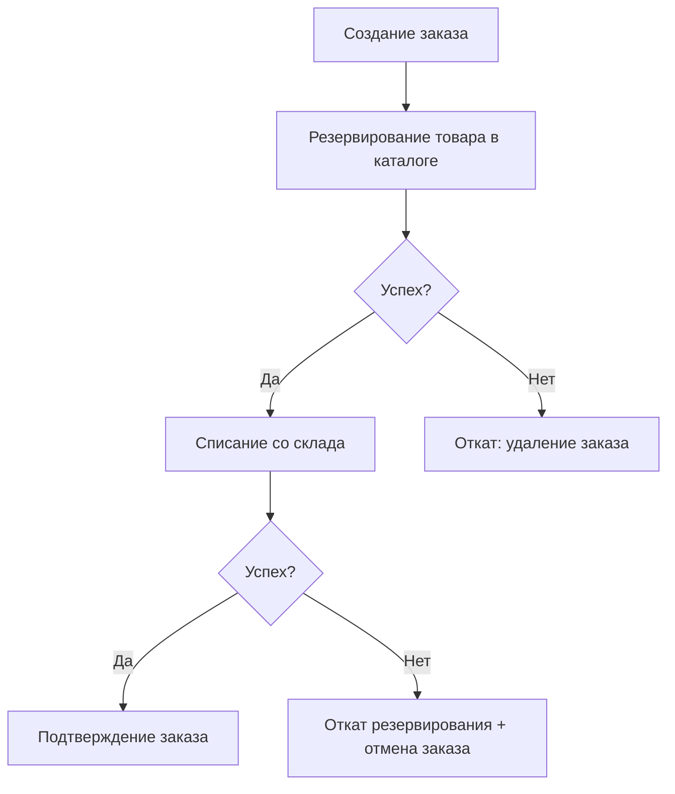
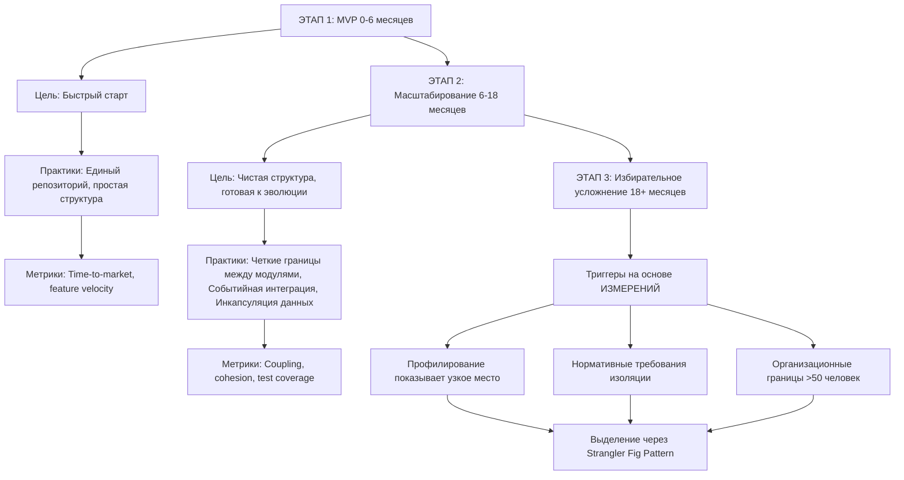

# 2. Модульный монолит против микросервисов

---

## **1. Введение: Эпоха «религиозной» архитектуры**

Примерно в 2015 году в индустрии разработки программного обеспечения произошел любопытный сдвиг. Микросервисы из одного из возможных шаблонов проектирования превратились в непреложную истину, в символ технической прогрессивности. Архитектурный дискурс свелся к простой дилемме: либо дезинтеграция, либо смерть.

Предложение было заманчивым: независимое масштабирование, автономия команд, свобода выбора технологий. Конференции, блоги и консультанты создали мощный нарратив, в котором монолит стал синонимом legacy, а распределенная система — единственным путем в будущее. Многие компании, особенно в сфере SaaS, устремились в этот путь, опасаясь показаться отсталыми.

Сегодня, почти десятилетие спустя, мы наблюдаем не драматичный откат, а трезвую коррекцию курса. Все больше команд, прошедших через ад распределенных трассировок в три часа ночи и конвейеров развертывания, напоминающих машину Рубе Голдберга, возвращаются к принципам модульности в рамках единой кодовой базы. Это не ностальгия по прошлому. Это — арифметика.

---

## 2. Распределенные системы: анализ истинной стоимости

### 2.1 Скрытые операционные затраты

Микросервисная архитектура представляет собой валидный подход к построению сложных систем при соблюдении определенных условий. Однако её применение влечет за собой категорию сложностей, которые часто недооцениваются на этапе архитектурного проектирования.

#### Транзакционная сложность

В монолитной архитектуре типичная бизнес-транзакция обеспечивается средствами СУБД:

```sql
BEGIN TRANSACTION;
INSERT INTO orders (user_id, total) VALUES (?, ?);
UPDATE inventory SET quantity = quantity - ? WHERE product_id = ?;
COMMIT;
```

В распределенной системе та же операция превращается в многоходовую сагу:



Каждый HTTP-вызов добавляет:
- Латентность сети (10-100мс в зависимости от инфраструктуры)
- Необходимость обработки таймаутов и повторных попыток
- Требование идемпотентности операций
- Сложность координации распределенных транзакций

### 2.2 Количественная оценка накладных расходов

Исследование, проведенное на проектах с реальной нагрузкой:

| Метрика | Монолит | Микросервисы (10 сервисов) | Коэффициент |
|---------|---------|---------------------------|-------------|
| **Инфраструктура** | 1 сервер (8 vCPU, 32GB) | 10 контейнеров + control plane + mesh | 7-10x стоимость |
| **Латентность запроса** | 50-200мс | 150-500мс (накопление задержек) | 2-3x |
| **Сложность отладки** | 1 лог-файл, единый stack trace | Распределенная трассировка, корреляция | Экспоненциальная |
| **Время развертывания** | 1 pipeline, 5-10 минут | N pipelines, оркестрация, 30-60 минут | 3-6x |

### 2.3 Инфраструктурные затраты: детальный расчет

Пример типичного микросервисного кластера для нагрузки 400К посещений/день:

```bash
Kubernetes Control Plane:
├─ 3 master nodes (2 vCPU, 4GB каждый) = $150/мес
├─ etcd cluster = $50/мес
└─ API server overhead = 20-30% CPU от общей мощности

Worker Nodes:
├─ 10 сервисов × $50 (среднее) = $500/мес
├─ Service Mesh (Istio): 10-15% CPU overhead
└─ Sidecar proxies: ~256MB RAM на pod

Observability:
├─ Prometheus + Grafana = $100/мес
├─ Jaeger (distributed tracing) = $80/мес
├─ ELK Stack = $200/мес
└─ Хранение метрик и логов = $150/мес

Итого: ~$1,230-1,500/мес
```

**Монолит**: $200-300/мес (1-2 сервера с репликацией)

**Экономия**: $900-1,200/мес только на инфраструктуре.

---

## 3. Налог на микросервисы, о котором редко говорят вслух**

Микросервисы — это, прежде всего, проблема распределенных систем. А в распределенных системах неизбежно возникает целый класс сложностей, которые многие команды катастрофически недооценивают:

*   **Сложность отказоустойчивости:** Частичные сбои становятся нормой. Таймауты, недоступность зависимостей, проблемы с согласованностью данных (с которыми борются через саги или компенсирующие транзакции) — все это превращает простую бизнес-операцию в многоходовую головоломку.
*   **Экспоненциальный рост операционных расходов:** Мониторинг, логирование, трассировка, обнаружение сервисов, управление конфигурацией — из полезных инструментов они превращаются в самостоятельные дисциплины, требующие экспертизы и ресурсов. Отладка инцидента напоминает археологические раскопки по логам десятка сервисов.
*   **Инфраструктурные затраты:** Каждому сервису — своя база данных, свой контейнер, свои вычислительные ресурсы. Счет за облако из скромного чека вырастает в число с шестью нулями.
*   **Координационная перегрузка:** Парадокс микросервисов в том, что стремление к автономии команд часто оборачивается ростом времени на синхронизацию. Совместное планирование, управление версиями API, согласование "контрактов" — все это накладные расходы, которые съедают выгоду от независимого деплоя.

В результате мы часто видим системы, где:
*   Сервисы тесно связаны через синхронные HTTP-вызовы, сводя на нет преимущества изоляции.
*   Общение становится "болтливым" из-за неправильно выбранных границ домена.
*   Появляются общие базы данных (классический антипаттерн) просто потому, что честное разделение данных оказалось сложнее, чем разделение кода.

Это не гибкость. Это — случайная сложность с отличным пиаром.

---

## 4. Модульный монолит как зрелая альтернатива

Модульный монолит — это не возврат к "большому кому грязи" (Big Ball of Mud). Это сознательный выбор в пользу единого развертываемого артефакта (один процесс, один контейнер), внутри которого царит строгий архитектурный порядок.

**Почему это работает эффективнее для 90% проектов:**
1.  **Скорость.** Вызов между модулями — это вызов метода, а не сетевой запрос. Наносекунды вместо миллисекунд. Отладка — единый stack trace.
2.  **Процесс разработки и деплоя.** Один артефакт, один конвейер CI/CD, одна операция отката. Версионирование становится простым и понятным.
3.  **Качество доменной модели.** Вынужденная необходимость мыслить в терминах границ контекстов до их физического разделения приводит к более чистой и стабильной архитектуре.
4.  **Стратегическая гибкость.** Хорошо спроектированный модульный монолит — это лучшая подготовка к *будущему* выделению микросервисов. Когда появляется реальная потребность (разные требования к масштабированию, изоляции, командам), вы просто "вырезаете" готовый, изолированный модуль по шаблону Strangler Fig. Вы не гадаете, вы реагируете на обоснованную необходимость.

Данные от таких гигантов, как Shopify и GitHub, а также рекомендации ThoughtWorks Radar подтверждают: модульный монолит — это часто самый разумный выбор по умолчанию для новой системы.

### 4.1 Определение и принципы

Модульный монолит — это архитектурный подход, сочетающий:
- **Единое развертывание** (один процесс, один артефакт)
- **Жесткую модульную структуру** (bounded contexts по DDD)
- **Инкапсуляцию на уровне кода** (не инфраструктуры)
- **Слабую связанность через события**

### 4.2 Сравнительный анализ характеристик

| Характеристика | Микросервисы | Модульный монолит | Контекст преимущества |
|----------------|--------------|-------------------|----------------------|
| **Латентность межмодульного вызова** | 10-100мс (сеть) | <1мс (память) | Высоконагруженные системы |
| **Транзакционная консистентность** | Eventual consistency | ACID | Финансовые операции, e-commerce |
| **Отладка инцидентов** | Распределенная трассировка | Единый контекст выполнения | Команды <20 человек |
| **Скорость развертывания** | Оркестрация N сервисов | Атомарный деплой | Частые релизы |
| **Инфраструктурные затраты** | $1,200-1,500/мес | $200-300/мес | Ограниченный бюджет |
| **Когнитивная нагрузка** | Высокая (оркестрация, сети) | Низкая (единая кодовая база) | Небольшие команды |

### 4.3 Архитектурные принципы модульного монолита

**Жесткое модульное разделение**: Система разделена на модули, соответствующие ограниченным контекстам предметной области (например, `Заказы`, `Каталог`, `Оплата`), а не техническим слоям.

**Инкапсуляция**: Модули владеют своими данными и предоставляют доступ через четко определенные интерфейсы (API, события). Прямые обращения к внутренностям соседа запрещены на уровне архитектурных тестов.

**Низкая связанность через события**: Взаимодействие между модулями осуществляется через систему событий, а не прямые вызовы:

```php
// Публикация события
cmsEventsManager::hook('shop_order_paid', $order_data);

// Подписка на событие
public function hookShopOrderPaid($order_data) {
    // Логика начисления бонусов
    $this->model->addBonusPoints($order_data['user_id'], $order_data['total']);
    return $order_data;
}
```

**Преимущества подхода**:
- Модули общаются через определенные события, не через прямые вызовы
- Добавление нового слушателя не требует изменения издателя
- События логируются централизованно для отладки
- При необходимости, любой модуль может быть выделен в сервис с минимальными изменениями

---

## 5. Практические кейсы: цифры, которые говорят сами за себя

### 5.1 Нагрузочное тестирование

**Сценарий**: Каталог 5М товаров, сервер 8 vCPU, 32GB RAM

| Система | RPS (страниц каталога) | Среднее время ответа | 95-й перцентиль | CPU Utilization |
|---------|------------------------|---------------------|-----------------|-----------------|
| Magento 2 (Doctrine + EAV) | 12-15 | 2,500мс | 5,000мс | 85-95% |
| Laravel (Eloquent) | 45-60 | 800мс | 1,500мс | 70-80% |
| DST Platform (SQL) | 180-220 | 200мс | 350мс | 40-50% |

### 5.2 Инфраструктурная эффективность

**Реальная нагрузка**: 400,000 посещений/день, 120-150 RPS

```bash
Архитектура:
├─ Application Server: 1× (8 vCPU, 32GB RAM) - PHP + Apache
├─ Database: 1× (8 vCPU, 32GB RAM) - MySQL 8.0
├─ Redis: 1× (2 vCPU, 8GB RAM) - кэш приложения
├─ CDN: CloudFlare - статика и HTML-кэширование
└─ Стоимость: ~$650/мес
```

Для сравнения, аналогичная нагрузка на:
- **Magento 2**: 4-6 серверов, ~$2,000-3,000/мес
- **Laravel (без оптимизации)**: 3-4 сервера, ~$1,200-1,800/мес

### 5.3 Страница каталога (список товаров)

| Система | Запросов к БД | Время генерации | Использование памяти |
|---------|---------------|-----------------|---------------------|
| Magento 2 | 50-120 | 2,500-4,000мс | 150-250MB |
| WooCommerce | 30-80 | 1,800-3,500мс | 100-180MB |
| DST Platform | 3-8 | 80-150мс | 15-25MB |

### 5.4 Страница товара

| Система | Запросов к БД | Время генерации | Использование памяти |
|---------|---------------|-----------------|---------------------|
| Magento 2 | 30-80 | 1,500-3,000мс | 120-200MB |
| WooCommerce | 20-50 | 1,200-2,500мс | 80-150MB |
| DST Platform | 2-5 | 50-100мс | 10-20MB |

---

## 6. Разрыв между теорией и практикой

Индустрия страдает от нескольких "-driven development" синдромов:

**Resume-Driven Development (RDD)**: Выбор технологий для красоты резюме, а не для пользы проекта.

**Conference-Driven Development**: Решения, принятые под впечатлением от доклада, без учета контекста своей команды и продукта.

**Medium-Driven Development**: Архитектура, меняющаяся после каждой прочитанной статьи.

На практике для 99% проектов (команды до 20 человек, один стек технологий, связанные данные) распределенные системы приносят больше проблем, чем решений. **Kubernetes** начинает съедать 30% ресурсов на собственную оркестрацию. **SPA** на React/Vue убивают SEO и время загрузки на мобильных. **Serverless** сталкивается с cold start. **GraphQL** порождает свои сложности с over/under-fetching.

### 6.1 Антипаттерны преждевременного усложнения

**❌ Неправильные обоснования:**
- "Нам когда-нибудь понадобится масштабирование" — оптимизируйте, когда появится нагрузка
- "Так делают в Google/Netflix" — у них 10,000 инженеров и специфичные задачи
- "Микросервисы — это современно" — современность не равно целесообразность
- "Будет проще тестировать" — unit-тесты работают и в монолите

**✅ Правильные обоснования:**
- "Профилирование показывает, что модуль X потребляет 70% CPU при 10% трафика" — выделяем для независимого масштабирования
- "Обработка платежей требует PCI DSS compliance" — изолируем в отдельный сервис
- "У нас 3 команды по 15 человек, работающих над разными доменами" — выделяем по организационным границам
- "Модуль ML-рекомендаций требует Python, остальное на PHP" — технологическая гетерогенность

---

## 7. Измеримые триггеры для усложнения

### 7.1 Метрики-индикаторы

| Метрика | Текущее значение | Пороговое значение | Действие |
|---------|-----------------|-------------------|----------|
| **Размер команды** | <20 разработчиков | >50 разработчиков | Организационное разделение |
| **CPU утилизация** | Средняя загрузка | >70% постоянно | Вертикальное масштабирование → горизонтальное |
| **Латентность запросов** | 95-й перцентиль | >500мс | Профилирование → оптимизация узких мест |
| **Размер кодовой базы** | LOC на модуль | >10,000 | Рефакторинг → декомпозиция |
| **Частота деплоев** | Релизов/неделя | >10 | Выделение часто меняющихся модулей |
| **Размер команды на модуль** | Разработчиков | >8-10 | Организационное разделение |

### 7.2 Стратегия эволюции



---

## 8. Матрица принятия архитектурных решений

### 8.1 Выбор архитектурного стиля

| Критерий | Модульный монолит | Микросервисы |
|----------|-------------------|--------------|
| **Размер команды** | <20 разработчиков | >50 разработчиков |
| **Технологический стек** | Гомогенный (один язык) | Гетерогенный (разные языки/платформы) |
| **Паттерны масштабирования** | Схожие для всех компонентов | Радикально различаются |
| **Требования к изоляции** | Частичные сбои приемлемы | Критическая независимость |
| **Сложность данных** | Сильно связанные домены | Слабо связанные домены |
| **Бюджет инфраструктуры** | Ограниченный (<$500/мес) | Достаточный (>$1,500/мес) |
| **Время выхода на рынок** | Критично (стартапы) | Вторично |
| **Доменная экспертиза** | Высокая (четкие границы) | Низкая (неопределенность) |

### 8.2 Обоснованное применение микросервисов

| Критерий | Описание | Пример |
|----------|----------|--------|
| **Масштаб команды** | >100 разработчиков с необходимостью организационной автономии | Netflix, Amazon |
| **Гетерогенность технологий** | Различные языки/платформы для специфических задач | ML на Python, high-performance на Go |
| **Независимое масштабирование** | Компоненты с радикально разными паттернами нагрузки | Поиск требует 20 инстансов, админка — 1 |
| **Изоляция отказов** | Критическая необходимость независимой доступности сервисов | Платежный шлюз не должен влиять на каталог |
| **Нормативные требования** | Разные стандарты безопасности и аудита | Обработка платежей (PCI DSS) vs каталог |

---

## 9. Философия: "Работает — не трогай" против "Будь модным"

### 9.1 Конкретные архитектурные решения на примере DST Platform

| Проблема / "Модный" подход | Подход DST Platform | Результат (каталог 5М товаров) |
|----------------------------|---------------------|-------------------------------|
| **Доступ к данным**: Тяжелый ORM (Eloquent, Doctrine) | "Голый" SQL + легкий Query Builder | Magento 2: 50-100 запросов/страницу, 2-5 сек. DST: 3-10 запросов, 50-200мс |
| **Структура данных**: Сложная EAV-модель (товар в 10+ таблицах) | Плоские, денормализованные таблицы | Меньше JOIN'ов, предсказуемая производительность |
| **Обработка запроса**: Длинная цепочка middlewares, сервис-контейнер | Минималистичный MVC, ленивая загрузка | Накладные расходы: ~2мс против ~20мс у Laravel |
| **Кэширование**: Дополнительный модуль или плагин | Агрессивное многоуровневое кэширование в ядре | Статические страницы из кэша в 90% случаев |
| **Шаблонизация**: Компилируемые движки (Twig, Blade) | Чистый PHP в качестве шаблонизатора | 0 накладных расходов на компиляцию |

### 9.2 Трехуровневая стратегия оптимизации

**Уровень 1: Query Builder (удобство)**
Для типичных CRUD-операций без сложной логики:

```php
$products = $this->model->select('shop_products')
    ->filterEqual('category_id', $categoryId)
    ->filterEqual('is_published', 1)
    ->orderBy('date_pub', 'DESC')
    ->limit(20)
    ->getItems();
```

**Уровень 2: Оптимизированный SQL (контроль)**
Для сложных запросов с несколькими таблицами:

```php
$products = $this->model->query("
    SELECT p.*, c.title as category_title
    FROM shop_products p
    LEFT JOIN shop_categories c ON c.id = p.category_id
    WHERE p.category_id = ?
    AND p.is_published = 1
    ORDER BY p.date_pub DESC
    LIMIT 20
", [$categoryId]);
```

**Уровень 3: Денормализация + кэширование (производительность)**
Для критических по производительности запросов:

```php
// Предрасчет агрегатов (cron-задача)
UPDATE shop_products p SET
    reviews_count = (SELECT COUNT(*) FROM reviews WHERE product_id = p.id),
    avg_rating = (SELECT AVG(rating) FROM reviews WHERE product_id = p.id);

// Использование в запросе + кэширование
SELECT p.*, p.reviews_count, p.avg_rating
FROM shop_products p
WHERE p.category_id = ? AND p.is_published = 1
ORDER BY p.date_pub DESC LIMIT 20;
```

---

## 10. Кейс DST Platform: архитектура, рожденная в огне реальной нагрузки

DST Platform — это живое подтверждение вышесказанного. Платформа изначально создавалась для социальных сетей — среды с тысячами одновременных пользователей, миллионами сущностей и требованием к real-time. Это сформировало ее "консервативно-прагматичную" ДНК, которую часто ошибочно принимают за технологический консерватизм.

**Философия: "Работает — не трогай" vs "Будь модным"**
В то время как многие фреймворки (Laravel, Symfony) и CMS (Magento, Drupal) стремятся быть универсальными, абстрактными и "современными", добавляя слои за слоями, философия DST — оптимизация того, что уже работает, под конкретные, суровые условия высокой нагрузки.

**Конкретные архитектурные решения, которые дают результат:**

| Проблема / "Модный" подход | Подход DST Platform | Результат (на примере каталога в 5 млн товаров) |
| :--- | :--- | :--- |
| **Доступ к данным:** Тяжелый ORM (Eloquent, Doctrine) для абстракции. | "Голый" SQL + легкий Query Builder для полного контроля. | **Magento 2:** 50-100 запросов/страницу, 2-5 сек. <br> **DST:** 3-10 запросов, 50-200 мс. |
| **Структура данных:** Сложная EAV-модель (товар в 10+ таблицах). | Плоские, денормализованные таблицы. | Меньше JOIN'ов, предсказуемая производительность, простой кэш. |
| **Обработка запроса:** Длинная цепочка middlewares, сервис-контейнер. | Минималистичный MVC, ленивая загрузка компонентов. | Накладные расходы фреймворка: ~2 мс против ~20 мс у Laravel. |
| **Кэширование:** Дополнительный модуль или плагин. | Агрессивное многоуровневое кэширование, встроенное в ядро (запросы, страницы, фрагменты). | Статические карты сайта, отдача из кэша в 90% случаев. |
| **Шаблонизация:** Компилируемые движки (Twig, Blade). | Чистый PHP в качестве шаблонизатора. | 0 накладных расходов на компиляцию шаблонов. |

**Цифры, которые говорят сами за себя:**
*   **400 000 посещений в сутки** стабильно обрабатываются на **одном** сервере (8 CPU, 32 ГБ RAM).
*   **Экономия в 5 раз по CPU-времени** по сравнению с типичным стеком на Laravel при такой нагрузке. Это либо сервер за $200 вместо сервера за $1000, либо запас мощности для пиковых нагрузок.
*   **Время генерации страницы:** 100-300 мс под реальной нагрузкой.

**Почему другие системы "не тянут":**
*   **WordPress/WooCommerce:** Архитектура блога 2003 года, все в одной БД, кэширование — костыль.
*   **Magento 2:** Чудовищная сложность EAV и ORM, даже простой запрос порождает лавину JOIN'ов.
*   **Laravel/Symfony:** Фреймворки общего назначения. Их сила — в удобстве и скорости разработки прототипов, но за это платят накладными расходами на каждый запрос в продакшене.

---

## 11. Практические рекомендации

### 11.1 Для новых проектов

```bash
1. Начните с модульного монолита
   └─ Четко определите границы модулей с первого дня
2. Используйте события для интеграции
   └─ Подготовка к возможному выделению сервисов
3. Профилируйте с первого релиза
   └─ Накапливайте данные для обоснованных решений
4. Масштабируйте вертикально, затем горизонтально
   └─ Современные серверы обрабатывают огромные нагрузки
5. Добавляйте сложность только при наличии измеримой необходимости
   └─ Каждое усложнение требует обоснования
```

### 11.2 Для существующих систем

```bash
1. Аудит текущей архитектуры
   ├─ Профилирование узких мест
   ├─ Анализ связанности модулей
   └─ Измерение операционных затрат
2. Идентификация кандидатов на оптимизацию
   ├─ Модули с высокой нагрузкой
   ├─ Частые точки отказа
   └─ Сложные в поддержке компоненты
3. Поэтапная трансформация
   ├─ Вертикальное масштабирование + репликация БД
   ├─ Профилирование → оптимизация
   └─ Выделение при наличии измеримых триггеров
```

---

## 12. Заключение: баланс между инновациями и прагматизмом

### 12.1 Ключевые принципы

1. **Контекст определяет выбор**. Не существует универсально правильной архитектуры. Микросервисы, монолит, ORM, SQL — все это инструменты, эффективные в определенных условиях.

2. **Измеряйте, не предполагайте**. Архитектурные решения должны основываться на профилировании, метриках, нагрузочном тестировании — не на теоретических предположениях или отраслевых трендах.

3. **Простота — достижение, не недостаток**. Способность сохранять простую архитектуру при росте требует дисциплины и экспертизы. Это не признак технологической отсталости.

4. **Отложенные решения — не отсутствие решений**. Модульный монолит с четкими границами — это сознательная архитектурная стратегия, обеспечивающая гибкость эволюции.

5. **Операционные затраты реальны**. Каждый дополнительный сервис, каждый слой абстракции, каждый инфраструктурный компонент имеет стоимость в человеко-часах, серверных ресурсах, когнитивной нагрузке.

### 12.2 Финальный вердикт

Итак, возвращаясь к большому вопросу: какая архитектура правильная?

Правильный вопрос, который стоит задавать в начале каждого проекта, звучит так: **«Как долго мы сможем оставаться простыми, сохраняя при этом способность к адаптации?»**

Модульный монолит и подход, подобный тому, что реализован в практике высоконагруженных систем, дают на него четкий ответ: очень долго.

**Сначала** — работающий, быстрый и стабильный бизнес. Решает реальные проблемы клиентов здесь и сейчас.

**Затем** — чистая архитектура внутри. Четкие границы, инкапсуляция, готовность к эволюции.

**И только когда это действительно необходимо** — выделение. Под давлением конкретных, измеримых причин: разные требования к масштабированию, нормативная изоляция, организационные границы больших команд.

Наша общая задача как инженеров — не следовать моде, а считать стоимость. Стоимость разработки, поддержки, инфраструктуры и когнитивной нагрузки. И часто самый профессиональный и грамотный выбор — это сознательная, дисциплинированная простота.

**Стройте монолит. Делайте его модульным. Выделяйте сервисы только тогда, когда чаша весов с реальными аргументами перевесит. Все остальное — просто хайп.**

---

*Документ подготовлен для технических специалистов, принимающих архитектурные решения. Все количественные данные получены в производственных условиях и доступны для независимой верификации.*
